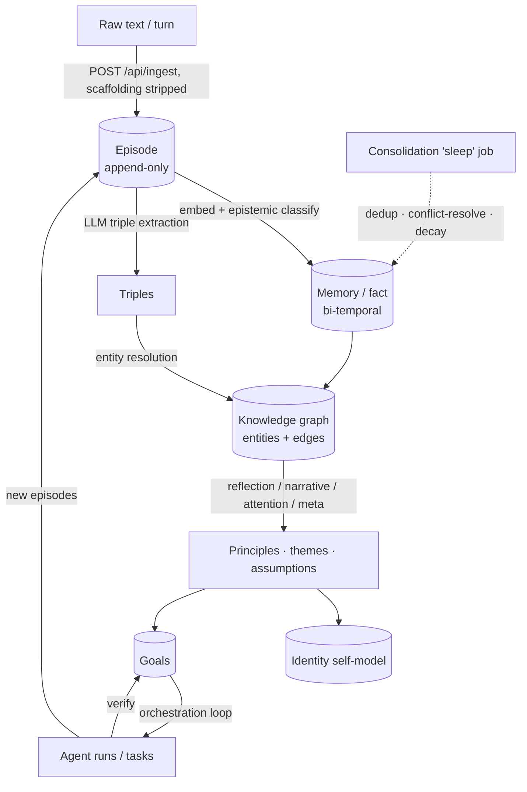

CurlyOS Core is a layered cognitive stack. Raw experience enters at the top, is recorded with provenance, distilled into time-aware facts, projected into a knowledge graph, folded into identity, and periodically re-examined by a metacognition layer — all while an orchestration engine pursues goals autonomously under safety governance.

## System map

```
~/curlyos-core/
├── api_server.py          # FastAPI app — REST API for all CurlyOS data (port 8643)
├── start_api_server.py    # Daemon start/stop helper
├── curlyos_setup.py       # Interactive setup wizard + health checks + migrations
├── migrate.py             # Ordered SQL migration runner (schema_migrations ledger)
│
├── memory/                # 4-tier memory
│   ├── governance/        # Episode recording, fact CRUD, invalidation
│   ├── consolidation/     # DEDUP · CONFLICT-RESOLVE · SUMMARIZE · DECAY · RECOMBINE ("sleep")
│   ├── retrieval/         # Hybrid recall: BM25 + vector + graph expansion + rerank
│   └── stores/            # DDL, Postgres pool, embedding backends
│
├── knowledge/             # Entity + relation extraction → resolution → graph projection
├── identity/              # Bi-temporal self-model (identity_facts triples)
├── cognition/             # Metacognition: attention · meta · narrative · reflection · decision_loop
├── studio/                # Idea canvas: sketches → graduation pipeline
├── simulation/            # Assumptions · scenarios · outcomes
├── evaluation/            # Gate checks · replay · scorers
├── goals/  workspace/     # Goal + task/project containers, on-disk hierarchy + artifacts
├── orchestration/         # Autonomous agent loop, scheduler, sandbox, verify
├── agent/  safety/        # PDP gate, approvals, hash chain, budget, kill switch
│
├── shared/                # Embedders, events, LLM model chain, epistemic classifier, settings, metrics
├── hermes_integration/    # Hermes MemoryProvider plugin (hooks + tool schemas)
├── mcp_server/            # Standalone MCP server exposing CurlyOS as 17 tools
└── deploy/                # docker-compose (Postgres+pgvector + Redis), ops scripts, migrations
```

A separate Next.js app (`curly-os`) is the optional companion UI — it renders the knowledge graph, memory, episodes, identity, cognition, journal, and studio through this API.

## The flow of an experience



## Subsystem responsibilities

| Layer | Subsystem | Responsibility |
|-------|-----------|----------------|
| Capture | [Memory · governance](../subsystems/memory.md) | Record episodes with provenance; create/invalidate facts; strip harness scaffolding |
| Recall | [Memory · retrieval](../subsystems/memory.md) | Hybrid recall: BM25 + vector + graph expansion + rerank, with caching |
| Cleanup | [Memory · consolidation](../subsystems/memory.md) | Async "sleep": dedup, conflict-resolve, summarize, decay, recombine |
| Structure | [Knowledge Graph](../subsystems/knowledge-graph.md) | Extract triples → resolve entities → project + densify the graph |
| Self | [Identity](../subsystems/identity.md) | Maintain a bi-temporal self-model resilient to context resets |
| Metacognition | [Cognition](../subsystems/cognition.md) | Reflection, narrative, attention, meta, decision loop |
| Action | [Orchestration](../subsystems/orchestration.md) | Decompose goals, run agents, verify, schedule, repeat |
| Guardrails | [Safety & Governance](../subsystems/safety-and-governance.md) | PDP, budget, kill switch, approvals, audit hash chain |
| Containers | [Goals & Workspace](../subsystems/goals-and-workspace.md) | Goals/tasks, on-disk workspace tree, artifacts |
| Creative / QA | [Studio · Simulation · Evaluation](../subsystems/studio-simulation-evaluation.md) | Idea canvas, world-modeling, gate-checks/scorers |
| Plumbing | [Shared Infrastructure](../subsystems/shared-infrastructure.md) | LLM tier routing, embedders, events, epistemic classifier, metrics, settings |

## LLM backend — tiered routing

Every LLM call goes through a **failover chain** (`shared/models.py`), and work is routed to one of three **task tiers** so the right model does the right job:

| Tier | Used by | Default backend |
|------|---------|-----------------|
| **fast** | per-ingest epistemic classification, KG extraction, memory distillation (high volume) | OmniRoute / cheap fast model (`CURLYOS_LLM_*`) |
| **agentic** | the orchestrator's ReAct runner + agent runs | `CURLYOS_AGENTIC_*` (e.g. Azure Kimi) |
| **deep** | heavy "thinking" — reflection, meta-cognition, narrative | `CURLYOS_DEEP_*` (e.g. Azure gpt-oss-120b) |

Each tier resolves its own `base_url` / key / model chain and degrades gracefully to the fast config when a tier is unset. Per-tier usage (calls, errors, fallbacks, latency) is exposed live at `/api/observability/llm`. See **[Shared Infrastructure](../subsystems/shared-infrastructure.md)** for the full routing mechanics.

## Data stores

| Store | Role |
|-------|------|
| PostgreSQL 16 + pgvector | Episodic log, semantic facts (HNSW vectors), knowledge graph, identity, cognition, goals, agent spine — see the [schema reference](../reference/database-schema.md) |
| Redis 7 | Working memory (`wm:{session}`, TTL ~2h), caches, locks, kill-switch flag |

Next: the **[Key Concepts](concepts.md)** that recur throughout every subsystem.
