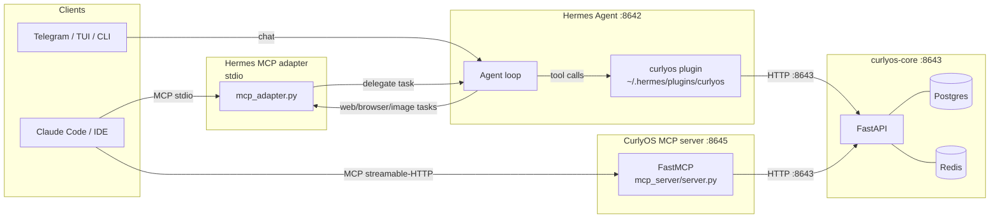

CurlyOS participates in three integration directions simultaneously:

1. **CurlyOS as Hermes memory provider** — the `hermes_integration` plugin runs inside the Hermes agent process, replacing its flat-file memory with the CurlyOS bi-temporal knowledge graph. Every Hermes session is recorded, recalled, and summarized via the curlyos-core API on port 8643.

2. **CurlyOS exposed as an MCP server** — `mcp_server/server.py` makes the full CurlyOS cognitive stack (memory, goals, runs, approvals) available to any MCP client (Claude Code, an IDE, a Hermes tool registration) over streamable-HTTP or stdio.

3. **CurlyOS delegating outbound to Hermes** — `hermes_integration/hermes_client.py` is a thin async client that lets CurlyOS workers send sub-tasks (web research, browsing, image generation) to the Hermes agentic endpoint on port 8642. The `mcp_adapter.py` re-exposes this delegation surface as MCP tools.

---

## Hermes MemoryProvider plugin

### What it is

The plugin is the file `hermes_integration/plugin.py`. It is deployed into the Hermes runtime at `~/.hermes/plugins/curlyos/__init__.py` by the install script. The repo copy is the canonical source; the deployed copy is a build artifact. The plugin implements Hermes's `MemoryProvider` ABC using **HTTP-only** transport — it holds no database connection and imports no curlyos-core code. Every operation is a single round-trip to the curlyos-core API on `:8643`.

### Install and enable

```bash
# 1. Deploy from the repo (keeps a rolling backup of the previous live copy)
bash deploy/install-hermes-plugin.sh

# 2. Restart Hermes so it reloads the plugin
hermes restart        # or kill + relaunch, depending on your setup
```

The script copies `hermes_integration/plugin.py` to `~/.hermes/plugins/curlyos/__init__.py` and `hermes_integration/plugin.yaml` to `~/.hermes/plugins/curlyos/plugin.yaml`. The manifest declares `name: curlyos`, `version: 0.2.0`.

**Never edit `~/.hermes/plugins/curlyos/` directly.** Edit `hermes_integration/plugin.py` in the repo, then re-run the install script.

### Lifecycle hooks

| Hook | Signature | Behavior |
|---|---|---|
| `initialize` | `initialize(session_id: str, **kwargs) -> None` | Pins the memory scope to `user:usr_hiten` (or `CURLYOS_CANONICAL_USER`); resets turn counters; probes `/api/health`. |
| `prefetch` | `prefetch(query: str, *, session_id: str = "") -> str` | Returns the cached recall block from the background thread started by `queue_prefetch` on the previous turn. Injected as authoritative reference context before each API call. |
| `queue_prefetch` | `queue_prefetch(query: str, *, session_id: str = "") -> None` | Starts a daemon thread that calls `POST /api/recall` (mode=fast, k=6) and stores the formatted result for the next `prefetch` read. |
| `on_turn_start` | `on_turn_start(turn_number: int, message: str, **kwargs) -> None` | Increments the turn counter; no I/O. |
| `sync_turn` | `sync_turn(user_content: str, assistant_content: str, *, session_id: str = "", **kwargs) -> None` | Records the completed turn as an episode via `POST /api/ingest`. Every 20 turns triggers a background fast-path consolidation. Short turns (user `< 20` chars, assistant `< 50` chars) are skipped. |
| `on_session_end` | `on_session_end(messages: List[Dict[str, Any]]) -> None` | Extracts identity and semantic facts from user messages using regex patterns; records a session-end episode; writes identity facts via `POST /api/identity`; triggers async fast-path consolidation. |
| `on_pre_compress` | `on_pre_compress(messages: List[Dict[str, Any]]) -> str` | Before context compression discards old messages, writes up to 5 substantive user statements as `hypothesis`-status memories so insights survive the discard. Returns `""`. |
| `on_memory_write` | `on_memory_write(action: str, target: str, content: str, metadata: Optional[Dict] = None) -> None` | Mirrors Hermes built-in memory writes to curlyos-core: `add/memory` → semantic fact via ingest; `add/user` → identity fact via `/api/identity`; `replace` → invalidate old + add new; `remove` → soft-invalidate by content match. |
| `on_delegation` | `on_delegation(task: str, result: str, *, child_session_id: str = "", **kwargs) -> None` | Called on the parent agent when a subagent completes. Records the delegation as an episode; extracts up to 3 hypothesis facts from the result using pattern matching. |
| `on_session_switch` | `on_session_switch(new_session_id: str, *, reset: bool = False, **kwargs) -> None` | Updates the session ID; optionally resets turn counters. |
| `shutdown` | `shutdown() -> None` | No-op. |

### Exposed tools (Hermes tool registry)

These are registered via `get_tool_schemas()` and dispatched through `handle_tool_call`. They are available to the Hermes agent model in the system prompt block.

| Tool | Parameters | Description |
|---|---|---|
| `curlyos_recall` | `query: str` (required), `k: int` (default 6, max 20), `mode: "fast"\|"deep"\|"divergent"` | Semantic + graph retrieval over the personal knowledge graph. Falls back to keyword search via `GET /api/search` if the embedding path fails. Invalidated facts are filtered out. |
| `curlyos_add_fact` | `statement: str` (required), `tags: list[str]` (optional), `valid_from: str ISO date` (optional) | Store a durable bi-temporal fact via the governance ingest path. Returns `{id, episode}`. |
| `curlyos_add_note` | `content: str` (required), `title: str` (optional), `tags: list[str]` (optional) | Store a longer note (`kind=procedure`). Prefer `curlyos_add_fact` for simple facts. |
| `curlyos_invalidate` | `mem_id: str` (required), `reason: str` (required), `superseded_by: str` (optional) | Soft-invalidate a fact by ID (sets `valid_to`). Never deletes. Use `curlyos_recall` first to find the ID. |
| `curlyos_identity` | `predicates: list[str]` (optional) | Read stable self-model facts from the identity engine. Omit `predicates` to return all. |
| `curlyos_pending_approvals` | _(none)_ | List agent runs parked awaiting a human grant or deny. Returns `{pending: [...], count}`. |
| `curlyos_approve` | `apv_id: str` (required, must start with `apv_`) | Grant a pending approval; the parked run resumes. Only call on explicit user instruction. If the user says "approve" without an ID, list pending approvals first. |
| `curlyos_deny` | `apv_id: str` (required, must start with `apv_`), `reason: str` (optional) | Deny a pending approval; the parked run resumes and skips the gated action. Only call on explicit user instruction. |

### Plugin config schema

| Config key | Env var | Default | Description |
|---|---|---|---|
| `api_url` | `CURLYOS_API_URL` | `http://127.0.0.1:8643` | curlyos-core API base URL |
| `CURLYOS_CANONICAL_USER` | `CURLYOS_CANONICAL_USER` | `hiten` | Pins memory scope for multi-platform sessions (Telegram, TUI, CLI all share the same memory). Set to `""` to use the platform-provided user ID instead. |

---

## Hermes client (outbound)

`hermes_integration/hermes_client.py` is a thin async HTTP client that lets CurlyOS workers delegate sub-tasks to the Hermes agentic endpoint. Hermes is not a discrete-tool API — it runs its own full agent loop (web search, browser, image generation, terminal) and returns the final result.

### Key resolution

Config is resolved in this order (first hit wins):

1. `HERMES_API_URL` env var, `HERMES_API_KEY` / `API_SERVER_KEY` env vars
2. `~/.hermes/config.yaml` keys `API_SERVER_KEY`, `API_SERVER_HOST`, `API_SERVER_PORT`
3. Default: `http://127.0.0.1:8642`

The resolved `(base_url, api_key)` pair is cached via `@lru_cache(maxsize=1)`.

### Public API

```python
from hermes_integration.hermes_client import complete, hermes_available

# Check whether a key is configured before delegating
if hermes_available():
    result = await complete(
        "Research the latest news on X",
        system="You are a research assistant.",  # optional
        timeout=180.0,                            # default; Hermes runs a full agent loop
    )
    # result: {"ok": bool, "text": str, "error"?: str}
```

`complete` never raises. On timeout, HTTP error, or bad response it returns `{"ok": False, "text": "", "error": "..."}`.

### Delegated task types

| Task | How it is used |
|---|---|
| Web research | `web_research` MCP tool / worker delegates a search-and-summarize prompt |
| Browser extraction | `browse` MCP tool delegates a URL + extraction goal |
| Image generation | `generate_image` MCP tool delegates a prompt; Hermes returns the file path or URL |
| Arbitrary sub-task | `delegate` MCP tool passes any natural-language task to Hermes's full toolset |

---

## MCP adapter

`hermes_integration/mcp_adapter.py` re-exposes the Hermes delegation surface as a standalone MCP server so any MCP client can gain Hermes capabilities without importing the Hermes SDK.

**Dependency-free design:** the adapter implements the MCP stdio protocol (JSON-RPC 2.0 over newline-delimited stdin/stdout) directly using only `asyncio`, `json`, and `sys`. The only non-stdlib import is `hermes_integration.hermes_client`. No `mcp` SDK install is required in the Hermes environment.

Protocol version: `2024-11-05`.

### Running the adapter

```bash
# Direct
python -m hermes_integration.mcp_adapter
```

```json
// .mcp.json registration (Claude Code or any MCP client)
{
  "mcpServers": {
    "hermes": {
      "command": "python",
      "args": ["-m", "hermes_integration.mcp_adapter"],
      "cwd": "/Users/hitensaxena/curlyos-core"
    }
  }
}
```

### Tools exposed

| Tool | Required params | Description |
|---|---|---|
| `web_research` | `query: string` | Research a topic on the web via Hermes; returns a sourced summary. |
| `browse` | `url: string`, `goal: string` (optional) | Visit a URL and extract information via the Hermes browser. |
| `generate_image` | `prompt: string` | Generate an image; returns the file path or URL. |
| `delegate` | `task: string` | Hand an arbitrary sub-task to the Hermes agent (full toolset). |

If `hermes_available()` returns false at startup (no API key configured), the adapter prints a warning to stderr but continues running — tool calls will return error strings.

---

## CurlyOS MCP server

`mcp_server/server.py` is a standalone MCP server built with `FastMCP` that exposes the full curlyos-core API as typed tools. Like the Hermes plugin, it is **HTTP-only**: no database connections, no curlyos-core imports. Every tool is one round-trip to `:8643`.

### Running the server

```bash
# streamable-HTTP (default) — long-lived shared service on :8645/mcp
python -m mcp_server.server

# stdio — spawned per-client
CURLYOS_MCP_TRANSPORT=stdio python -m mcp_server.server
```

Hermes mounts it with:

```bash
hermes mcp add http://127.0.0.1:8645/mcp
```

### Complete tool list (17 tools)

#### Memory group

| Tool | Signature | Description |
|---|---|---|
| `recall` | `query: str, k: int = 6, mode: str = "fast"` | Semantic + graph retrieval; falls back to keyword search. `mode`: `fast`, `deep`, `divergent`. `k` capped at 20. |
| `add_fact` | `statement: str, tags: Optional[list[str]] = None` | Store a durable bi-temporal fact via the governance ingest path. Returns `{id, episode}`. |
| `add_note` | `content: str, title: str = ""` | Store a longer note (`kind=procedure`). |
| `invalidate` | `mem_id: str, reason: str = ""` | Soft-invalidate a memory by ID (sets `valid_to`). |
| `identity` | `predicates: Optional[list[str]] = None` | Read stable self-model facts. Filter by predicate names, or omit for all. |

#### Views group (read-only)

| Tool | Signature | Description |
|---|---|---|
| `list_goals` | `status: Optional[str] = None` | List goals with progress. Filter: `active\|paused\|achieved\|abandoned`. |
| `list_opportunities` | `status: Optional[str] = None` | List detected opportunities. Filter: `detected\|scored\|accepted\|rejected\|expired`. |
| `list_projects` | `status: Optional[str] = None` | List projects optionally filtered by status. |
| `list_runs` | `status: Optional[str] = None, agent: Optional[str] = None, limit: int = 20` | List native agent runs. Filter: `running\|parked\|completed\|failed\|cancelled`. `limit` capped at 50. |
| `get_run` | `run_id: str` | Full execution trace of one run: status, result, error, actions, triggered approvals. |
| `list_inbox` | `unread: bool = False, limit: int = 20` | List inbox items (synthesized outputs of background/agent work). |
| `list_approvals` | _(none)_ | List pending human-approval requests. |

#### Execution group

| Tool | Signature | Description |
|---|---|---|
| `start_run` | `task: str` | Start a new native agent run on a natural-language task. Returns `{run_id, status}`. Side-effects are gated behind approvals. |
| `resume_run` | `run_id: str` | Resume a parked agent run (e.g. after granting an approval). |
| `cancel_run` | `run_id: str` | Cancel a running or parked agent run. |
| `approve` | `apv_id: str` | Grant a pending approval (`apv_...` ID from `list_approvals`). Resumes the parked run. |
| `deny` | `apv_id: str, reason: str = "user_denied"` | Deny a pending approval. |

**Total: 17 tools** (5 memory + 7 views + 5 execution).

---

## Configuration and env vars

| Variable | Default | Used by | Description |
|---|---|---|---|
| `CURLYOS_API_URL` | `http://127.0.0.1:8643` | Plugin, MCP server | curlyos-core API base URL |
| `CURLYOS_SCOPE` | `user:usr_hiten` | MCP server | Memory scope for all MCP server tool calls |
| `CURLYOS_CANONICAL_USER` | `hiten` | Plugin | Pins memory scope across platforms; override to use platform-provided user ID |
| `CURLYOS_MCP_TRANSPORT` | `streamable-http` | MCP server | Transport mode: `streamable-http` or `stdio` |
| `CURLYOS_MCP_HOST` | `127.0.0.1` | MCP server | Bind host for the streamable-HTTP server |
| `CURLYOS_MCP_PORT` | `8645` | MCP server | Bind port for the streamable-HTTP server |
| `HERMES_API_URL` | `http://127.0.0.1:8642` | Hermes client | Hermes agent base URL (first-priority over config.yaml) |
| `HERMES_API_KEY` | _(none)_ | Hermes client | Hermes API key (also checked as `API_SERVER_KEY`) |

**Port summary:**

- `:8642` — Hermes agent (OpenAI-compatible agentic endpoint; CurlyOS delegates TO this)
- `:8643` — curlyos-core API (Hermes plugin and MCP server call INTO this)
- `:8645` — CurlyOS MCP server (MCP clients connect TO this)

---

## Gotchas and edge cases

**Plugin drift is forbidden.** `~/.hermes/plugins/curlyos/` is a build artifact. The only way it diverged from the repo before was via direct editing; that accumulated 650 lines of drift. Always use `bash deploy/install-hermes-plugin.sh` and restart Hermes.

**Hermes process scoping.** The plugin pins all memory to `user:usr_hiten` by default, regardless of the platform user ID that Hermes passes in `initialize`. This means Telegram sessions, TUI sessions, and CLI sessions all share the same memory scope. Set `CURLYOS_CANONICAL_USER=""` to opt out and use per-platform scoping.

**`complete()` never raises.** The Hermes client returns `{"ok": False, ..., "error": "..."}` on every failure mode (timeout, HTTP error, bad JSON, missing key). Callers must check `result["ok"]`.

**Approval ID validation.** Both the plugin tools (`curlyos_approve`, `curlyos_deny`) and MCP server tools (`approve`, `deny`) refuse to operate unless the `apv_id` starts with `apv_`. If the model calls approve without an explicit ID, the plugin returns a tool error instructing it to call `curlyos_pending_approvals` first.

**`on_pre_compress` saves hypotheses, not canonical facts.** Insights extracted before context compression are stored with `epistemic_status="hypothesis"` so they are visible to the consolidation pipeline but excluded from default recall. They will be promoted to canonical facts only if the consolidation LLM confirms them.

**MCP server `recall` fallback.** If `POST /api/recall` fails (e.g. the embedding service is down), both the MCP server and the plugin fall back to `GET /api/search` (keyword full-text search). The response will contain `"fallback": "keyword"` to signal this.

**Sync pool debt (plugin only).** The plugin `__init__.py` docstring notes that some paths previously reached Postgres directly via a sync pool. As of the HTTP-only transport swap, this debt is resolved — the deployed `plugin.py` is HTTP-only. The sync pool note in `__init__.py` refers to the historical state that the Phase C rewrite eliminated. [Inference: verify against any future re-additions.]

**MCP adapter startup warning.** If `hermes_available()` returns false when the adapter starts (no key in env or `~/.hermes/config.yaml`), it prints to stderr but does not exit. Tool calls will return `"ERROR: Hermes API key not configured"` strings — not MCP-level errors.

---

## Integration topology


