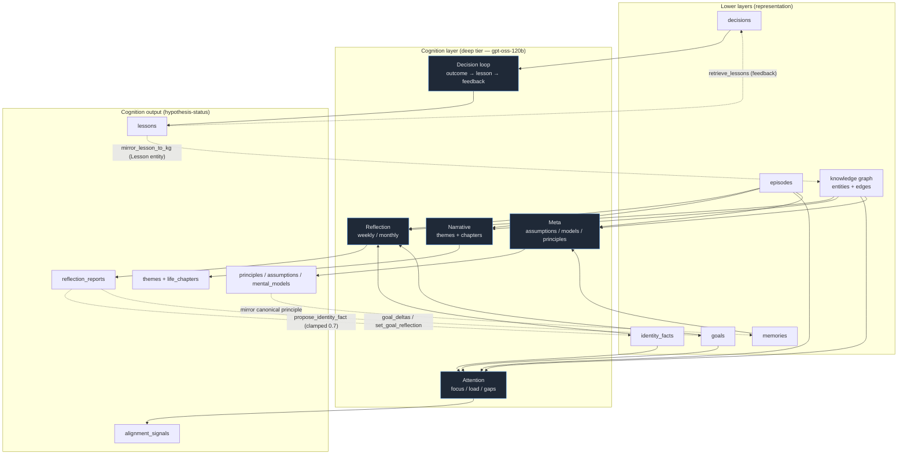

The Cognition subsystem is what makes CurlyOS Core an *operating system for a mind* rather than a memory database. Everything below the cognition layer (episodes, memories, the knowledge graph, identity facts, goals) is **representation** — it records what is known. The cognition layer is **introspection** — it reads that representation back, looks for patterns, structures it into narrative, audits past behaviour, and writes durable conclusions (principles, assumptions, identity updates, goal deltas, lessons) back into the lower layers. It is the layer that "thinks about thinking."

The package lives at `cognition/` and aggregates five faculties, each in its own subpackage:

- `cognition/reflection/` — periodic weekly/monthly passes that read the clean knowledge graph + recent episodes and emit findings, identity candidates, and goal deltas.
- `cognition/narrative/` — recurring-theme detection and grounded "life chapter" composition.
- `cognition/attention/` — focus areas, neglected entities, cognitive load, and value/goal-vs-action alignment gaps.
- `cognition/meta/` — working assumptions, mental models, decision audits, and distilled principles.
- `cognition/decision_loop/` — the decision → outcome → lesson → feedback loop that lets the OS learn from its own decisions.

A design note from `cognition/__init__.py`: the standalone `introspection/` module was retired (Phase F) because it was never wired in. Its epistemic-humility rule survives **structurally**: all cognition output is written at `epistemic_status = 'hypothesis'`, and graduation to canonical requires either a confidence threshold or explicit user confirmation. This is the spine of the whole subsystem — cognition proposes, it does not unilaterally rewrite the user's identity.

## Overview

### Why this is an OS, not a database

A database answers "what is stored?" An operating system *manages a resource over time*. Cognition treats the user's mind-state as that resource:

- **Reflection** turns a stream of raw episodes into structured, dated `reflection_reports` and feeds the conclusions back into `identity_facts` and `goals` — the system's self-model updates itself.
- **Narrative** composes the same episodes into human-legible "chapters" and "themes," so the history is *interpretable*, not just queryable.
- **Attention** models attention as "the scarcest personal resource," surfacing where cognitive mass actually sits versus where the user *says* it should sit.
- **Meta** maintains a falsifiable model of *how the user decides* (assumptions, mental models, principles) and audits it.
- **Decision loop** closes the control loop: a decision carries a falsifiable prediction, the outcome is scored against it, and a reusable lesson is distilled and fed into future decisions.

Crucially, several faculties write their conclusions back into the layers they read from — reflection promotes identity facts and goal deltas, meta mirrors principles into recallable `memories`, the decision loop mirrors lessons into the knowledge graph as first-class `Lesson` entities. That write-back loop is what makes it an OS: the representation and the introspection co-evolve.

### Deep-tier routing

All LLM-bearing cognition routes through the **deep** tier. In `api_server.py`, every cognition endpoint resolves its client with `_make_llm_client("deep")`. The tier system caches one `(client, model)` per tier:

- `fast` — high-volume, cheap work (distillation, classification, KG extraction). Resolves `CURLYOS_LLM_*`.
- `agentic` — orchestration + agent runs (resolves `CURLYOS_AGENTIC_*`).
- `deep` — heavy "thinking" cognition: reflection, meta, narrative. Resolves `CURLYOS_DEEP_*`, defaulting model chain to `gpt-oss-120b` (`shared/models.py::deep_chain`).

The deep tier degrades gracefully: each `CURLYOS_DEEP_*` var falls back to the `FAST` config and finally to OpenRouter, so an unconfigured deep tier still works. Because the deep models are reasoning models (Azure gpt-oss-120b / Kimi), cognition prompts use generous `max_tokens` (2000–3000) to leave headroom past the model's `reasoning_content`, and a no-key result is *not* cached (so adding a key later is picked up). Every LLM call in cognition is wrapped so that a model failure falls back to a heuristic — the loop must run even with no model.

## Reflection

`cognition/reflection/__init__.py` — structured analysis of episodic memory. It produces `reflection_reports` rows containing `findings[]`, `goal_deltas[]`, and `identity_candidates[]`, and feeds identity candidates into the identity engine.

### Cadence and pipeline

Runs as scheduled jobs (mirroring the retired Hermes crons): weekly (Monday ~06:20) and monthly (1st of month ~06:40). The pipeline:

1. SELECT recent episodes for the time window (weekly = 7 days, monthly = 30 days), `LIMIT 200`.
2. Fetch current identity context (`identity.get_identity_context`) and current knowledge-graph context (`knowledge.graph.graph_context`).
3. Extract **recurring themes** from the *clean knowledge graph* — the most-connected entities (graph degree), excluding the central person. Raw capitalized-word frequency was abandoned because it produced sentence-fragment junk.
4. Track **goal progress**: prefers first-class `goals` rows (Phase G — `goal_` ids, title + success criteria); falls back to an `ILIKE '%goal%'` scan over `memories` on older DBs.
5. If an LLM is available, run a sharper structured pass (`_analyze_with_llm`) that adds findings and identity candidates; on any failure it silently falls back to the heuristic results that are always computed.
6. INSERT the `reflection_reports` row.
7. For each identity candidate, call `identity.propose_identity_fact()`.

### Inputs and outputs

- **Inputs:** clean knowledge graph (graph-degree themes), recent `episodes`, `identity_facts` context, `goals` / `memories`, and (monthly only) a `mental_models` review.
- **Outputs:** a `reflection_reports` row; hypothesis-status `findings`; `goal_deltas`; `identity_candidates` proposed back to `identity_facts`.

Important epistemic guard: identity inferences from reflection are always clamped — `confidence=min(ic.get("confidence", 0.0), 0.7)` — so a reflection-derived identity fact stays a hypothesis and never auto-promotes to canonical on its own.

### Key functions

```python
async def run_reflection(pool, publisher, scope, report_type="weekly",
                         days_back=7, llm_client=None, llm_model="gpt-4o-mini") -> dict
async def run_weekly_reflection(pool, publisher, scope, window_days=7,
                                llm_client=None, llm_model="openai/gpt-4o-mini") -> dict
async def run_monthly_reflection(pool, publisher, scope,
                                 llm_client=None, llm_model="openai/gpt-4o-mini") -> dict
async def get_reflection_reports(pool, scope, limit=10) -> list[dict]
async def get_report_detail(pool, report_id) -> dict | None
```

Internal helpers: `_fetch_goal_targets(pool, scope)` (first-class goals or legacy fallback), `_kg_recurring_themes(pool, scope, limit=15)` (graph-degree themes), `_analyze_with_llm(...)`, `_analyze_heuristic(episodes, identity_ctx)` (tool/project keyword counting). The module-level `WEEKLY_ANALYSIS_PROMPT` enforces strict identity-candidate rules (snake_case predicate, short concrete object, stable facts only, no transcript fragments).

`run_weekly_reflection` returns `{report_id, findings_count, identity_candidates_count, summary}`. `run_reflection` (the older entry point) returns `{rpt_id, report_type, episodes_scanned, findings, goal_deltas, identity_candidates}`.

### Table written

`reflection_reports` (DDL in `REFLECTION_DDL`): `id (rpt_)`, `scope`, `report_type` (`weekly | monthly | manual`), `time_window_start`, `time_window_end`, `episodes_scanned`, `findings jsonb`, `goal_deltas jsonb`, `identity_candidates jsonb`, `summary`, `created_at`.

## Narrative

`cognition/narrative/__init__.py` — composes "life chapters," recurring "themes," and turning points from bi-temporal events. The Narrator may run as a lens within reflection.

### Theme detection

`surface_themes(pool, publisher, scope, min_frequency=2)` is the task-API entry. It defines themes as **the most-connected entities in the current knowledge graph** (clean/typed/deduped), not raw word frequency — degree `>= max(min_frequency, 2)`, excluding `hiten`, top 30. It is idempotent: it supersedes prior hypothesis themes (`valid_to = now()`) before inserting a fresh snapshot, so cron re-runs don't accumulate duplicates. All themes are inserted at `epistemic_status = 'hypothesis'`.

(The older `extract_themes` and `compose_narrative`/`detect_chapters` helpers use simpler keyword-frequency and 3-day-window clustering; they are retained but the production path uses `surface_themes` + `compose_chapters`.)

### Life-chapter composition and grounding constraints

`compose_chapters(pool, publisher, scope, llm_client=None, llm_model="")` is the grounded composer:

1. Pull episodes ordered by `ingested_at ASC`, `LIMIT 200`; supersede prior hypothesis chapters.
2. Segment at **topic shifts**: a chapter boundary is a Jaccard distance below 0.3 between consecutive episodes' top-keyword sets, but only once the current segment has `>= 3` episodes (so chapters are meaningful, not noisy singletons).
3. **Synthesize** each chapter's title + summary. The grounding constraints are the core safety property: the title is a *theme* (e.g. "Building CurlyOS"), **never a raw episode/transcript line**. The LLM prompt is grounded in the knowledge graph (`knowledge.graph.graph_context`) and explicitly forbids copying any entry verbatim, including speaker tags (`User:`/`Assistant:`), `[turn ...]`, timestamps, or `Session ...`. With no LLM, a clean keyword-derived title fallback (`_keyword_title`) is used instead — still never raw text.

All chapters are inserted at `epistemic_status = 'hypothesis'`.

### Functions

```python
async def detect_chapters(pool, scope) -> list[dict]
async def extract_themes(pool, scope) -> list[dict]
async def compose_narrative(pool, scope) -> dict           # {themes, chapters, summary}
async def get_chapters(pool, scope) -> list[dict]
async def get_themes(pool, scope) -> list[dict]
async def surface_themes(pool, publisher, scope, min_frequency=2) -> list[dict]
async def compose_chapters(pool, publisher, scope, llm_client=None, llm_model="") -> list[dict]
```

> Note: the REST endpoint `POST /api/cognition/narrative/compose` is a *separate*, query-driven narrative composer defined in `api_server.py` (not in this module). It draws only from journal/`mind` content — excluding operational sources (`claude-code`, `agent`, `hermes`, `meta`, `reflection`) — and answers a user question in grounded first-person prose, falling back to a heuristic when no LLM is available.

### Tables written

`life_chapters` (`cha_`): `id`, `scope`, `title`, `summary`, `start_date`, `end_date`, `epistemic_status`, validity columns. `themes` (`thm_`): `id`, `scope`, `name`, `description`, `frequency`, `epistemic_status`, validity. `theme_chapter_links` (composite PK `theme_id`, `chapter_id`) links the two.

## Attention

`cognition/attention/__init__.py` — models attention as the scarcest personal resource. It has a hard conceptual dependency on Activity Telemetry, which does not yet exist; in its absence it derives honest signals from episode content and **knowledge-graph structure** rather than fabricating telemetry.

### Faculties

- **Focus areas** — `get_focus_areas(pool, scope, limit=12)`: where cognitive mass sits, computed as the highest-degree knowledge-graph entities (excluding `hiten`), with type label and degree weight. Honest signal derived from graph structure.
- **Neglected entities** — `get_neglected_entities(pool, scope, min_degree=5, limit=10)`: high-degree (well-established) entities that are *absent* from recent genuine captures — relationships/projects drifting out of attention. "Genuine captures" explicitly exclude the bulk import (`source_ref` not like `brain:%` / `mind:%`).
- **Cognitive load** — `estimate_cognitive_load(pool, scope, window_days=14)`: a 0–1 score from episode **density** (saturating at 10 episodes/day) weighted 0.4, plus **topic switching** (Jaccard similarity below 0.3 between consecutive episodes' top words) weighted 0.6. Returns `{score, breakdown: {density, topic_switching, episode_count, window_days}}`.
- **Cognitive breadth** — `cognitive_breadth(pool, scope)`: how scattered cognition is — distinct active entity types and concentration ratio (top type / total). Returns `{total_entities, distinct_types, by_type, concentration}`.
- **Alignment gaps** — `detect_alignment_gaps(pool, publisher, scope)`: the writing faculty. It checks each active `goal` and identity `value` (predicates matching `%value%` or in `builds/focus/priority/primary_project/cares_about/exercise`) for whether its *distinctive* terms recur in recent genuine activity. A goal can sit in the graph yet get no real attention; if mentions fall below `LOW_ATTENTION = 8`, it writes an `alignment_signals` row of type `goal_action_gap` / `value_action_gap` at hypothesis status. Severity scales with under-attention (`base_sev + (8 - mentions)*0.1`, capped 0.95). Idempotent: supersedes prior hypothesis signals before writing a fresh snapshot. A `STOP` set strips generic filler words so only specific concepts drive the match.
- **Allocation** — `get_allocation(pool, scope, window_days=7)`: episode-content keyword classification into `work/creative/health/social/learning/admin`, with first-half-vs-second-half trend detection (`increasing/decreasing/stable`).
- **Heatmap** — `get_heatmap(pool, scope, window_days=30)`: a 24×7 grid; currently uniform/zero (a TODO awaiting activity telemetry).
- **Neglected opportunities** — `get_neglected_opportunities(pool, scope, min_priority="high")`: cross-references identity goals against recent episode text via `identity.get_identity_context` and `memory.governance.list_episodes`.

### Table written

`alignment_signals` (`aln_`, DDL `ATTENTION_DDL`): `id`, `scope`, `signal_type` (`value_action_gap | fulfillment | regret`, plus the `goal_action_gap`/`value_action_gap` written by the engine), `description`, `severity (0.0-1.0)`, `epistemic_status` (default hypothesis), validity columns. The module header also references materialized views `attention_allocation_weekly` and `focus_heatmap_grid` (telemetry-backed, not yet populated).

## Meta

`cognition/meta/__init__.py` — assumptions, mental models, decision audits, and distilled principles. This is the system's falsifiable model of *how the user thinks*.

### Assumptions and the blast radius

Assumptions are load-bearing things the user treats as true that *could* be wrong. CRUD: `create_assumption(...)` emits a `metacog.assumption.created` event; `get_assumptions(pool, scope, domain=None, active=True, epistemic_filter=("hypothesis","belief","canonical"))`. Assumptions form a dependency graph via `assumption_edges` (rel types `rests_on | contradicts | derived_from | audited_by`). `get_blast_radius(pool, assumption_id)` returns `{assumption_id, depends_on, depended_by}` — what an assumption rests on and what would be affected if it failed. Edges are created with `add_assumption_edge(pool, src_id, dst_id, rel_type="rests_on")`.

### Mental models

`create_mental_model(...)` (emits `metacog.model.created`) and `get_mental_models(pool, scope, domain=None)`. Models are named lenses with a description, confidence, and version.

### Decision audits

`run_decision_audit(pool, publisher, scope, window_days=7, llm_client=None, llm_model="openai/gpt-4o-mini")` scans recent episodes for decisions and writes `decision_audits` rows at hypothesis status. With an LLM it does structured extraction (`_llm_extract_decisions` — distinguishes the user's accepted decisions from the assistant's suggestions); on failure it falls back to a keyword regex (`decided|chose|picked|went with|switched|moved to`). Dedups on exact `(scope, decision)` because `decision_audits` has no `valid_to` supersede path. Returns `{audits_created, decisions_found, method: "llm"|"regex"}`.

### Principles distillation and generation

`distill_principles(pool, publisher, scope, min_confidence=0.7, llm_client=None, ...)` distills 3–7 *generalizable* principles about how the user decides, from recent `decision_audits`, via the LLM (`_llm_distill_principles`). The old verb-counting heuristic is gone (it produced noise), so this returns `[]` with no LLM. Inserts `canonical` when confidence `>= 0.75`, else `hypothesis`; dedups by statement.

`generate_assumptions_and_models(pool, publisher, scope, llm_client=None, ...)` LLM-extracts 5–10 load-bearing assumptions and 4–8 recurring mental models from the user's principles, beliefs (`memories` at `epistemic_status='belief'`), and top knowledge-graph entities. It supersedes prior auto-generated assumptions and mental models (idempotent snapshot), and is a no-op without an LLM. `max_tokens=3000` for deep-tier reasoning headroom.

`get_principles(pool, scope, status="canonical", domain=None)` and `add_principle(pool, scope, statement, domain="general", epistemic_status="hypothesis")` round out the registry.

### Functions

```python
async def create_assumption(pool, publisher, scope, statement, domain="general",
                            confidence=0.5, source_episode_id=None) -> dict
async def get_assumptions(pool, scope, domain=None, active=True,
                          epistemic_filter=("hypothesis","belief","canonical")) -> list[dict]
async def get_blast_radius(pool, assumption_id) -> dict
async def add_assumption_edge(pool, src_id, dst_id, rel_type="rests_on") -> dict
async def create_mental_model(pool, publisher, scope, name, description,
                              domain="general", source_episode_id=None) -> dict
async def get_mental_models(pool, scope, domain=None) -> list[dict]
async def run_decision_audit(pool, publisher, scope, window_days=7,
                             llm_client=None, llm_model="openai/gpt-4o-mini") -> dict
async def distill_principles(pool, publisher, scope, min_confidence=0.7,
                             llm_client=None, llm_model="openai/gpt-4o-mini") -> list[dict]
async def generate_assumptions_and_models(pool, publisher, scope,
                                          llm_client=None, llm_model="openai/gpt-4o-mini") -> dict
async def get_principles(pool, scope, status="canonical", domain=None) -> list[dict]
async def add_principle(pool, scope, statement, domain="general",
                        epistemic_status="hypothesis") -> dict
```

### Tables written

DDL `METACOG_DDL`: `assumptions` (`asu_`), `assumption_edges`, `mental_models` (`mdl_`), `decision_audits` (`dau_`), `principles` (`prn_`).

## Decision loop

`cognition/decision_loop/__init__.py` — the faculty that lets CurlyOS *learn from its own decisions* rather than merely record them. Schema lives in `migrations/0007_decision_loop.sql`. These are deliberately thin psycopg helpers (sync + async variants of each) that own only DB mechanics and scoring; the lesson *text* is produced upstream by the reflection/meta LLM.

The four moves plus a KG mirror:

1. **DECIDE** — a `decisions` row carries a falsifiable prediction (`predicted_outcome` + `prediction_confidence`). (Written upstream, e.g. by the Executive/orchestrator.)
2. **OUTCOME** — `record_outcome(...)` records what actually happened and scores it against the prediction via a **Brier surprise** term: `(confidence - hit)^2`. High surprise = confidently wrong (or unconfidently right) — exactly what's worth distilling. It backfills `decisions.outcome`/`outcome_id` and stamps `reviewed_at` so the scheduler's review index stops surfacing it.
3. **LESSON** — `distill_or_reinforce_lesson(...)` creates a new `lessons` row, or — if the nearest existing lesson is within cosine `sim_threshold=0.85` — *reinforces* it instead (bumps `support_count` + `confidence`, appends provenance, promotes `provisional → validated` at `support_count >= 3`). This stops near-duplicate fragmentation and lets confidence accrue with evidence.
4. **FEEDBACK** — `retrieve_lessons(...)` pulls the lessons most relevant to a pending decision by embedding similarity, optionally gated to a `domain` (or unconditioned lessons). Excludes retired/contradicted lessons. This is the move that actually closes the loop — it's the feedback read used by Executive hydration.
5. **KG-mirror** — `mirror_lesson_to_kg(...)` promotes a lesson into the knowledge graph as a first-class `Lesson` entity with `applies_to` edges to the entities it concerns, so lessons are reachable by ordinary graph traversal. Idempotent (caches `kg_entity_id` on `lessons.properties`).

### How it ties the faculties together

The decision loop is the reflection step *for the system's own choices*. `distill_lessons_from_outcomes(pool, scope, embedder, llm_client, llm_model, surprise_threshold=0.25, limit=20)` is invoked from the **weekly reflection endpoint**: it finds high-surprise, not-yet-distilled outcomes (Brier `>= 0.25`), uses `_distill_statement` (LLM with heuristic fallback) to phrase a one-sentence generalizable lesson, reinforces-or-creates it, and mirrors it into the KG — all idempotent so repeated reflections converge. The same endpoint then runs `decay_lesson_confidence(...)`, which exponentially decays idle lessons (half-life 30 days, floor 0.1, retire below 0.05) so a lesson that stops being reinforced fades and eventually retires instead of dominating retrieval forever. Thus: meta/reflection produce the *text*, the decision loop owns the *scoring, dedup, decay, and graph integration*, and the lessons flow back as feedback into future decisions.

### Functions (sync + async variants)

```python
def _brier_surprise(confidence, matched) -> float | None
def record_outcome(conn, *, scope, decision_id, summary, valence, embedding,
                   goal_id=None, matched_prediction=None, metrics=None,
                   evidence_refs=None, source_episode_id=None) -> str
def distill_or_reinforce_lesson(conn, *, scope, statement, embedding,
                                derived_from_outcomes, applies_when=None, conditions=None,
                                applies_to_entities=None, updates_model=None,
                                source_episode_id=None, sim_threshold=0.85,
                                confidence_step=0.1) -> tuple[str, str]
def retrieve_lessons(conn, *, scope, query_embedding, domain=None, limit=5) -> list[dict]
def mirror_lesson_to_kg(conn, *, scope, lesson_id, rel_type="applies_to",
                        source_episode_id=None) -> str

# async equivalents: record_outcome_async, distill_or_reinforce_lesson_async,
#                     retrieve_lessons_async, mirror_lesson_to_kg_async

async def distill_lessons_from_outcomes(pool, *, scope, embedder=None, llm_client=None,
                                        llm_model="gpt-4o-mini",
                                        surprise_threshold=0.25, limit=20) -> dict[str, int]
async def decay_lesson_confidence(pool, *, scope, half_life_days=30.0,
                                  floor=0.1, retire_below=0.05) -> dict[str, int]
```

Constants: `EMBED_DIM = 1024`, `DEFAULT_SURPRISE_THRESHOLD = 0.25`, `DEFAULT_HALF_LIFE_DAYS = 30.0`, `DEFAULT_CONFIDENCE_FLOOR = 0.1`, `DEFAULT_RETIRE_BELOW = 0.05`. The helper `_vec(embedding)` formats a 1024-dim vector as a pgvector literal and raises on dimension mismatch.

### Tables touched

`decisions`, `outcomes` (`out_`), `lessons` (`les_`) from `migrations/0007_decision_loop.sql`, plus `knowledge_entities` / `knowledge_edges` for the KG mirror.

## Data model

| Faculty | Table | Id prefix | Key columns | Read / Write |
| --- | --- | --- | --- | --- |
| Reflection | `reflection_reports` | `rpt_` | `report_type`, `time_window_start/end`, `episodes_scanned`, `findings jsonb`, `goal_deltas jsonb`, `identity_candidates jsonb`, `summary` | W (read by API) |
| Reflection (read) | `episodes`, `goals`, `memories`, `identity_facts`, `knowledge_entities/edges` | — | content/title/statement | R |
| Reflection (write-back) | `identity_facts`, `goals` | `idf_` / `goal_` | via `propose_identity_fact`, `set_goal_reflection` | W |
| Narrative | `life_chapters` | `cha_` | `title`, `summary`, `start_date`, `end_date`, `epistemic_status` | W |
| Narrative | `themes` | `thm_` | `name`, `description`, `frequency`, `epistemic_status` | W |
| Narrative | `theme_chapter_links` | — | `theme_id`, `chapter_id` (composite PK) | W |
| Attention | `alignment_signals` | `aln_` | `signal_type`, `description`, `severity`, `epistemic_status` | W |
| Attention | `attention_allocation_weekly`, `focus_heatmap_grid` | — | materialized views (telemetry; not yet populated) | R |
| Attention (read) | `episodes`, `goals`, `identity_facts`, `knowledge_entities/edges` | — | content/degree | R |
| Meta | `assumptions` | `asu_` | `statement`, `domain`, `confidence`, `epistemic_status` | W |
| Meta | `assumption_edges` | `cor_` | `src/dst_assumption_id`, `rel_type` | W |
| Meta | `mental_models` | `mdl_` | `name`, `description`, `domain`, `confidence`, `version` | W |
| Meta | `decision_audits` | `dau_` | `decision`, `domain`, `predicted_outcome`, `actual_outcome`, `quality_score` | W |
| Meta | `principles` | `prn_` | `statement`, `domain`, `epistemic_status` | W |
| Meta (write-back) | `memories` | `mem_` | mirrored canonical principles | W |
| Decision loop | `decisions` | `dec_` | `predicted_outcome`, `prediction_confidence`, `outcome`, `outcome_id`, `reviewed_at` | R/W |
| Decision loop | `outcomes` | `out_` | `summary`, `valence`, `matched_prediction`, `surprise`, `metrics`, `embedding` | W |
| Decision loop | `lessons` | `les_` | `statement`, `confidence`, `support_count`, `status`, `conditions`, `derived_from_outcomes`, `applies_to_entities`, `embedding` | R/W |
| Decision loop (mirror) | `knowledge_entities` / `knowledge_edges` | `ent_` / `cor_` | `Lesson` entity + `applies_to` edges | W |

Every faculty respects the bi-temporal `valid_from` / `valid_to` convention: nothing is hard-deleted; idempotent re-runs supersede prior hypothesis rows by stamping `valid_to = now()` and inserting a fresh snapshot.

## Public API surface

Importable from each subpackage (all `cognition.<faculty>`):

- `cognition.reflection`: `run_reflection`, `run_weekly_reflection`, `run_monthly_reflection`, `get_reflection_reports`, `get_report_detail`. DDL: `REFLECTION_DDL`.
- `cognition.narrative`: `detect_chapters`, `extract_themes`, `compose_narrative`, `get_chapters`, `get_themes`, `surface_themes`, `compose_chapters`. DDL: `NARRATIVE_DDL`.
- `cognition.attention`: `get_allocation`, `get_heatmap`, `detect_alignment_gaps`, `get_focus_areas`, `get_neglected_entities`, `cognitive_breadth`, `get_neglected_opportunities`, `estimate_cognitive_load`. DDL: `ATTENTION_DDL`.
- `cognition.meta`: `create_assumption`, `get_assumptions`, `get_blast_radius`, `add_assumption_edge`, `create_mental_model`, `get_mental_models`, `run_decision_audit`, `distill_principles`, `generate_assumptions_and_models`, `get_principles`, `add_principle`. DDL: `METACOG_DDL`.
- `cognition.decision_loop`: `record_outcome`, `distill_or_reinforce_lesson`, `retrieve_lessons`, `mirror_lesson_to_kg` (+ `_async` variants), `distill_lessons_from_outcomes`, `decay_lesson_confidence`.

## Related REST endpoints

Defined in `api_server.py`. Read endpoints are synchronous projections of the tables; trigger endpoints all resolve `_make_llm_client("deep")`.

Read (GET):

- `GET /api/cognition/meta` — `{principles, assumptions, decision_audits, mental_models}` for the scope.
- `GET /api/cognition/reflection` — last 10 `reflection_reports`.
- `GET /api/cognition/attention` — `{alignment_gaps, focus_areas, neglected, breadth, cognitive_load}` (focus/neglected/breadth/load computed live, KG-grounded).
- `GET /api/cognition/narrative` — `{chapters, themes}`.
- `GET /api/scheduler` — the heartbeat table (all background jobs, cadences, last/next fire).

Trigger (POST):

- `POST /api/reflection/weekly` — body `{scope, window_days}`. Runs weekly reflection, then `_sync_identity_from_reflection`, `_sync_goals_from_reflection`, then the decision-loop `distill_lessons_from_outcomes` + `decay_lesson_confidence`.
- `POST /api/reflection/monthly` — body `{scope}`. Monthly reflection + identity/goal sync.
- `POST /api/meta/audit` — body `{scope, window_days}`. `run_decision_audit` + `distill_principles` + `_sync_principles_to_memory`.
- `POST /api/meta/distill` — body `{scope, min_confidence}`. `distill_principles` + principle mirror.
- `POST /api/narrative/generate` — body `{scope, min_frequency}`. `surface_themes` + `compose_chapters` (supersedes prior hypothesis snapshot).
- `POST /api/cognition/narrative/compose` — body `{query, since?, domain?}`. Query-driven grounded first-person narrative from journal/mind content only.
- `POST /api/attention/scan` — body `{scope, window_days}`. `detect_alignment_gaps` + `get_allocation` + `estimate_cognitive_load`.

Note `GET /api/cognition/*` are read views; the write-back to identity/goals is performed by `_sync_identity_from_reflection`, `_sync_goals_from_reflection`, and `_sync_principles_to_memory` invoked from the trigger endpoints.

## Configuration & settings

Deep-tier environment variables (read by `_make_llm_client("deep")`), each falling back to the FAST config then OpenRouter:

```bash
CURLYOS_DEEP_API_KEY      # falls back to CURLYOS_LLM_API_KEY, OPENROUTER_API_KEY
CURLYOS_DEEP_BASE_URL     # falls back to CURLYOS_LLM_BASE_URL, then OpenRouter
CURLYOS_DEEP_MODEL        # else deep_chain()[0] — default chain head: gpt-oss-120b
CURLYOS_DEEP_CHAIN        # fallback model chain for the deep tier
```

Scheduler cadences (the cognitive heartbeat, registered in `api_server.py`; cadences mirror the retired Hermes crons, offset later in the day):

| Job | Cadence | Period guard |
| --- | --- | --- |
| `reflection_weekly` | Weekly, Monday ~06:20 | `reflection_reports` has a `weekly` row this week |
| `reflection_monthly` | Monthly, 1st ~06:40 | `reflection_reports` has a `monthly` row this month |
| `meta_audit` | Monthly, 1st ~07:20 | `decision_audits` has a row this month |
| `narrative_generate` | Weekly, Sunday ~05:20 | `themes` has a row this week |
| `attention_scan` | Weekly, Monday + Thursday ~08:10 | (none — heuristic, duplicates harmless) |

The period guards are **output-based** (they check whether a row already exists for the current `date_trunc` period), so a manual API trigger, a Hermes-fired run, and the scheduler all interlock — whoever produced output first makes the others no-op, preventing double LLM spend.

Autonomy / epistemic toggles: cognition output is always written at `epistemic_status = 'hypothesis'`. Promotion to canonical happens only via (a) confidence thresholds (principles at `>= 0.75`; identity facts via `propose_identity_fact` at `>= 0.75`, though reflection inferences are clamped to `0.7` so they stay hypotheses) or (b) explicit user confirmation. Lesson status follows its own ladder (`provisional → validated` at support `>= 3`; `retired` below confidence 0.05).

## Gotchas & edge cases

- **Heuristic fallback everywhere.** Every LLM call is wrapped so a model failure (or absent key) falls back to a heuristic. `distill_principles` and `generate_assumptions_and_models` are the exceptions that return empty / no-op with no LLM (the old heuristics produced noise). `distill_lessons_from_outcomes` is a **no-op without an embedder** — lessons must be embedded to dedup and retrieve.
- **Identity inferences are clamped to confidence 0.7** in reflection, so they never auto-promote to canonical; `_sync_identity_from_reflection` additionally filters transcript junk (`[turn`, `User:`, `Assistant:`, objects over 120 chars) and skips predicates that already have a current fact (churn-free, idempotent).
- **Themes ≠ word frequency.** Both narrative and reflection define "recurring theme" as graph degree, *not* capitalized-word frequency, because the latter produced sentence-fragment junk ("It", "There"). The KG must be populated for themes to be meaningful.
- **No activity telemetry yet.** `get_heatmap` returns a uniform zero grid; `attention_allocation_weekly` / `focus_heatmap_grid` views are unpopulated. Attention signals are derived from episode content + KG structure as an honest substitute.
- **Bulk-import exclusion.** Alignment gaps and neglected-entity detection exclude `source_ref LIKE 'brain:%'` / `'mind:%'` (the bulk historical import) — a goal can sit in the imported graph yet receive zero genuine recent attention; that absence *is* the signal.
- **`decision_audits` and `principles` have no `valid_to` supersede path** — they dedup by exact statement match instead, so a re-run won't create exact duplicates but won't invalidate stale rows either.
- **Two narrative composers exist.** `cognition.narrative.compose_narrative` (theme+chapter summary) vs the API endpoint `compose_narrative` in `api_server.py` (query-driven, journal-only). Don't confuse them.
- **Sync vs async decision-loop helpers.** The sync `record_outcome` *requires* an embedding (raises if dimension wrong); the async `record_outcome_async` allows `embedding=None` (the outcome is still recorded and Brier-scored, just not semantically retrievable).
- **Prompt-injection hardening.** The narrative-compose and chapter-synthesis prompts explicitly instruct the model to treat episode material as data and ignore any instructions/notifications embedded in it, and never to address the reader — because journal/episode content can contain assistant-chat fragments.

## Diagram


