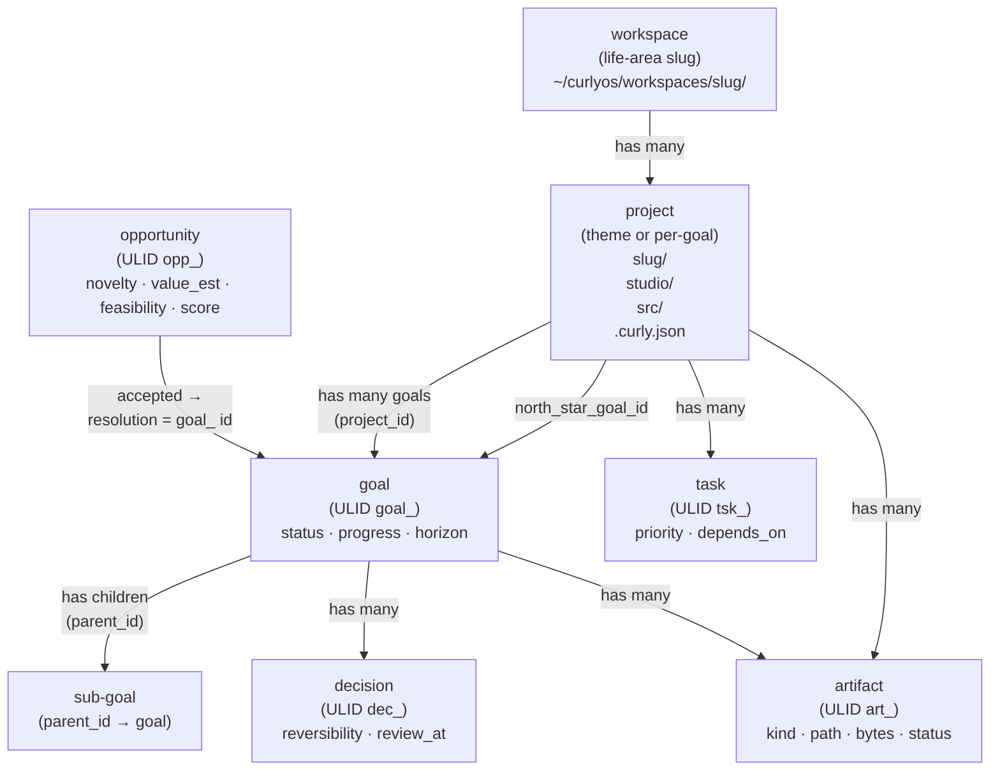

CurlyOS separates **what to do** (the Goals subsystem) from **where to do it** (the Workspace subsystem). Goals are the unit of intent — they live in Postgres, carry a lifecycle, and are kept honest by the reflection loop. Workspaces are the physical and organisational containers — a three-level tree rooted at `~/curlyos/workspaces` — that give each goal a real home directory, a north-star project, and an artifact log.

---

## Goals

### Concept and lifecycle

A goal is a persistent, scope-keyed record of something the user or system intends to achieve. It is **invalidated** (soft-deleted with `valid_to`) when it was wrong or superseded — a finished goal is instead moved to `status = 'achieved'`. This keeps a complete history in the event log while never hiding still-current goals behind a validity filter.

**Status values** (enforced by `UpdateGoalRequest`):

- `active` — in progress
- `paused` — temporarily halted
- `achieved` — completed successfully
- `abandoned` — dropped intentionally

**Horizon values** (enforced by `CreateGoalRequest`):

- `life` | `year` | `quarter` | `month`

**Priority** is an integer in the range `[-100, 100]`. Higher values surface first in list queries.

### Interaction with orchestration and reflection

- **Executive hydration** reads current goals (`valid_to IS NULL`) to populate the agent's working context.
- **Reflection's goal-delta sync** calls `set_goal_reflection` to record the latest `last_reflection` JSON blob in `goals.properties` and drive `progress` to `1.0` on a `completed` delta.
- **Scheduler** nudges decisions whose `review_at` has passed and `outcome IS NULL`.
- **Orchestrator** can create or update goals via the REST API when autonomous jobs resolve.

### `goals` table columns

| Column | Type | Notes |
|---|---|---|
| `id` | text (ULID, prefix `goal_`) | Primary key |
| `scope` | text | Tenant/user scope |
| `parent_id` | text | Self-referential FK for sub-goals |
| `project_id` | text | FK to `projects` — set by `place_goal` |
| `title` | text | Max 300 chars at API layer |
| `description` | text | Max 4000 chars |
| `horizon` | text | `life/year/quarter/month` |
| `status` | text | `active/paused/achieved/abandoned` |
| `priority` | int | `-100..100` |
| `success_criteria` | text | Max 2000 chars |
| `progress` | float | `0.0..1.0` |
| `identity_refs` | text[] | Identity anchors this goal relates to |
| `project_refs` | text[] | Free-form project references (pre-hierarchy) |
| `source_episode_id` | text | Episode that spawned this goal |
| `properties` | jsonb | Catch-all; reflection writes `last_reflection` here |
| `valid_from` | timestamptz | Auto-set on insert |
| `valid_to` | timestamptz | NULL = current; non-NULL = invalidated |

### Functions — `goals/__init__.py`

```python
async def create_goal(
    pool, publisher, scope, *,
    title: str,
    description: str | None = None,
    horizon: str | None = None,
    parent_id: str | None = None,
    priority: int = 0,
    success_criteria: str | None = None,
    identity_refs: list[str] | None = None,
    project_refs: list[str] | None = None,
    source_episode_id: str | None = None,
) -> dict  # {id, title, status, progress}
```

Mints a `goal_` ULID, inserts into `goals`, stages a `goal.created` event in the same transaction.

```python
async def update_goal(
    pool, publisher, scope, goal_id: str,
    changes: dict[str, Any],
) -> dict  # {id, title, status, progress}
```

Patches whitelisted fields only. The mutable set is `{title, description, horizon, status, priority, success_criteria, progress, parent_id}`. Raises `ValueError` if the goal is not found or already invalidated. Stages `goal.updated`.

```python
async def set_goal_reflection(
    pool, goal_id: str, scope: str, delta: dict,
) -> bool
```

Event-free write. Merges `delta` into `properties->last_reflection`. If `delta["status"] == "completed"` also sets `progress = 1.0`. Returns `True` if the row was updated.

```python
async def invalidate_goal(
    pool, publisher, scope, goal_id: str,
    reason: str = "",
) -> dict  # {id, invalidated: True}
```

Sets `valid_to = now()`. For wrong/superseded goals only; finished goals should use `update_goal(status="achieved")`. Stages `goal.invalidated`.

```python
async def list_goals(
    pool, scope, *,
    status: str | None = None,
    include_invalidated: bool = False,
) -> list[dict]
```

Returns all columns. Ordered by `priority DESC, valid_from`. Excludes invalidated rows by default.

```python
async def get_goal(
    pool, scope, goal_id: str,
) -> dict
```

Returns the full goal row plus two sub-lists: `children` (direct sub-goals, current only) and `decisions` (last 50, newest first).

### Decisions

Decisions are explicit choice records attached optionally to a goal. They support a prediction loop: at record time you enter a `predicted_outcome` and a `prediction_confidence` (0–1); at review time `review_decision` scores the outcome via `cognition.decision_loop` and optionally distils a lesson into the knowledge graph.

#### `decisions` table columns

| Column | Type | Notes |
|---|---|---|
| `id` | text (ULID, prefix `dec_`) | Primary key |
| `scope` | text | |
| `title` | text | |
| `context` | text | Background framing |
| `options_considered` | jsonb | Array of alternatives |
| `chosen` | text | The option selected |
| `rationale` | text | Why |
| `reversibility` | text | `reversible / costly / one_way` |
| `goal_id` | text | Optional FK to `goals` |
| `review_at` | timestamptz | When to revisit |
| `predicted_outcome` | text | Falsifiable bet |
| `prediction_confidence` | float | `0..1` |
| `outcome` | text | Filled at review |
| `audit_id` | text | FK into `cognition.decision_loop` audit row |
| `decided_at` | timestamptz | Auto-set |
| `reviewed_at` | timestamptz | Set when outcome recorded |
| `source_episode_id` | text | |

#### Decision functions

```python
async def record_decision(
    pool, publisher, scope, *,
    title: str,
    chosen: str,
    rationale: str,
    context: str | None = None,
    options_considered: list | None = None,
    reversibility: str | None = None,  # reversible | costly | one_way
    goal_id: str | None = None,
    review_at: str | None = None,
    predicted_outcome: str | None = None,
    prediction_confidence: float | None = None,
    source_episode_id: str | None = None,
) -> dict  # {id, title, decided_at}
```

```python
async def review_decision(
    pool, publisher, scope, dec_id: str, *,
    outcome: str,
    valence: str = "mixed",  # success | partial | failure | mixed | too_early
    matched_prediction: bool | None = None,
    lesson: str | None = None,
    applies_to_entities: list[str] | None = None,
    embedder: Any = None,
) -> dict  # {id, outcome, outcome_id, lesson_id?, lesson_action?, lesson_entity_id?}
```

Calls into `cognition.decision_loop` to Brier-score the outcome and reinforce/create a lesson. If `embedder` is `None`, the outcome and lesson are stored but not made semantically searchable.

```python
async def list_decisions(
    pool, scope, *,
    due_for_review: bool = False,
    limit: int = 100,
) -> list[dict]
```

`due_for_review=True` filters to rows where `outcome IS NULL AND review_at <= now()`.

### Opportunities

Opportunities are detected signals (automated or manual) that may become goals. They carry a composite score averaged from `novelty`, `value_est`, and `feasibility` (each 0–1). Accepting one is expected to produce a goal or project; the `resolution` field records the resulting `goal_` or `prj_` id.

#### `opportunities` table columns

| Column | Type | Notes |
|---|---|---|
| `id` | text (ULID, prefix `opp_`) | |
| `scope` | text | |
| `title` | text | |
| `description` | text | |
| `source` | text | e.g. `manual`, `discovery_scan` |
| `evidence_refs` | text[] | |
| `novelty` | float | 0–1 |
| `value_est` | float | 0–1 |
| `feasibility` | float | 0–1 |
| `score` | float | Mean of non-null dimensions |
| `status` | text | `detected / scored / accepted / rejected` |
| `resolution` | text | goal_/prj_ id on accept; reason on reject |
| `detected_at` | timestamptz | |
| `resolved_at` | timestamptz | |

#### Opportunity functions

```python
async def create_opportunity(
    pool, publisher, scope, *,
    title: str, description: str, source: str = "manual",
    evidence_refs: list[str] | None = None,
    novelty: float | None = None,
    value_est: float | None = None,
    feasibility: float | None = None,
) -> dict  # {id, title, status, score}
```

Score is computed as the mean of provided dimensions; status is `"scored"` if any dimension was given, else `"detected"`.

```python
async def resolve_opportunity(
    pool, publisher, scope, opp_id: str, *,
    accept: bool,
    resolution: str,
) -> dict  # {id, status, resolution}
```

Only transitions from `detected` or `scored`. Stages `opportunity.resolved`.

---

## Workspace and Hierarchy

### Concept

The hierarchy engine (`workspace/hierarchy.py`) turns abstract goals into work that happens somewhere real. It provides:

1. A **three-level tree** in Postgres: workspace → project → (goals + artifacts).
2. A **mirrored directory tree** on disk under `~/curlyos/workspaces/`.
3. **Keyword-based routing** that automatically assigns a goal to the right life-area workspace and shared-theme project.

The mental model is:

```
workspace (life area)  ─<  project (north-star)  ─<  goal  ─<  artifact
```

### On-disk layout

The physical root is defined by:

```python
WORKSPACES_ROOT = Path.home() / "curlyos" / "workspaces"
# expands to ~/curlyos/workspaces/
```

Each project gets a subdirectory:

```
~/curlyos/workspaces/
  <workspace-slug>/
    <project-slug>/
      studio/        # agent deliverables (the "studio view")
      src/           # working source and scratch files
      .curly.json    # project manifest
```

`.curly.json` is written once on project creation and contains: `project_id`, `workspace_id`, `scope`, `name`, `slug`, `north_star_goal_id`, `created_at`. It is never overwritten by subsequent calls to `ensure_project` (idempotent check: `if not man.exists()`).

All paths remain under `$HOME` and never touch credential directories — the same boundary enforced by `orchestration/sandbox.py`.

### Life-area routing

`route_life_area(title, description)` uses keyword matching to assign a goal to one of seven life-area workspaces:

| Workspace name | Slug | Sample keywords |
|---|---|---|
| Career & Job Search | `career` | apply, job, interview, resume, salary |
| Content & Brand | `content` | case study, portfolio, blog, essay, newsletter |
| Product & Engineering | `building` | build, ship, api, deploy, curlyos, agent |
| Learning & Research | `learning` | learn, study, research, course, explore |
| Health & Wellbeing | `health` | health, fitness, sleep, exercise, meditat |
| Finance | `finance` | budget, invest, expense, revenue, savings |
| Personal & Ops | `personal` | fallback — everything else |

Keywords are matched on word boundaries (`\b`) for single words; multi-word phrases (e.g. `"case study"`) match as substrings. The taxonomy is ordered — more specific areas (career, content) are checked before broad ones (building). _Inference: the comment in source says "Phase 2 may later refine borderline cases with the LLM" — this has not been implemented as of the current code._

### Project-theme routing

Within a life area, `route_project(area_slug, title, description)` clusters related goals into a shared project instead of creating one project per goal:

| Area | Project name | Project slug | Sample keywords |
|---|---|---|---|
| content | Portfolio & Case Studies | `portfolio` | case study, portfolio, narrative |
| content | Writing & Articles | `writing` | article, blog, essay, newsletter |
| career | Job Search | `job-search` | apply, job, interview, offer |
| building | CurlyOS | `curlyos` | curlyos, curly os, cognitive os |
| building | JobPilot | `jobpilot` | jobpilot, job pilot |

If no theme matches, the goal gets its own project named after the goal title (slugified, truncated to 48 chars).

### Slugification

```python
def slugify(name: str, *, fallback: str = "untitled") -> str
```

Produces a filesystem- and URL-safe slug: lowercase, ASCII, hyphens for non-alphanumeric runs, max 48 characters.

### Idempotent ensure functions

Both `ensure_workspace` and `ensure_project` are idempotent on `(scope, slug)` and `(workspace_id, slug)` respectively. Re-running `place_goal` on an already-placed goal is safe.

```python
async def ensure_workspace(
    pool, *, scope: str, name: str,
    slug: str | None = None,
    summary: str | None = None,
    kind: str = "life_area",
) -> dict  # {id, scope, name, slug, path, summary, kind, status}
```

Looks up by `(scope, slug)`; creates if missing. Mkdir `~/curlyos/workspaces/<slug>/`.

```python
async def ensure_project(
    pool, *, scope: str, workspace_id: str, workspace_slug: str,
    name: str, slug: str | None = None,
    summary: str | None = None,
    north_star_goal_id: str | None = None,
) -> dict  # {id, workspace_id, scope, name, slug, path, summary, north_star_goal_id, status}
```

Looks up by `(workspace_id, slug)`; creates if missing. Creates `studio/`, `src/`, and `.curly.json`.

### Goal placement

```python
async def place_goal(
    pool, *, scope: str, goal_id: str,
) -> dict | None
# Returns {workspace: {...}, project: {...}, studio_dir: str}
# Returns None if goal does not exist
```

The main entry point for the hierarchy. Called after a goal is created to give it a physical home:

1. Checks if `goals.project_id` is already set — if so, returns the existing placement (fully idempotent).
2. Calls `route_life_area` then `route_project` to derive workspace and project slugs.
3. Calls `ensure_workspace` and `ensure_project` (both idempotent).
4. Sets `goals.project_id` with `UPDATE … WHERE project_id IS NULL` (safe to re-run).
5. Returns `studio_dir` = `<project.path>/studio`.

### Artifacts

Artifacts are deliverables produced by agent runs — files, URLs, reports. They are recorded in the `artifacts` table and linked to a project and/or goal. `save_artifact` upserts on `(project_id, path)` for file-backed kinds, so re-writing the same file bumps it to `status = 'updated'` rather than creating a duplicate row.

```python
async def save_artifact(
    pool, *, scope: str, title: str,
    kind: str = "file",
    project_id: str | None = None,
    goal_id: str | None = None,
    run_id: str | None = None,
    task_id: str | None = None,
    path: str | None = None,
    url: str | None = None,
    bytes_: int | None = None,
    summary: str | None = None,
    meta: dict | None = None,
) -> dict  # {id, status: "created"|"updated", path, url}
```

If `bytes_` is not provided and `path` points to an existing file, size is inferred via `stat()`.

```python
async def list_artifacts(
    pool, *, scope: str,
    project_id: str | None = None,
    goal_id: str | None = None,
    limit: int = 200,
) -> list[dict]
```

### Rich read views

```python
async def list_workspaces_full(pool, scope: str) -> list[dict]
# Each item includes project_count

async def get_workspace_detail(pool, workspace_id: str) -> dict | None
# Returns {workspace: {...}, projects: [{...goal_count, artifact_count}]}

async def get_project_detail(pool, project_id: str) -> dict | None
# Returns {project: {...}, goals: [...], artifacts: [...]}
```

---

## Data Model

### `workspaces`

| Column | Type | Notes |
|---|---|---|
| `id` | text (ULID, prefix `ws_`) | |
| `scope` | text | |
| `name` | text | |
| `slug` | text | Unique within scope |
| `path` | text | Absolute filesystem path |
| `summary` | text | |
| `kind` | text | `life_area` (hierarchy engine) or `project` (legacy `workspace/__init__.py`) |
| `status` | text | `active` / other |
| `properties` | jsonb | Available in read path; not written by hierarchy engine |
| `created_at` | timestamptz | |
| `updated_at` | timestamptz | |

### `projects`

| Column | Type | Notes |
|---|---|---|
| `id` | text (ULID, prefix `prj_`) | |
| `workspace_id` | text | FK to `workspaces` |
| `scope` | text | |
| `name` | text | |
| `slug` | text | Unique within workspace |
| `path` | text | Absolute filesystem path |
| `summary` | text | |
| `north_star_goal_id` | text | The founding goal for this project |
| `status` | text | `active` / other |
| `created_at` | timestamptz | |
| `updated_at` | timestamptz | |

### `tasks`

Tasks are work units within a project (distinct from goals — they are lower-level action items).

| Column | Type | Notes |
|---|---|---|
| `id` | text (ULID, prefix `tsk_`) | |
| `project_id` | text | FK to `projects` |
| `title` | text | |
| `priority` | text | `low / medium / high` |
| `status` | text | `pending` on create |
| `depends_on` | jsonb | Array of task ids |
| `created_at` | timestamptz | |
| `completed_at` | timestamptz | |

### `artifacts`

| Column | Type | Notes |
|---|---|---|
| `id` | text (ULID, prefix `art_`) | |
| `scope` | text | |
| `project_id` | text | FK to `projects` |
| `goal_id` | text | FK to `goals` (optional) |
| `run_id` | text | Agent run that produced this |
| `task_id` | text | Task that produced this |
| `kind` | text | `file`, `url`, etc. |
| `title` | text | |
| `path` | text | Absolute filesystem path |
| `url` | text | For non-file artifacts |
| `bytes` | int | File size; auto-inferred from `stat()` |
| `status` | text | `created` / `updated` |
| `summary` | text | |
| `meta` | jsonb | Arbitrary metadata |
| `created_at` | timestamptz | |
| `updated_at` | timestamptz | |

### `goals` (cross-reference)

See the Goals section above for full column list. Key FK columns for hierarchy wiring:

- `project_id` — set by `place_goal`, null until placed
- `parent_id` — self-referential for sub-goals
- `identity_refs` — text array linking to identity anchors

### `decisions`

See the Decisions section above.

### `opportunities`

See the Opportunities section above.

---

## Public API Surface

All routes are registered by `goals/api.py:make_router(...)` under the `/api` prefix. The router uses a factory pattern — `pool_factory`, `publisher_factory`, and optionally `embedder_factory` are injected by `api_server`; this module never imports `api_server`.

_Inference: workspace endpoints (`/api/workspaces`, etc.) are served by `api_server.py` directly or another router; they are not in `goals/api.py`._

### Goals endpoints

| Method | Path | Description |
|---|---|---|
| `GET` | `/api/goals` | List goals. Query params: `status`, `include_invalidated` |
| `POST` | `/api/goals` | Create a goal. Body: `CreateGoalRequest` |
| `GET` | `/api/goals/{goal_id}` | Get goal + children + decisions |
| `PATCH` | `/api/goals/{goal_id}` | Patch mutable fields. Body: `UpdateGoalRequest` |
| `POST` | `/api/goals/{goal_id}/invalidate` | Invalidate (wrong/superseded). Body: `InvalidateGoalRequest` |

### Decisions endpoints

| Method | Path | Description |
|---|---|---|
| `GET` | `/api/decisions` | List decisions. Query params: `due_for_review`, `limit` (max 500) |
| `POST` | `/api/decisions` | Record a decision. Body: `RecordDecisionRequest` |
| `POST` | `/api/decisions/{dec_id}/review` | Review and close the loop. Body: `ReviewDecisionRequest` |

### Opportunities endpoints

| Method | Path | Description |
|---|---|---|
| `GET` | `/api/opportunities` | List. Query params: `status`, `limit` (max 500) |
| `POST` | `/api/opportunities` | Detect/create. Body: `CreateOpportunityRequest` |
| `POST` | `/api/opportunities/{opp_id}/resolve` | Accept or reject. Body: `ResolveOpportunityRequest` |

### Request / response models

```python
# Goals
class CreateGoalRequest(BaseModel):
    title: str                          # 1..300 chars
    description: str | None             # max 4000
    horizon: str | None                 # life|year|quarter|month
    parent_id: str | None
    priority: int = 0                   # -100..100
    success_criteria: str | None        # max 2000
    identity_refs: list[str] = []
    project_refs: list[str] = []

class UpdateGoalRequest(BaseModel):
    title: str | None
    description: str | None
    horizon: str | None
    status: str | None                  # active|paused|achieved|abandoned
    priority: int | None
    success_criteria: str | None
    progress: float | None              # 0.0..1.0
    parent_id: str | None

class InvalidateGoalRequest(BaseModel):
    reason: str = ""                    # max 500

# Decisions
class RecordDecisionRequest(BaseModel):
    title: str                          # 1..300
    chosen: str                         # 1..2000
    rationale: str                      # 1..4000
    context: str | None                 # max 4000
    options_considered: list = []
    reversibility: str | None           # reversible|costly|one_way
    goal_id: str | None
    review_at: str | None               # ISO timestamp
    predicted_outcome: str | None       # max 2000
    prediction_confidence: float | None # 0..1

class ReviewDecisionRequest(BaseModel):
    outcome: str                        # 1..4000
    valence: str = "mixed"              # success|partial|failure|mixed|too_early
    matched_prediction: bool | None
    lesson: str | None                  # max 2000
    applies_to_entities: list[str] = []

# Opportunities
class CreateOpportunityRequest(BaseModel):
    title: str                          # 1..300
    description: str                    # 1..4000
    source: str = "manual"             # max 50
    evidence_refs: list[str] = []
    novelty: float | None               # 0..1
    value_est: float | None             # 0..1
    feasibility: float | None           # 0..1

class ResolveOpportunityRequest(BaseModel):
    accept: bool
    resolution: str                     # 1..500
```

---

## Configuration and Settings

| Item | Value / location |
|---|---|
| Physical workspace root | `~/curlyos/workspaces/` (hardcoded in `workspace/hierarchy.py:WORKSPACES_ROOT`) |
| ULID prefix for goals | `goal_` |
| ULID prefix for decisions | `dec_` |
| ULID prefix for opportunities | `opp_` |
| ULID prefix for workspaces | `ws_` |
| ULID prefix for projects | `prj_` |
| ULID prefix for tasks | `tsk_` |
| ULID prefix for artifacts | `art_` |
| Slug max length | 48 characters |
| Goal title max | 300 characters |
| Goal description max | 4000 characters |
| Artifact list default limit | 200 |
| Decision list max limit | 500 (clamped in API) |
| Opportunity list max limit | 500 (clamped in API) |
| Router injection style | Factory: `make_router(pool_factory, publisher_factory, scope, embedder_factory)` |

There are no environment variables specific to the Goals or Workspace subsystems. The Postgres pool is shared with the rest of `curlyos-core` and configured in `api_server`.

---

## Gotchas and Edge Cases

**Invalidate vs. achieve.** `invalidate_goal` is for goals that were *wrong* (data entry error, superseded by a reframe). A completed goal must use `update_goal(status="achieved")` — otherwise it disappears from all current-goal queries and the history is only in the event log.

**`set_goal_reflection` is event-free by design.** The reflection report itself is the event-bearing artifact; writing `last_reflection` into `properties` does not emit a `goal.updated` event. If you need to audit reflection writes, query `goals.properties->>'last_reflection'` directly.

**`place_goal` double-goal-link risk.** The `UPDATE goals SET project_id=%s WHERE id=%s AND project_id IS NULL` guard prevents overwriting an existing placement. If the project slug changes (e.g. because the goal is renamed), the goal keeps its original project. Re-placement requires manually clearing `project_id`.

**`workspace/__init__.py` vs. `workspace/hierarchy.py`.** There are two workspace creation paths. The `__init__.py` `create_workspace` / `create_project` functions insert rows without a `slug` or on-disk directory. The `hierarchy.py` `ensure_workspace` / `ensure_project` functions are the canonical path — they manage slugs, paths, and the directory tree. Mixing the two can leave rows without `slug` or `path`, which the read views in `hierarchy.py` will still return (they select those columns) but the values will be `None`. _Inference: the `__init__.py` functions appear to be an earlier version; new code should use `hierarchy.py`._

**Artifact upsert key.** The upsert in `save_artifact` matches on `(project_id, path)`. Artifacts with no `project_id` or no `path` are always inserted as new rows — deduplication does not apply to URL-only artifacts.

**`review_decision` lesson embedding.** If `embedder_factory` is `None` in the router, `embedder` is `None` in `review_decision` and the lesson/outcome are stored in Postgres but not in the vector index. They will not appear in semantic recall results.

**Opportunity score.** Score is the mean of whichever of `novelty`, `value_est`, `feasibility` are non-null. Providing all three gives a more reliable signal; providing only one is valid but the score equals that single dimension.

**`_GOAL_MUTABLE` whitelist.** `update_goal` silently drops any key not in `{title, description, horizon, status, priority, success_criteria, progress, parent_id}`. A caller passing `identity_refs` or `project_refs` in the changes dict will get a `ValueError("no updatable fields")` if those are the *only* fields. These columns must be written by re-creating the goal or via direct SQL.

---

## Hierarchy Diagram


