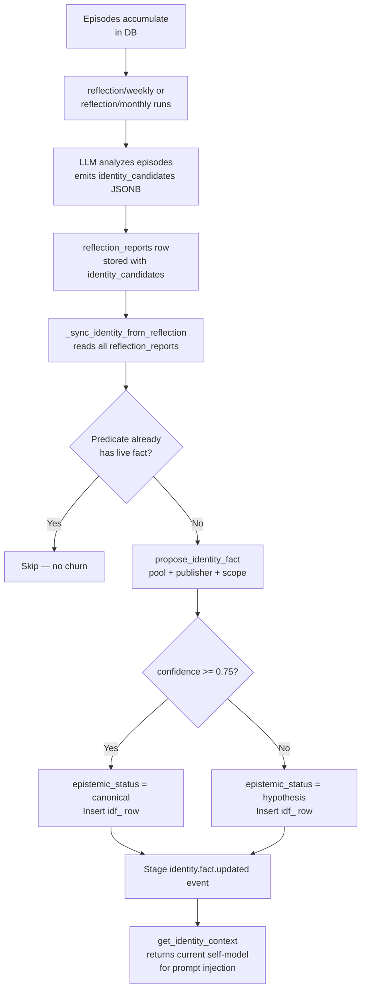

The Identity subsystem maintains a durable, structured self-model for the CurlyOS agent. Where general memories capture episodic content and observations, identity captures **who the agent is** — name, role, values, preferences, and persistent traits — as a small set of typed triples. These triples survive context compression, process restarts, and long inactivity because they live in a dedicated Postgres table (`identity_facts`) rather than in the LLM's context window.

## Overview

Every LLM session starts fresh. Without an explicit self-model, the agent would need to re-derive its identity from raw episodic history on every turn — expensive, lossy, and fragile. The Identity subsystem solves this by maintaining a **stable, queryable self-model** that any component can inject into a prompt in milliseconds.

The self-model is built incrementally:

1. Reflection runs scan recent episodes and emit `identity_candidates` — proposed `(predicate, object, confidence)` triples.
2. `_sync_identity_from_reflection` promotes the best candidate per predicate into `identity_facts` via `propose_identity_fact`.
3. Callers (agents, prompt builders, the webapp) retrieve the current self-model with `get_identity_context`.

Because every fact records when it was believed valid (`valid_from` / `valid_to`) and which episode it came from (`source_episode_id`), the full history of a belief change — for example "preferred language changed from Ruby to Python" — is preserved as an auditable chain rather than overwritten.

## Data Model

### `identity_facts` table

DDL from `migrations/0001_baseline.sql`:

```sql
CREATE TABLE IF NOT EXISTS identity_facts (
  id                text        PRIMARY KEY,
  scope             text        NOT NULL,
  predicate         text        NOT NULL,
  object            text        NOT NULL,
  confidence        real        NOT NULL,
  epistemic_status  text        NOT NULL DEFAULT 'canonical',
  valid_from        timestamptz NOT NULL,
  valid_to          timestamptz,
  ingested_at       timestamptz NOT NULL,
  created_at        timestamptz NOT NULL DEFAULT now(),
  source_episode_id text        NOT NULL REFERENCES episodes(id),
  superseded_by     text        REFERENCES identity_facts(id)
);
```

#### Column reference

| Column | Type | Notes |
|---|---|---|
| `id` | `text` | ULID with `idf_` prefix, e.g. `idf_01JXXXXXXXX`. |
| `scope` | `text` | Tenant / user namespace, e.g. `user:usr_hiten`. Defaults to `CURLYOS_SCOPE` env var. |
| `predicate` | `text` | The attribute being described, e.g. `name`, `preferred_language`, `core_value`. Max 200 chars via API. |
| `object` | `text` | The attribute's current value, e.g. `"Hiten"`, `"Python"`, `"curiosity"`. Max 2000 chars via API. |
| `confidence` | `real` | `[0.0, 1.0]`. Drives promotion logic — see Confidence Gating below. |
| `epistemic_status` | `text` | `canonical` when `confidence >= 0.75`; `hypothesis` otherwise. |
| `valid_from` | `timestamptz` | When this version of the fact became valid. Set to `now()` on insert. |
| `valid_to` | `timestamptz` | `NULL` for the current live fact; set to `now()` when superseded or manually invalidated. |
| `ingested_at` | `timestamptz` | Wall-clock insert time (same as `valid_from` for new insertions). |
| `created_at` | `timestamptz` | DB default `now()`, never updated. |
| `source_episode_id` | `text` | FK to `episodes(id)`. Every fact traces to an episode for provenance. Required — API auto-creates a provenance episode if none is supplied. |
| `superseded_by` | `text` | Self-referencing FK to the `idf_` that replaced this row. `NULL` on active facts. |

#### Indexes

```sql
-- Fast "what do I believe right now?" query
CREATE INDEX idx_idf_scope_predicate_current
  ON identity_facts (scope, predicate) WHERE valid_to IS NULL;

-- Historical / bi-temporal range scans
CREATE INDEX idx_idf_bitemporal
  ON identity_facts (scope, predicate, valid_from, valid_to);
```

### How identity triples differ from general memories

| Dimension | `memories` | `identity_facts` |
|---|---|---|
| Schema | Free-text statement + embedding | Structured `(predicate, object)` triple |
| Retrieval | Vector similarity + BM25 | Exact predicate lookup or ILIKE scan |
| Multiplicity | Many per predicate type | One live row per `(scope, predicate)` |
| Conflict resolution | Deduplication by `statement_key` | Higher-confidence row supersedes lower |
| Primary purpose | Episodic recall | Stable self-model / prompt injection |

## API / Functions

All public functions are defined in `identity/__init__.py`. They are `async` and expect a `psycopg3` async connection pool.

### Confidence Gating constants

```python
AUTO_PROMOTE_THRESHOLD   = 0.75   # confidence >= this → epistemic_status = "canonical"
CONFIRM_REQUIRED_THRESHOLD = 0.90 # documented threshold; not enforced as a code gate —
                                   # inference: intended for future human-approval flow
```

> **Inference note:** `CONFIRM_REQUIRED_THRESHOLD = 0.90` is declared but not used to block writes in the current implementation. Facts with confidence `>= 0.90` are auto-promoted as `canonical` like any other fact above `0.75`. The constant appears to document an intent for a future human-approval gate at very high confidence.

---

### `propose_identity_fact`

```python
async def propose_identity_fact(
    pool: Any,
    publisher: Any,
    scope_text: str,
    predicate: str,
    object: str,
    confidence: float,
    source_episode_id: str,
) -> dict:
```

**Behavior:**

1. Validates that `source_episode_id` is a ULID with `epi_` prefix; raises `ValueError` if not.
2. Checks for an existing live fact on `(scope, predicate)` (i.e., `valid_to IS NULL`).
3. **No existing fact** → inserts a new row. `epistemic_status` is `canonical` if `confidence >= 0.75`, else `hypothesis`.
4. **Existing fact, new confidence is higher** → inserts new row first (to satisfy the `superseded_by` FK), then sets `valid_to = now()` and `superseded_by = new_id` on the old row. `action_taken = "superseded"`.
5. **Existing fact, new confidence is equal or lower** → no write; returns the existing fact unchanged. `action_taken = "no_change"`.
6. Stages an `identity.fact.updated` event via `publisher.stage`. Event staging is best-effort — exceptions are silently swallowed.

**Return value:**

```python
{
    "idf_id": "idf_01...",
    "predicate": "preferred_language",
    "object": "Python",
    "confidence": 0.85,
    "epistemic_status": "canonical",
    "action_taken": "inserted" | "superseded" | "no_change",
}
```

When `action_taken = "no_change"`, `epistemic_status` is `None` (the existing row's status is not re-read).

---

### `get_identity_context`

```python
async def get_identity_context(
    pool: Any,
    scope_text: str,
    predicates: list[str] | None = None,
) -> dict[str, Any]:
```

Returns all current live facts (`valid_to IS NULL`) for `scope_text`, ordered by `confidence DESC`. If `predicates` is supplied, filters to only those predicates.

**Return value** — a flat dict keyed by predicate:

```python
{
    "name": {
        "object": "Hiten",
        "confidence": 0.95,
        "idf_id": "idf_01...",
        "valid_from": "2025-01-01T00:00:00+00:00",
        "epistemic_status": "canonical",
    },
    "preferred_language": { ... },
}
```

When the same predicate has multiple rows (should not occur due to the partial unique index but defensible), only the first (highest-confidence) row is returned.

**Primary use case:** prompt injection — call this before building the system prompt to give the agent stable self-knowledge.

---

### `invalidate_identity_fact`

```python
async def invalidate_identity_fact(
    pool: Any,
    publisher: Any,
    scope_text: str,
    fact_id: str,
    superseded_by: str | None = None,
) -> dict:
```

Manually closes a fact by setting `valid_to = now()` and optionally linking `superseded_by`. Stages an `identity.fact.updated` event with `action_taken = "invalidated"`. Scoped to `scope_text` — will not invalidate a fact belonging to a different scope even if `fact_id` matches.

**Return value:**

```python
{"fact_id": "idf_01...", "valid_to": "2025-06-16T12:00:00+00:00"}
```

If no matching live row is found, `valid_to` is `None`.

---

### `list_identity_facts`

```python
async def list_identity_facts(
    pool: Any,
    scope_text: str,
    include_expired: bool = False,
    predicate: str | None = None,
) -> list[dict]:
```

Returns all facts for a scope, ordered by `confidence DESC`. By default excludes expired facts (`valid_to IS NULL`). Pass `include_expired=True` to retrieve the full historical record. Optionally filter to a single `predicate`.

**Return value** — list of dicts containing all columns:

```python
[
    {
        "idf_id": "idf_01...",
        "scope": "user:usr_hiten",
        "predicate": "name",
        "object": "Hiten",
        "confidence": 0.95,
        "epistemic_status": "canonical",
        "valid_from": "2025-01-01T00:00:00+00:00",
        "valid_to": None,
        "superseded_by": None,
        "source_episode_id": "epi_01...",
    },
    ...
]
```

---

### Internal: `_sync_identity_from_reflection` (in `api_server.py`)

```python
async def _sync_identity_from_reflection(pool: Any, pub: Any, scope: str) -> dict:
```

Closes the reflection → identity loop. Called at the end of every `/api/reflection/weekly` and `/api/reflection/monthly` run.

**Algorithm:**

1. Reads all `identity_candidates` JSONB arrays from `reflection_reports` for the scope.
2. Filters out junk (objects containing `[turn`, `User:`, `Assistant:`, or longer than 120 chars).
3. Deduplicates to one best candidate per predicate (highest confidence wins).
4. Skips any predicate that already has a live identity fact (idempotent — prevents churn on re-runs).
5. Calls `propose_identity_fact` for remaining candidates, reusing a single provenance episode per batch.

**Return value:**

```python
{"identity_promoted": 3, "identity_skipped": 1}
```

## Related REST Endpoints

### `GET /api/identity`

```
GET /api/identity?scope=user:usr_hiten&predicates=name,preferred_language&valid=true
```

| Query param | Type | Default | Description |
|---|---|---|---|
| `scope` | `string` | `CURLYOS_SCOPE` env var | Tenant namespace. |
| `predicates` | `string` | — | Comma-separated list; filters to named predicates. |
| `valid` | `bool \| null` | `true` | `true` = current facts only; `false` = superseded only; omit (or `null`) = all (history + current). |

**Response:**

```json
{"items": [...], "count": 3}
```

Each item is a raw `identity_facts` row (all columns). The webapp uses `valid=null` to display a fact's change history alongside its current value.

---

### `POST /api/identity`

```
POST /api/identity
Content-Type: application/json
```

Request body (`ProposeIdentityRequest`, defined in `api_server.py:272`):

```python
class ProposeIdentityRequest(BaseModel):
    predicate: str        # 1–200 chars
    object: str           # 1–2000 chars
    confidence: float     # default 0.5, range [0.0, 1.0]
    source_episode_id: str  # default "" — auto-created if blank
```

If `source_episode_id` is empty or omitted, the endpoint calls `memory.governance.record_episode` with `source_ref="web:identity"` to create a provenance episode automatically before delegating to `propose_identity_fact`.

**Response:** same shape as `propose_identity_fact` return value, plus a legacy `id` alias:

```json
{
    "idf_id": "idf_01...",
    "id": "idf_01...",
    "predicate": "preferred_language",
    "object": "Python",
    "confidence": 0.85,
    "epistemic_status": "canonical",
    "action_taken": "inserted"
}
```

Returns `HTTP 400` for invalid `source_episode_id` format; `HTTP 500` for unexpected errors.

---

### Identity counts in `GET /api/observability/overview`

The overview endpoint queries:

```sql
SELECT epistemic_status AS k, count(*) AS n
FROM identity_facts
WHERE valid_to IS NULL
GROUP BY epistemic_status
```

and surfaces the result as `identity_by_status` in the response body.

---

### Reflection endpoints that trigger identity sync

Both `POST /api/reflection/weekly` and `POST /api/reflection/monthly` call `_sync_identity_from_reflection` after the LLM reflection pass, so identity facts are updated as a side-effect of every scheduled or manual reflection run.

## Configuration and Settings

### Environment variables

| Variable | Default | Effect |
|---|---|---|
| `CURLYOS_SCOPE` | `user:usr_hiten` | Default scope used by all identity operations when none is specified by the caller. |

### Settings registry (`shared/settings.py`)

No keys in `SETTINGS_REGISTRY` are directly gated to identity behavior. The closest relevant knobs are general cognition toggles:

| Key | Default | Relevance |
|---|---|---|
| `auto_promote` | `true` | Controls whether the opportunity→goal pipeline auto-promotes; does not affect identity promotion, which is unconditional at `confidence >= 0.75`. |
| `epistemic_classify_enabled` | `true` | Controls per-ingest LLM classification; affects epistemic tags on `memories`, not directly on `identity_facts`. |

The `AUTO_PROMOTE_THRESHOLD` and `CONFIRM_REQUIRED_THRESHOLD` constants in `identity/__init__.py` are currently hard-coded, not wired to `app_settings`. Adding them to the registry would require a settings migration.

## Gotchas and Edge Cases

**One live fact per `(scope, predicate)` is not enforced by a DB constraint.** The partial unique index (`WHERE valid_to IS NULL`) enforces it at the Postgres level. If two concurrent inserts race, both could succeed. `get_identity_context` defends against this by taking only the first row from its `ORDER BY confidence DESC` result — the higher-confidence value wins silently.

**`no_change` does not refresh confidence.** If a fact exists at confidence `0.90` and a new proposal arrives at confidence `0.85`, the existing `0.90` fact is returned unchanged. The new proposal is silently discarded. There is no "upvote" / accumulation semantics.

**Equal-confidence proposals are also no-ops.** The comparison is strict `>`: `if confidence > existing_conf`. A proposal at the same confidence level as the existing fact returns `no_change` without touching the DB.

**`_sync_identity_from_reflection` skips predicates that already have any live fact.** This means that once a predicate is set — even at low confidence — reflection promotion will never overwrite it. Manual invalidation via `POST /api/identity` (with higher confidence) or `invalidate_identity_fact` is required to update it.

**`source_episode_id` must have the `epi_` ULID prefix.** The API auto-creates a provenance episode when the field is blank, but if a caller passes an arbitrary string (e.g., an `idf_` ID or a legacy UUID), `propose_identity_fact` raises `ValueError` immediately before touching the DB.

**Event staging is best-effort.** The `identity.fact.updated` event emitted on every write uses `publisher.stage` inside a try/except that silently ignores failures. If the Redis publisher is unavailable, the identity write still commits — but downstream event consumers (e.g., the attention system) will not be notified.

**`ingested_at` is always equal to `valid_from`** in the current implementation. Both are set to the same `now()` value at insert time. `ingested_at` is preserved for schema compatibility with the `memories` table convention.

## Reflection → Identity Update Flow


