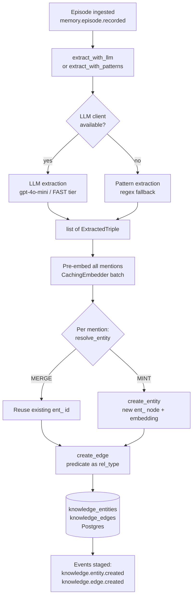

The Knowledge Graph subsystem converts raw episodic text into a queryable, typed graph of entities and relationships. Every ingest triggers an LLM extraction pass (with a rule-based fallback) that produces `(subject, predicate, object)` triples; an entity-resolution stage deduplicates mentions against existing nodes before writing; and the final projection is stored in two Postgres tables that carry full bi-temporal metadata so historical states can be reconstructed. A `graph_context` helper distils the live graph into a compact text summary that the cognition scheduler injects into reflection and narrative prompts.

## Overview

The pipeline runs in four stages triggered for each ingested episode:

1. **Extraction** — an LLM (FAST tier by default) reads episode text and emits structured `(subject, subject_type, predicate, object, object_type, confidence)` JSON. A regex fallback fires only when no LLM client is configured.
2. **Resolution** — each mention is resolved against `knowledge_entities` via exact normalized-name match, then ANN cosine similarity. A `MERGE` result reuses an existing node ID; a `MINT` result creates a new one.
3. **Projection** — resolved entity IDs are written to `knowledge_entities`; edges (predicates) are written to `knowledge_edges`. Both writes stage domain events (`knowledge.entity.created`, `knowledge.edge.created`) inside the same DB transaction.
4. **Densification (passive)** — the graph is kept connected by the HNSW index (`idx_ke_hnsw`) that powers ANN blocking during resolution. Explicit densification passes (embedding similarity + co-occurrence) are not yet implemented as a scheduled job; the embedding column is the hook point for future work. *(This stage is partially speculative — the HNSW index exists and is used for resolution; a scheduled densification worker is planned but not yet shipped.)*



## Data model

### `knowledge_entities`

| Column | Type | Notes |
|---|---|---|
| `id` | `text` PK | ULID with `ent_` prefix, e.g. `ent_01J...` |
| `scope` | `text` NOT NULL | User/workspace scope string, e.g. `user:usr_hiten` |
| `name` | `text` NOT NULL | Canonical surface form of the entity |
| `label` | `text` NOT NULL | Entity type; one of the 12 closed taxonomy values (default `Entity`) |
| `properties` | `jsonb` | Free-form dict; accumulates `aliases`, `mention_count` on merge |
| `embedding` | `vector(1024)` | pgvector column; populated by the embedder at creation time |
| `epistemic_status` | `text` | `canonical` (default), `belief`, or `hypothesis` |
| `valid_from` | `timestamptz` | Bi-temporal valid start (defaults to `now()`) |
| `valid_to` | `timestamptz` | NULL = currently valid; set by `invalidate_entity` for soft-delete |
| `ingested_at` | `timestamptz` | Wall-clock insert time |
| `source_episode_id` | `text` | Episode that first created this node |
| `created_at` | `timestamptz` | Row creation time |

### `knowledge_edges`

| Column | Type | Notes |
|---|---|---|
| `id` | `text` PK | ULID with `cor_` prefix |
| `src_entity_id` | `text` FK | References `knowledge_entities(id)` |
| `dst_entity_id` | `text` FK | References `knowledge_entities(id)` |
| `rel_type` | `text` NOT NULL | Normalized predicate, e.g. `uses`, `works_on`, `is` |
| `properties` | `jsonb` | Carries `confidence` (0.0–1.0) from the extractor |
| `valid_from` | `timestamptz` | Bi-temporal valid start |
| `valid_to` | `timestamptz` | NULL = currently valid |
| `source_episode_id` | `text` | Episode that produced this edge |
| `created_at` | `timestamptz` | Row creation time |

### Entity type taxonomy

The closed set is declared in `knowledge/extraction/__init__.py` as `ENTITY_LABELS`:

```
Person, Organization, Project, Tool, Skill,
Concept, Place, Event, Health, Media, Activity, Other
```

`normalize_label(raw)` maps any free-form string to this set, falling back to `"Other"`.

### Bi-temporal design

Both tables use `(valid_from, valid_to)` columns. A row is "live" when `valid_to IS NULL`. Soft-deleting an entity or edge sets `valid_to = now()` and stages an invalidation event rather than physically removing the row. Historical snapshots can be reconstructed by filtering on any timestamp window.

### Inferred-edge provenance

Edges produced by resolution (ANN merge path) carry no special marker beyond `source_episode_id`. The `properties.confidence` field from the LLM extractor is preserved on every edge so downstream consumers can threshold by certainty. *(A dedicated `inferred` flag or `provenance` column does not currently exist — confidence is the only quality signal.)*

### Indexes

```sql
idx_ke_scope_label  -- (scope, label) WHERE valid_to IS NULL
idx_ke_name         -- (name)         WHERE valid_to IS NULL
idx_ke_hnsw         -- HNSW on embedding vector_cosine_ops (m=32, ef_construction=200)
idx_kedge_src       -- (src_entity_id) WHERE valid_to IS NULL
idx_kedge_dst       -- (dst_entity_id) WHERE valid_to IS NULL
idx_kedge_rel       -- (rel_type)      WHERE valid_to IS NULL
```

## Extraction

**Module:** `knowledge/extraction/__init__.py`

### Functions

```python
async def extract_with_llm(
    episode_content: str,
    source_episode_id: str,
    llm_client: Any = None,
    model: str | None = None,
) -> list[ExtractedTriple]
```

Sends `episode_content` to the LLM using `EXTRACTION_PROMPT` (the prompt uses `.replace("{text}", ...)` not `.format()` because the prompt body contains literal JSON curly braces). Parses the JSON response via `shared.llm.json_records`, which tolerates truncation and fenced code blocks. Returns at most `~5` triples per sentence; confidence is clamped to `[0.0, 1.0]`. If `llm_client` is `None` it delegates to `extract_with_patterns`. If the LLM call raises any exception it logs a warning and returns an empty list — it does **not** fall back to patterns, to avoid polluting the graph with regex noise when a real client was configured.

```python
def extract_with_patterns(
    episode_content: str,
    source_episode_id: str,
) -> list[ExtractedTriple]
```

Rule-based fallback. Matches two regex patterns: `"X uses/prefers/loves/works on Y"` and `"X is/are Y"`. Every candidate span is passed through `_looks_like_entity` before being accepted.

```python
def _looks_like_entity(s: str) -> bool
```

Rejects spans longer than 40 characters or more than 4 words. Prevents sentence fragments from becoming graph nodes on the regex path.

```python
def normalize_label(raw: str | None) -> str
```

Maps a free-form type string (case-insensitive) to the closed `ENTITY_LABELS` taxonomy. Unknown values return `"Other"`.

### `ExtractedTriple` dataclass

```python
@dataclass
class ExtractedTriple:
    subject: str
    predicate: str          # normalized: lowercase + underscores
    object: str
    confidence: float       # 0.0–1.0
    source_episode_id: str
    source_text: str = ""   # first 200 chars of episode for provenance
    subject_type: str = "Other"
    object_type: str = "Other"
```

### LLM tier used for extraction

Extraction calls `_make_llm_client()` with no tier argument, which resolves to the **FAST** tier. Environment variables (in precedence order):

- `CURLYOS_LLM_API_KEY` (then `OPENROUTER_API_KEY`)
- `CURLYOS_LLM_BASE_URL` (default `https://openrouter.ai/api/v1`)
- `CURLYOS_LLM_MODEL` (default `openai/gpt-4o-mini` inside `extract_with_llm`)

The model call uses `temperature=0.1`, `max_tokens=2048`, and `response_format={"type": "json_object"}`.

### Prompt

`EXTRACTION_PROMPT` instructs the model to return `{"triples": [...]}` where each element has `subject`, `subject_type`, `predicate`, `object`, `object_type`, and `confidence`. The prompt is injected via string replacement, not `.format()`.

### Batching

There is no episode batching — `extract_with_llm` is called once per episode, inline in `_process_episode_bg`. Pre-embedding of mentions is batched: `extract_and_project` collects all distinct subject/object strings from the triple list and issues a single `embedder.embed(...)` call via `CachingEmbedder` before the resolution loop, so resolution and entity creation reuse cached vectors.

## Resolution

**Module:** `knowledge/resolution/__init__.py`

### `ResolutionDecision` enum

```python
class ResolutionDecision(StrEnum):
    MERGE = "merge"       # Link to returned existing entity id
    MINT  = "mint"        # Create a new entity
    AMBIGUOUS = "ambiguous"  # Reserved; not yet emitted
```

### Functions

```python
async def resolve_entity(
    mention: str,
    scope: str = DEFAULT_SCOPE,
    pool: Any = None,
    embedder: Any = None,
    similarity_threshold: float = 0.85,
) -> tuple[ResolutionDecision, str | None]
```

Two-stage resolution:

1. **Exact match** — `lower(name) = normalize_mention(mention)` on live rows in scope (ordered `created_at ASC` so repeated resolution always converges to the oldest canonical node).
2. **ANN blocking** — embeds the mention and queries `embedding <=> vec` via `idx_ke_hnsw`. Returns MERGE if `1 - cosine_distance >= similarity_threshold` (default `0.85`). Only runs if `embedder` is not `None` and the entity has a stored embedding.

If `pool` is `None` (offline/test) the function always returns `(MINT, None)`. Both resolution stages are wrapped in broad exception handlers that log warnings rather than raising — resolution failures must never abort ingest.

```python
def normalize_mention(mention: str) -> str
```

Strips, lowercases, and collapses whitespace. Used for exact-match comparison and as a within-episode dedup key in `extract_and_project`.

### Canonicalization

The `merge_entity` function (in `knowledge/graph/__init__.py`, exposed for compatibility) adds the new name string to `properties.aliases[]` and increments `properties.mention_count`. No semantic merge of properties is performed.

### Within-episode dedup

`extract_and_project` maintains a `seen: dict[str, str]` cache (normalized mention → entity id) for the duration of one episode's processing. This eliminates redundant DB lookups and handles the read-after-write gap that would occur if the same mention appears twice in a single episode.

## Graph projection

**Module:** `knowledge/graph/__init__.py`

### Core write functions

```python
async def create_entity(
    pool: Any,
    publisher: Any,
    scope: str,
    name: str,
    label: str = "Entity",
    properties: dict | None = None,
    source_episode_id: str | None = None,
    epistemic_status: str = "canonical",
    embedder: Any = None,
) -> dict
```

Mints a `ent_` ULID, optionally generates a 1024-dim embedding via `embedder.embed_single(name + json(props))`, inserts into `knowledge_entities`, and stages a `knowledge.entity.created` event inside the same transaction. Returns the full row as a dict.

```python
async def create_edge(
    pool: Any,
    publisher: Any,
    src_entity_id: str,
    dst_entity_id: str,
    rel_type: str,
    properties: dict | None = None,
    source_episode_id: str | None = None,
) -> dict
```

Mints a `cor_` ULID, validates both endpoint entity IDs exist (raises `ValueError` if not), inserts into `knowledge_edges`, and stages a `knowledge.edge.created` event. Self-loop edges (`s_id == o_id`) are silently dropped in `extract_and_project`.

### Soft-delete (bi-temporal invalidation)

```python
async def invalidate_entity(pool, publisher, entity_id) -> dict
async def invalidate_edge(pool, publisher, edge_id) -> dict
```

Set `valid_to = now()` on the target row and stage `knowledge.entity.invalidated` / `knowledge.edge.invalidated` events. The row is retained; queries filter `valid_to IS NULL` for live data.

### Read / traversal functions

```python
async def get_entity(pool: Any, entity_id: str) -> dict | None
```

Fetch one entity by primary key. Returns `None` if not found.

```python
async def search_entities(
    pool: Any,
    scope: str,
    query: str | None = None,
    label: str | None = None,
    limit: int = 20,
) -> list[dict]
```

ILIKE search on `name`, optionally filtered by `label`. Orders by `created_at DESC`. Dense vector search is a planned future enhancement.

```python
async def get_neighbors(
    pool: Any,
    entity_id: str,
    rel_type: str | None = None,
    direction: str = "both",  # "outgoing" | "incoming" | "both"
    limit: int = 20,
) -> list[dict]
```

Returns `[{"entity": ..., "edge": ...}]` for the immediate neighbourhood. `direction="both"` issues a `UNION ALL` of outgoing and incoming queries.

```python
async def k_hop_expand(
    pool: Any,
    entity_ids: list[str],
    k: int = 1,
    scope: str | None = None,
) -> set[str]
```

Recursive CTE (`WITH RECURSIVE expansion AS (...)`) that walks up to `k` hops from seed entity IDs. Returns a set of discovered entity IDs (seeds excluded). Scope-filters via a join on `knowledge_entities` when `scope` is provided.

```python
async def graph_context(
    pool: Any,
    scope: str,
    top_n: int = 25,
    max_rels: int = 4,
) -> str
```

Produces a compact markdown-style text summary of the live graph for cognition prompts. Selects the `top_n` highest-degree entities and up to `max_rels` outgoing relations each. Returns an empty string if the graph is empty. Format: `"- EntityName [Label]: rel_type→Target; ..."`.

### Pipeline entry point

```python
async def extract_and_project(
    pool: Any,
    publisher: Any,
    scope: str,
    episode_id: str,
    episode_content: str,
    embedder: Any = None,
    llm_client: Any = None,
) -> dict
```

The single function called by the ingest background worker. Orchestrates extraction → mention pre-embedding → within-episode dedup → per-mention resolve/mint → edge creation. Returns `{"triples_extracted": int, "entities_created": int, "entities_merged": int, "edges_created": int}`.

### Densification

The HNSW index (`idx_ke_hnsw`) enables ANN-based entity resolution, which is the primary mechanism keeping the graph connected: mentions that are semantically near existing nodes merge into them rather than spawning isolated duplicates. A dedicated scheduled densification pass (embedding similarity + co-occurrence over the full entity set) is **not yet implemented**. The `embedding` column and HNSW index are the designed hook points for this future work.

### Orphan avoidance

`create_edge` validates both endpoint IDs exist before inserting. `extract_and_project` skips edges where either endpoint resolved to `None` (e.g. too-short mention) or where `s_id == o_id`. The REST `GET /api/graph` endpoint post-filters edges client-side to drop any links whose endpoint falls outside the returned node window (possible when the limit truncates the node list).

## Public API surface

Functions intended for consumption by other modules:

| Function | Module | Used by |
|---|---|---|
| `extract_and_project` | `knowledge.graph` | `api_server._process_episode_bg`, backfill scripts |
| `graph_context` | `knowledge.graph` | Cognition scheduler (reflection/narrative prompts) |
| `create_entity` | `knowledge.graph` | `extract_and_project`, resolution tests |
| `create_edge` | `knowledge.graph` | `extract_and_project` |
| `get_entity` | `knowledge.graph` | REST expand route |
| `search_entities` | `knowledge.graph` | Future semantic search |
| `get_neighbors` | `knowledge.graph` | REST expand route, GraphRAG |
| `k_hop_expand` | `knowledge.graph` | REST expand route |
| `invalidate_entity` | `knowledge.graph` | Admin / correction flows |
| `invalidate_edge` | `knowledge.graph` | Admin / correction flows |
| `resolve_entity` | `knowledge.resolution` | `extract_and_project` |
| `normalize_mention` | `knowledge.resolution` | `extract_and_project` |
| `extract_with_llm` | `knowledge.extraction` | `extract_and_project` |
| `extract_with_patterns` | `knowledge.extraction` | `extract_with_llm` fallback |
| `normalize_label` | `knowledge.extraction` | `extract_with_llm` |

Events emitted (consumed by other subsystems via the event bus):

- `knowledge.entity.created`
- `knowledge.entity.invalidated`
- `knowledge.edge.created`
- `knowledge.edge.invalidated`

Events consumed:

- `memory.episode.recorded` (triggers `_process_episode_bg`)
- `memory.fact.stored` (documented as a future trigger in `knowledge/__init__.py`)

## Related REST endpoints

### `GET /api/graph`

Returns the full live graph for a scope, ordered by degree (hub-first) to preserve the most-connected nodes under truncation.

**Query params:**
- `scope` — user scope string (default: server-configured `SCOPE`)
- `limit` — max nodes to return (default `20000`, max `50000`)

**Response:**
```json
{
  "nodes": [{"id": "ent_...", "name": "...", "label": "...", "degree": 12}],
  "links": [{"source": "ent_...", "target": "ent_...", "rel_type": "uses"}]
}
```

Edges are post-filtered so both endpoints are always within the returned node set.

### `GET /api/graph/{entity_id}/expand`

BFS expansion from a single seed node up to `k` hops.

**Path param:** `entity_id` — a `knowledge_entities.id` value  
**Query param:** `k` — hop depth (default `1`, max `3`)

**Response:**
```json
{
  "entities": [{"id": "...", "name": "...", "label": "...", "properties": {}, "epistemic_status": "canonical"}],
  "edges":    [{"id": "...", "src_entity_id": "...", "dst_entity_id": "...", "rel_type": "..."}]
}
```

Implementation uses iterative BFS (not the `k_hop_expand` recursive CTE) and includes the seed entity in the returned set.

### Extraction trigger (implicit)

Knowledge extraction is not a standalone REST endpoint — it is triggered automatically on every `POST /api/ingest` call unless the request body contains `"extract_knowledge": false` or the setting `kg_extraction_enabled` is `false`. The ingest endpoint queues `_process_episode_bg` as a background task after returning the HTTP response.

## Configuration and settings

### Database setting

| Key | Type | Default | Description |
|---|---|---|---|
| `kg_extraction_enabled` | `bool` | `true` | Master switch; set to `false` to disable all KG extraction on ingest |

Readable/writable via `GET /api/settings` and `PUT /api/settings`. Managed by `shared/settings.py`.

### Environment variables (FAST tier — used by extraction)

| Variable | Default | Notes |
|---|---|---|
| `CURLYOS_LLM_API_KEY` | — | Falls back to `OPENROUTER_API_KEY` |
| `CURLYOS_LLM_BASE_URL` | `https://openrouter.ai/api/v1` | Override for self-hosted endpoints |
| `CURLYOS_LLM_MODEL` | `openai/gpt-4o-mini` | Model used by `extract_with_llm` |

### Per-request flag

`POST /api/ingest` accepts `"extract_knowledge": false` in the request body to skip graph extraction for a single episode without changing the global setting. Both the per-request flag AND `kg_extraction_enabled` must be truthy for extraction to run.

### Similarity threshold

The ANN resolution threshold (`0.85` by default) is a hardcoded argument default in `resolve_entity`. It is not currently exposed as a settings key or environment variable. Adjust by patching the call site in `extract_and_project` if needed.

## Gotchas and edge cases

**LLM failure returns empty, not garbage.** When an LLM client is configured but the API call fails (network error, rate limit, etc.), `extract_with_llm` returns `[]`. It does **not** fall back to pattern extraction. This is intentional: the regex extractor can produce sentence-fragment "entities" and pollute the graph. The episode can be re-extracted by reprocessing the event.

**Pattern extractor is offline-only.** `extract_with_patterns` is only called when `llm_client is None`. If you see regex-derived entities in a production graph, no LLM client was configured at ingest time.

**Prompt uses `.replace`, not `.format`.** `EXTRACTION_PROMPT` contains literal JSON example syntax with curly braces. Using `str.format()` would interpret those as template fields and raise `KeyError`. The injection is `EXTRACTION_PROMPT.replace("{text}", episode_content)`.

**`_make_llm_client` is called without a tier for extraction.** This resolves to the FAST tier. If `CURLYOS_LLM_API_KEY` is unset but `OPENROUTER_API_KEY` is set, extraction will use OpenRouter. If neither is set, `_make_llm_client` returns `(None, "")` and extraction falls through to `extract_with_patterns`.

**UNION ALL param binding in `get_neighbors(direction="both")`.** The branch parameters are duplicated manually (`branch_params + branch_params + [limit]`) because the `UNION ALL` query has two independent `WHERE` clauses. If `rel_type` is added, both branches need it.

**`knowledge_edges` has no `scope` column.** Edges inherit scope through their `src_entity_id` foreign key. The observability endpoint (`GET /api/pipeline`) counts edges by joining `knowledge_edges` to `knowledge_entities` on `src_entity_id`. Any direct edge query that needs scope-isolation must replicate this join.

**Entity limit default was historically too low.** The `GET /api/graph` default was originally `1500`, which silently truncated the graph once it grew. It is now `20000`. If the graph exceeds this, the webapp will silently show a partial view — raise the limit or implement server-side pagination.

**Embedder `embed_single` vs `embed`.** `create_entity` explicitly calls `embedder.embed_single(text)` rather than `embedder.embed([text])[0]`. The latter accidentally worked before but is incorrect — `embed()` expects a list and the return type is a list-of-vectors. The correct single-item call is `embed_single`.

**`AMBIGUOUS` decision is reserved but never emitted.** The `ResolutionDecision.AMBIGUOUS` variant exists for future use (e.g. two candidates above threshold). Currently `resolve_entity` only returns `MERGE` or `MINT`.

**Neo4j swap-in is designed but not implemented.** `knowledge/graph/__init__.py` documents a `GraphStore ABC` interface, but no ABC is defined in the current code. All implementations use the Postgres tables directly. The Neo4j path mentioned in the module docstring is aspirational.
