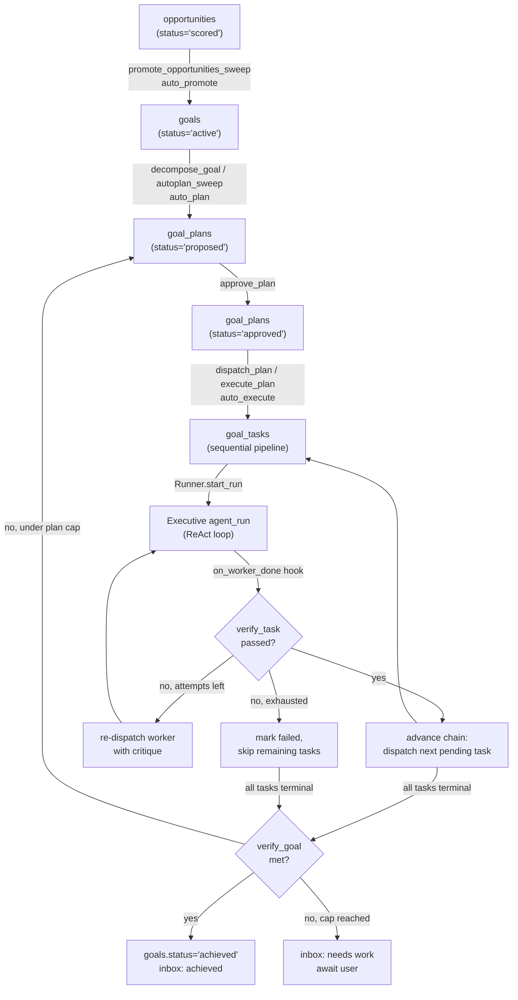
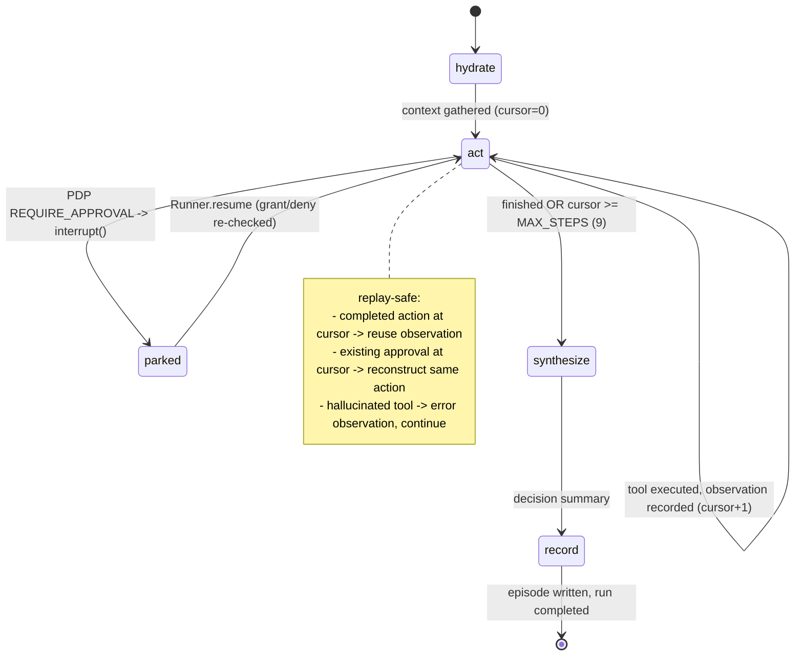

The Orchestration subsystem is CurlyOS Core's autonomous-agent engine — the most complex subsystem in the codebase. It is the layer that decides *when* cognition runs and *how* goals turn into real work on the machine. It takes a `goal`, decomposes it into a small plan of concrete worker tasks, dispatches each task to an **Executive** agent that runs a ReAct-style loop on the **agentic** LLM tier (over LangGraph with a Postgres checkpointer), executes real file and shell tools inside a home-confined sandbox, then *verifies* the actual outcome against the task's success criteria — retrying with a critique on failure and re-planning at the goal level until the goal is genuinely achieved.

Wrapped around that execution core is an autonomous lifecycle (`opportunity -> goal -> plan -> agent -> verify -> repeat`) and an in-process **scheduler** that owns the cadence of all native cognition (consolidation, reflection, meta-audit, narrative, attention) plus the autonomous-planning sweeps and approval housekeeping. This scheduler — not Hermes cron — is the cognitive heartbeat of the OS.

> Note on design intent: the file `docs/orchestration-plan.md` describes an *earlier, different* design (a supervisor/worker multi-agent team under `cognition/orchestration/`, with a Telegram conversation plane). The shipped code in `orchestration/` is a later evolution of that plan: a single Executive ReAct runner plus a goal-orchestrator and scheduler. Where the two diverge, this document describes the shipped code.

## Overview

There are two interlocking loops.

**1. The agentic-tier ReAct runner (per-task execution).** A `Runner` owns the `agent_runs` row lifecycle and drives a compiled LangGraph state graph for each run. The graph is `hydrate -> act-loop -> synthesize -> record`. The `act` node does *not* plan the whole task up front; it decides ONE action at a time (decide -> execute -> observe -> decide), so each decision sees the real results of prior steps. Every side-effecting tool call passes the PDP (Policy Decision Point); an action requiring approval parks the run via LangGraph `interrupt()`, and a grant/deny resumes it. Tool execution writes a hash-chained `actions -> observations -> tool_calls` audit trail, giving exactly-once side effects across crashes and resumes.

**2. The autonomous lifecycle (goal orchestration).** The orchestrator turns a goal into a proposed plan (`decompose_goal`), the plan is approved and dispatched as a *sequential pipeline* of worker runs, and each finished worker is VERIFIED before the next task is unlocked. When the whole plan finishes, the goal itself is verified: achieved -> notify the user; not-met -> deliver the gap to the inbox and (bounded) re-plan. The front of the lifecycle promotes high-scoring `opportunities` into goals; the scheduler's `orchestrator_autoplan` job ties the whole chain together so it can run end-to-end without a human click (gated by the `auto_promote` / `auto_plan` / `auto_execute` settings).

## Components

### orchestrator (`orchestration/orchestrator.py`)

The goal-execution orchestrator. Turns a goal into a plan of concrete tasks, dispatches each task to a worker (an Executive `agent_run` tagged with `goal_id`), and aggregates worker outcomes back into goal progress. Plan-then-approve: `decompose_goal` proposes a plan (status `proposed`); nothing runs until `approve_plan`, then dispatch starts workers. Every state change emits an event (`goal.plan.*`, `goal.task.*`, `goal.progress`, `goal.achieved`, `goal.needs_work`).

Key functions and signatures:

- `decompose_goal(*, pool, publisher, llm, scope, goal_id, guidance: str | None = None, notify_inbox: bool = True) -> dict` — LLM-decomposes a goal into a proposed plan of 2-6 worker tasks (capped at 6), each paired with a `verify` success test. Supersedes any live plan for the goal (`UPDATE goal_plans SET status='abandoned' WHERE status IN ('proposed','approved','executing')`). Drops a `kind='plan'` inbox item. Returns `{plan_id, goal_id, rationale, task_count}` or `{error}`.
- `approve_plan(*, pool, publisher, scope, plan_id) -> dict` — `proposed -> approved`; emits `goal.plan.approved`.
- `dispatch_task(*, pool, publisher, runner, scope, task_id, autonomy: str | None = None) -> dict` — starts ONE worker via `runner.start_run`. Places the goal into a workspace/project (best-effort `workspace.hierarchy.place_goal`) and prepends a WORKING DIRECTORY preamble + `save_artifact` instruction to the task. Sets the task to `running`, the plan to `executing`.
- `dispatch_plan(*, pool, publisher, runner, scope, plan_id, autonomy=None) -> dict` — starts the plan as a SEQUENTIAL pipeline: dispatches only the first pending task; later tasks chain via `on_worker_done`.
- `execute_plan(*, pool, publisher, runner, scope, plan_id) -> dict` — the one-click inbox/chat path: approve-if-needed then `dispatch_plan(autonomy="full_auto")` so the plan runs end-to-end without per-action approval (regardless of the global bypass).
- `promote_opportunities_sweep(*, pool, publisher, scope, max_promote: int = 2, min_score: float = 0.6) -> dict` — promotes `scored` opportunities at/above `min_score` into goals; respects `auto_promote` (default on). Creates goals only — it executes nothing.
- `autoplan_sweep(*, pool, publisher, llm, scope, max_goals: int = 3, runner=None) -> dict` — decomposes active unplanned goals (respects `auto_plan`, default on); when `auto_execute` is on AND a runner is available, also approves+dispatches `proposed` plans (`execute_plan`), bounded by `AUTO_EXECUTE_PER_SWEEP`.
- `on_worker_done(pool_factory, publisher_factory, scope, run_id, status, *, get_runner=None, llm=None) -> None` — the Runner `on_run_event` hook. VERIFIES the run's real outcome (`verify_task`), then: pass -> complete the task and advance the chain; fail with attempts left -> re-dispatch with critique; fail exhausted -> mark failed and skip remaining pending tasks. Parked -> reflect and stop (resumes later). Idempotent and never raises into the run loop.
- `orchestrator_chat(*, pool, publisher, llm, runner, scope, message, goal_id=None, project_id=None) -> dict` — natural-language command interpreter (LLM-classified action `decompose | approve | dispatch | status | none` with a keyword fallback `_heuristic_action`). Persists both sides to `orchestrator_messages`.
- Reads: `get_plan(pool, scope, goal_id)`, `overview(pool, scope)`, `list_messages(...)`, `get_artifacts(pool, scope, goal_id)`.

Important constants:

- `MAX_GOAL_PLANS = 3` — a goal is auto-re-planned at most 3 times before it stops and awaits the user.
- `AUTO_EXECUTE_PER_SWEEP = 3` — cap on proposed plans auto-dispatched per sweep (avoid stampeding the runner).
- `_TASK_STATUS` — run-status -> task-status mapping (`completed/failed/parked`; `cancelled -> skipped`).
- `_WRITE_TOOLS` — maps write-class tools to artifact types for `get_artifacts`.

### runner (`orchestration/runner.py`)

The run executor. Owns the `agent_runs` row lifecycle, bounded concurrency, drain-on-shutdown, and startup recovery. The run-row state machine (runner-owned; the graph owns cognition) is: `running -> parked (interrupt) -> running (resume) -> completed | failed`, and `running -> cancelled`.

`class Runner` constructor takes `dsn`, `scope`, the infra factories (`pool_factory`, `publisher_factory`, `redis_factory`, `embedder_factory`), `llm`, `notifier`, `max_concurrent: int = 2`, and an optional `on_run_event` hook.

Key methods:

- `start() -> None` — opens a dedicated checkpointer pool (`AsyncConnectionPool(min_size=1, max_size=4, kwargs={"autocommit": True, "prepare_threshold": 0, "row_factory": dict_row})`), builds the `AsyncPostgresSaver` and calls `saver.setup()`, compiles the graph via `make_graph(get_deps, llm, saver)`, then runs `_recover()`.
- `start_run(task, *, source="api", goal_id=None, autonomy: str | None = None) -> str` — mints a `run` id, inserts an `agent_runs` row (agent `'Executive'`, status `running`), emits `agent.run.started`, and spawns `_drive`. `autonomy=None` resolves via `_resolve_autonomy()` (the global `AGENT_BYPASS` setting: on -> `full_auto`, else `confirm_each`).
- `resume(run_id) -> bool` — the ONE resume primitive: `parked -> running`, then re-invokes the checkpointed graph with `Command(resume="wake")` on `thread_id=run_id`. Returns False if not parked.
- `cancel(run_id, reason="user_cancelled") -> bool`.
- `_drive(run_id, graph_input)` — runs `graph.ainvoke(graph_input, config={"configurable": {"thread_id": run_id}, "recursion_limit": 50})` under a `Semaphore(max_concurrent)`. An `__interrupt__` in the result -> `_park`; otherwise `_finish(completed)`.
- `_park` — sets status `parked`, notifies the user with the approval id and a reply hint, fires `_emit_run_event(run_id, "parked")`.
- `_finish(run_id, status, decision, error)` — writes `result`/`error`/`finished_at`, emits `agent.run.completed`/`agent.run.failed`, fires the run-event hook.
- `_recover()` — on start, re-drives any `Executive` runs left `running` by a crash (None input continues from the last checkpoint). `parked` runs stay parked.
- `snapshot() -> dict` — in-flight run ids, draining flag, llm presence.

### graph (`orchestration/graph.py`) — the LangGraph state graph

The Executive graph. Nodes are thin adapters; every domain operation is reached through the tool registry. The graph: `START -> hydrate -> act -> (conditional: act | synthesize) -> synthesize -> record -> END`.

State (`class AgentState(TypedDict, total=False)`): `run_id`, `scope`, `task`, `context`, `autonomy`, `cursor` (loop index = count of actions taken), `finished`, `history` (annotated with an `_append` reducer), `decision`.

Nodes:

- `hydrate` — assembles context via the tool registry: `recall` (top 8), `get_identity`, `list_goals`, `recall_lessons`. Returns `{context, cursor: 0, finished: False}`. Context capped at 6000 chars.
- `act` — the ReAct step. Replay-safe: first checks for a completed action at this `cursor` (reuse its observation), then for an existing approval at this `cursor` (reconstruct the SAME action deterministically, no second LLM call). Otherwise `_decide_next` asks the model for the single next action. The chosen tool is run through the PDP via `agent.pdp_gate.evaluate(...)`; `REQUIRE_APPROVAL` parks via a loop around `interrupt(park_payload)` that re-checks the approval state until it leaves `pending`. On `ALLOW`, executes the tool and writes the hash-chained `insert_action` / `insert_observation` / `insert_tool_call` rows. Results over 15,000 chars are stored as `{truncated, preview}`.
- `route_after_act(state) -> "synthesize" | "act"` — terminates when `finished` or `cursor >= MAX_STEPS`.
- `synthesize` — LLM-summarizes what the run accomplished (with a deterministic fallback); returns `{decision: {summary, steps, denied}}`.
- `record` — writes the run outcome as an episode (`memory.governance.record_episode`) — every run is an episode.

`make_graph(get_deps, llm, checkpointer)` builds and `compile(checkpointer=...)`s the graph. `parse_next_action(text)` parses the model's reply from JSON, a plan array (first usable step), or native tool-call markup (`<..._tool_call>` / `<..._arg_key>` regexes) into `{"tool","args","why"}` | `{"done": True}` | `None`. `_render_history(history, budget=4000)` renders a compact, result-bearing view of prior steps (keeps the newest if over budget).

Important constants:

- `MAX_STEPS = 9` — room to read -> write -> build/verify -> commit. A budget nudge is injected once `cursor >= 2` and `<= 4` steps remain to push the model to produce the deliverable.
- `RUN_AUTONOMY = "confirm_each"` — the Phase-A ceiling and `act`'s autonomy fallback.
- Active prompt lookup: `act` calls `evolution.get_active_prompt(pool, scope, "executive.act", _DECIDE_SYSTEM)`.

### tools (`orchestration/tools.py`)

The Executive's typed, action-classed tool registry. Each `Tool` declares a PDP `action_class`, a one-line planner-facing `description` + compact `params`, an async `fn(deps, args) -> dict`, and (for net_egress) an `egress_host`. `ToolDeps` is the per-run infra bundle (`pool`, `publisher`, `redis`, `notifier`, `scope`, `run_id`, `embedder_factory`).

The `REGISTRY` (tool name -> `Tool`), grouped by action class:

| Tool | action_class | Purpose |
| --- | --- | --- |
| `recall` | `read` | Hybrid semantic+keyword memory search (`memory.retrieval.retrieve`, mode `fast`). |
| `search_graph` | `read` | Find knowledge-graph entities by name (degree-ranked). |
| `list_goals` | `read` | List goals with progress and criteria. |
| `get_identity` | `read` | Current identity facts. |
| `read_file` | `read` | Read a UTF-8 file under home (capped 30,000 chars). |
| `list_dir` | `read` | List a directory under home (first 200 entries). |
| `recall_lessons` | `read` | Lessons from past decisions relevant to a query. |
| `remember` | `memory_write` | Store a fact/insight (episode + recallable memory). |
| `record_decision` | `memory_write` | Record a decision in the registry. |
| `review_decision` | `memory_write` | Close a decision: outcome + optional distilled lesson. |
| `create_goal` | `memory_write` | Create a new goal. |
| `create_sketch` | `memory_write` | Write a sketch into the studio. |
| `write_file` | `file_edit` | Create/overwrite a file (parent dirs auto-created). |
| `edit_file` | `file_edit` | Replace one exact, unique substring (surgical edit). |
| `save_artifact` | `file_edit` | Register a tangible deliverable in the goal's studio. |
| `run_command` | `code_exec` | Run an allowlisted build/test/git-local command. |
| `git_commit` | `code_exec` | Stage all + commit (local only, never push). |
| `notify` | `external_post` | Send the user a notification. |
| `git_push` | `external_post` | Push to a remote (DEPLOYS LIVE) — PDP forces approval even under bypass. |
| `web_research` | `net_egress` | Web research, delegated to Hermes (egress_host `127.0.0.1`). |
| `browse` | `net_egress` | Visit a URL + extract, delegated to Hermes. |
| `generate_image` | `net_egress` | Image generation, delegated to Hermes. |
| `delegate_to_hermes` | `net_egress` | Escape hatch: hand an arbitrary sub-task to Hermes. |

Helpers: `planner_tool_block()` renders the registry for the planner prompt; `execute_tool(name, deps, args) -> dict` dispatches and turns any tool exception into an `{error}` observation rather than crashing the run. The four Hermes-delegated tools call `hermes_integration.hermes_client.complete(...)` — actual internet egress happens inside Hermes (`127.0.0.1:8642`), so from CurlyOS this is a localhost call.

### sandbox (`orchestration/sandbox.py`)

The action sandbox — the safety boundary BELOW the PDP. Even a `full_auto` (bypass) run cannot escape home or run an un-allowlisted command, because the tool refuses and returns an error observation.

- `resolve_in_home(path) -> Path` — realpath-resolves a path, requires it under `$HOME` (symlinks cannot hop out), and rejects credential stores via `_DENY_DIRS` (`.ssh`, `.aws`, `.gnupg`, `.config/gcloud`, `.kube`, `.docker`) and `_DENY_NAME_HINTS` (`id_rsa`, `id_ed25519`, `.pem`, `credentials`, `.npmrc`, `.pypirc`). Raises `ValueError` otherwise.
- `check_command(command) -> (ok, reason)` — allows `&&`-chained allowlisted commands; rejects every other chaining/redirection form. `_FORBIDDEN_TOKENS` = `;`, `||`, `|`, `>`, `<`, backtick, `$(`, `&`, newline.
- `run_command(command, cwd=None, timeout=CMD_TIMEOUT) -> dict` — runs each `&&` segment via `create_subprocess_exec` (NO shell), short-circuiting on the first non-zero exit. Returns `{exit_code, stdout, stderr, timed_out, cwd}`; never raises for a non-zero exit (that is a normal observation). Env forces `GIT_TERMINAL_PROMPT=0` and `CI=1`.

Allowlists: `_ALLOWED_CMDS` (ls/cat/grep/find/node/python/tsc/npm/pnpm/yarn/npx/git/...). For npm/pnpm/yarn/npx: install/add/ci/update/upgrade/remove/uninstall are blocked (they hit the network); npm/pnpm subcommands must be in `_ALLOWED_PKG_SUB` (`run/test/build/lint/exec/start/typecheck/tsc`). For git: `push` is deliberately ABSENT — only `_ALLOWED_GIT_SUB` local subcommands. Constants: `CMD_TIMEOUT = 180` s, `_MAX_OUTPUT = 12_000` chars.

### verify (`orchestration/verify.py`)

The feedback half of the loop. A worker finishing is not the same as the task being achieved; the verifier reads what the run actually DID (its `tool_calls`: files written, commands run + exit codes, errors) and judges against the success criteria. LLM-judged with a deterministic fallback ("passed unless the evidence shows an error / non-zero exit").

- `verify_task(*, pool, llm, scope, task, run_id, run_status, now, summary=None) -> dict` — returns `{passed, critique, evidence, at}`. Hard rejects when `run_status == "failed"`. Deterministic signals: `_has_failure(calls)` (any tool error or non-zero exit) and `_produced_artifact(calls)`.
- `verify_goal(*, pool, llm, scope, goal, tasks, artifacts) -> dict` — returns `{passed, critique}`; fallback is "all tasks completed".
- `_ACTION_TOOLS = {"write_file", "edit_file", "run_command", "git_commit", "git_push"}` — the calls a verifier weighs as evidence.

### scheduler (`orchestration/scheduler.py`)

The in-process scheduler — the OS's cognitive heartbeat, replacing Hermes cron. One code-defined job table drives every background behavior. Every firing is wrapped in an `agent_runs` row (agent `workflow:<name>`) plus `agent.run.started/completed/failed` events, so Mission Control sees background cognition with the same trace surface as interactive runs.

Cadence dataclasses, each with `next_due(after, last_fired) -> datetime` and `display() -> str`:

- `Every(minutes)` — first firing is one interval after boot (no boot storms).
- `DailyAt("HH:MM")`, `WeeklyAt(weekdays: tuple[int,...], "HH:MM")` (0=Mon), `MonthlyAt(day: 1..28, "HH:MM")`.

Cadences are computed in HOST LOCAL TIME (the box runs IST).

`class Job` — `name`, `cadence`, `fn: () -> Awaitable[dict]`, optional `period_guard: () -> Awaitable[bool]` (True = this period's output already exists -> skip), `enabled`, plus scheduler-owned mutable state (`last_fired`, `last_status`, `last_error`, `last_run_id`, `consecutive_failures`, `next_due`).

`class Scheduler(jobs, *, scope, pool_factory, publisher_factory, redis_factory, notifier=None)`:

- `start()` / `stop()` — single asyncio loop. `_loop()` re-reads `self.jobs` each tick (sleep clamped to 1-60 s), so the live job list can be mutated between ticks (this is how user jobs register without a restart).
- `fire(job)` — lock -> period guard -> open run row -> `fn()` -> close out. Per-job single-flight via a Redis `lock:sched:<name>` (`SET NX EX`, TTL `_LOCK_TTL_S = 3600`). With Redis absent the scheduler still runs (single process). Failures never kill the loop: the run row records the error, the notifier gets one ping (`_notify_failure`), and the job waits for its next slot. Statuses: `completed | failed | skipped_locked | skipped_period_done`.
- `snapshot()` — the `/api/scheduler` payload.

### user_jobs (`orchestration/user_jobs.py`)

The user-defined layer over `scheduled_jobs` rows — the webapp-managed jobs. Each row becomes a `scheduler.Job` whose `fn` routes the row's natural-language `task` through the Executive agent (`Runner.start_run`) — the same engine as an interactive run — and delivers the synthesized output as an `inbox_items` row when the run reaches a true terminal state.

- `parse_cadence(cadence_type, cadence_json)` -> a cadence object; raises `ValueError` on malformed input. `MIN_INTERVAL_MINUTES = 5` floors `Every` so a "every 1 minute" cannot hammer the LLM.
- `make_job_fn(*, job_id, scope, name, task, get_runner, pool_factory)` — builds `Job.fn`. It starts the run, marks the job `running` with the inner run id immediately (so the webapp shows live progress), and does NOT wait — delivery happens later via the runner hook. This is what lets a run that PARKS for approval (and finishes hours later) still deliver its real output.
- `deliver_run_output(pool_factory, run_id, status)` — the runner park/completion hook. Syncs the owning scheduled job's `last_status`; on a true terminal state (`completed`/`failed`) delivers output to the inbox exactly once (dedup on `run_id`). No-op for interactive runs; idempotent.
- `reconcile_deliveries(pool_factory)` — startup catch-up: replays every job's last run through `deliver_run_output` to heal anything missed during a restart window.
- `build_job(row, *, get_runner, pool_factory)`, `load_user_jobs(pool, *, get_runner, pool_factory)`, and live (re)registration helpers `register_job` / `unregister_job` / `find_job` (job scheduler names are `user:<sjob_id>`).
- `_extract_summary(result)` — pulls synthesized text from `agent_runs.result` (keys tried: `summary, answer, output, narrative, text`).

### evolution (`orchestration/evolution.py`)

Self-evolution v1 — the Executive's planner prompt becomes evolvable. The loop is `propose -> eval gate -> approval gate -> activate`, both gates enforced through the real PDP (`action_class=self_modify`).

- `propose_prompt(pool, publisher, scope, *, name, content, notes="", proposed_by="manual") -> dict` — inserts a candidate `prompt_versions` row (auto-incremented `version`); emits `evolution.candidate.proposed`.
- `evaluate_prompt(pool, publisher, scope, *, pmt_id, llm) -> dict` — Gate 1. Runs the candidate against the golden planner dataset with DETERMINISTIC constraint scoring (`score_plan`: valid JSON array, known tools, step cap, `no_writes` / `first_tool` / `includes_tool` expectations). `PASS_THRESHOLD = 0.8`; a `pass_rate` below threshold OR a regression vs. the active version -> status `held`. Records an `evaluation_runs` row; emits `evolution.eval.completed` (+ `evolution.candidate.held`).
- `activate_prompt(pool, publisher, redis, scope, *, pmt_id, approval_id) -> dict` — Gate 2 + the switch. Builds a `PDPRequest` with `action_class=self_modify`, `eval_verdict`, and `approval_state`, and only proceeds when `safety.pdp.decide` yields `ALLOW`. Retires the previous active version; emits `evolution.prompt.activated`.
- `get_active_prompt(pool, scope, name, default) -> str` — runtime lookup (the hardcoded constant is version 0 / the fallback); never raises.
- `ensure_golden_dataset(pool)`, `score_plan(plan_text, expect)`, `list_prompt_versions(pool, scope, name=None)`.

Constants: `PASS_THRESHOLD = 0.8`, `GOLDEN_DATASET_NAME = "executive-planner-v1"`, `GOLDEN_PLANNER_TASKS` (6 cases).

> Inferred bug (stated explicitly): `evaluate_prompt` imports `_PLAN_USER` from `orchestration.graph`, but graph.py defines `_DECIDE_USER`, not `_PLAN_USER` — so `evaluate_prompt` raises `ImportError` at call time. Separately, evolution evolves the prompt under the name `executive.plan` (and `GOLDEN_DATASET_NAME` / docstring refer to a "plan" node), while the runner's `act` node loads its active prompt under the name `executive.act`. So even a successfully-activated evolved prompt would not be picked up by the running graph (name mismatch). Both look like leftovers from the rename of the `plan` node into the single-step `act` loop. The hardcoded `_DECIDE_SYSTEM` fallback in `get_active_prompt` masks the second issue at runtime.

### workflows (`orchestration/workflows.py`)

Exploration workflows — the divergent layer. All three take the LLM seam as a parameter and no-op gracefully with `llm=None`.

- `discovery_scan(*, pool, publisher, embedder, redis, llm, scope, max_new=4) -> dict` — divergent recall (epistemic filter `{canonical, belief, hypothesis}`) + active goals + knowledge-graph bridges -> LLM proposals -> deduped, scored `opportunities` rows (`source="discovery_scan"`, `novelty/value_est/feasibility` clamped to 0..1). Returns a retryable error on an empty completion. Scheduled weekly + manual trigger.
- `run_simulation(*, pool, publisher, embedder, redis, llm, scope, sim_id) -> dict` — executes a `simulation_runs` row: LLM generates up to 5 weighted scenarios; outputs land as `possible_world` memories in a `scenario:<sim_id>` scope — INVISIBLE to default recall (the epistemic filter is the isolation mechanism). Writes `simulation_scenarios` rows and sets `simulation_runs.status='completed'` with an `outcome_distribution`.
- `council(*, pool, publisher, llm, scope, dec_id) -> dict` — a 4-perspective stress-test of a decision (`skeptic / champion / operator / outsider`) + a moderator synthesis; lands at `decisions.properties.council` and emits `decision.reviewed`.

### api (`orchestration/api.py`)

The Agents API router (router-factory pattern). `make_router(*, pool_factory, scope, publisher_factory=None, redis_factory=None, embedder_factory=None, llm_factory=None) -> APIRouter` with prefix `/api`. The runner and scheduler are resolved from `request.app.state` at request time (created in the lifespan, after routers are included). It defines the runs, scheduled-jobs, inbox, goal-orchestrator, evolution, exploration-workflow, and autonomy-toggle endpoints (enumerated below). Request models include `StartRunRequest`, `ScheduledJobCreate/Update`, `DecomposeRequest`, `OrchestratorChatRequest`, `ProposePromptRequest`, `ActivatePromptRequest`, `BypassRequest`.

## Execution model

**Goal -> tasks.** `decompose_goal` sends the goal block (`title`, `description`, `success_criteria`, `horizon`, optional `guidance`) to the agentic-tier LLM under `DECOMPOSE_SYSTEM`, parses 2-6 tasks (each with a `verify` success test), abandons any prior live plan, and inserts `goal_plans` (status `proposed`) + `goal_tasks` (seq-ordered). Tasks are deliberately sequential and concrete (a "draft -> integrate -> build -> commit" shape), and the prompt forbids assuming a file exists unless an earlier task in the same plan creates it.

**Task -> worker.** On dispatch, the goal is placed into a workspace/project (`place_goal`), and the worker instruction is prefixed with the studio working directory + a `save_artifact` reminder. `runner.start_run(instruction, source="goal:<id>", goal_id=<id>, autonomy=...)` creates the `agent_runs` row and spawns the graph.

**The agent loop steps.** `hydrate` gathers context (recall/identity/goals/lessons). Then `act` repeats: `_decide_next` -> one action; the action is gated by the PDP; on `ALLOW` the tool runs and audit rows are written; `route_after_act` loops back to `act` until `finished` or `cursor >= MAX_STEPS` (9). `synthesize` produces a summary; `record` writes the run as an episode.

**Tool dispatch.** `act` looks up the tool in `REGISTRY`, attaches `egress_host` for net_egress tools, and calls `agent.pdp_gate.evaluate(...)` with the tool's `action_class` and the run's `autonomy_level`. A hallucinated/unavailable tool is recorded as an error observation (no crash) and the loop continues — the step cap bounds thrashing.

**Sandbox isolation.** Every file/shell tool funnels through `orchestration.sandbox` BELOW the PDP: paths must resolve under `$HOME` and outside the credential denylist; commands must pass the allowlist with no shell metacharacters; `git push` is impossible via `run_command` (only via the approval-gated `git_push` tool). This holds even for `full_auto` runs.

**Retries (self-improvement).** When `verify_task` fails and attempts remain, `_handle_failed_verdict` re-dispatches a fresh worker whose instruction appends the critique ("PREVIOUS ATTEMPT FAILED VERIFICATION ... fix exactly this"), increments `goal_tasks.attempt`, and emits `goal.task.retry`. When attempts are exhausted, the task is `failed` and the remaining pending tasks in the plan are `skipped` (a hard failure breaks the chain, since later steps usually depend on it).

**Verification + goal-achieved termination.** A verified task calls `_advance_chain` to dispatch the next pending task. When every task is terminal, `_recompute_progress` finalizes the plan (`executing -> done`) and `_on_plan_complete` runs `verify_goal`: passed -> `goals.status='achieved'`, progress `1.0`, achieved inbox item, `goal.achieved` event; not-passed -> a needs-work inbox item, `goal.needs_work`, and (if under `MAX_GOAL_PLANS` and an LLM is available) a fresh `decompose_goal` aimed at the gap. Otherwise it stops and awaits the user.

**Replay / exactly-once.** LangGraph re-executes an interrupted node from its top, so everything before `interrupt()` is idempotent: approvals are found-or-created keyed on `(run_id, payload->>'cursor')`, and a completed action's observation is reused (looked up by the same cursor key) rather than re-run. Together with the hash-chained `tool_calls` this gives exactly-once side effects across crashes and resumes.

## Scheduler & cadence

The scheduler (`orchestration/scheduler.py`) — not Hermes cron — owns the cadence of all native cognition. The fixed job table is built in `api_server._scheduler_jobs()` and registered in the lifespan (disabled by `CURLYOS_SCHEDULER=0`). All cadences are HOST LOCAL TIME.

| Job | Cadence | Period guard | What it does |
| --- | --- | --- | --- |
| `decision_review_nudge` | daily 09:00 | — | Notify about decisions whose `review_at` passed without an outcome. |
| `discovery_scan` | weekly Wed 20:00 | — | `workflows.discovery_scan` -> scored opportunity rows. |
| `orchestrator_autoplan` | every 60 m | — | The autonomous lifecycle tick: `promote_opportunities_sweep(max_promote=2)` then `autoplan_sweep(max_goals=3, runner=...)`. Promotion runs first so a freshly-promoted goal is planned the same tick. |
| `consolidation_fast` | every 20 m | (internal per-scope lock) | `consolidation_run(mode="fast")`. |
| `consolidation_deep` | daily 03:05 | (internal lock) | `consolidation_run(mode="deep")`. |
| `reflection_weekly` | weekly Mon 06:20 | weekly report exists | `reflection_weekly`. |
| `reflection_monthly` | monthly day 1 06:40 | monthly report exists | `reflection_monthly`. |
| `meta_audit` | monthly day 1 07:20 | `decision_audits` this month | `meta_audit`. |
| `narrative_generate` | weekly Sun 05:20 | `themes` this week | `narrative_generate`. |
| `attention_scan` | weekly Mon+Thu 08:10 | — (heuristic, dup-safe) | `attention_scan`. |
| `approval_silence` | every 60 m | — | Expire overdue approvals (event each) and remind once per approval older than 6h. |

Output-based period guards (`_reflection_period_guard`, `_table_period_guard`) ensure that double-triggering — by a lingering Hermes cron during migration, manual POSTs, or restarts — never double-spends LLM calls. User-defined jobs (`user:<sjob_id>`) are loaded into the SAME scheduler after the runner exists, so their `fn` can resolve the runner from `app.state` at fire time.

## Autonomy & safety

The autonomous loop runs only as far as three settings allow; each gate is checked in code before any LLM cost or side effect:

- `auto_promote` (default ON) — `promote_opportunities_sweep` only creates goals from scored opportunities when this is on. Creating goals executes nothing.
- `auto_plan` (default ON) — `autoplan_sweep` only decomposes unplanned active goals when this is on. New plans land in the inbox.
- `auto_execute` (default OFF) — `autoplan_sweep` only approves+dispatches proposed plans (and thus runs workers without a human click) when this is on AND a runner is available, bounded by `AUTO_EXECUTE_PER_SWEEP`.
- `AGENT_BYPASS` (the global bypass toggle, default OFF) — resolved by `Runner._resolve_autonomy`: on -> runs default to `full_auto` (side effects auto-allow); off -> `confirm_each`.

These autonomy toggles control *whether the loop advances on its own*. They do NOT remove per-action safety. Every side-effecting tool call still passes the **PDP** (cross-link: see the Safety subsystem). Under `full_auto`, side effects auto-allow EXCEPT the hard floors the PDP always enforces — `self_modify`, `memory_forget_hard`, and the kill-switch — plus tools deliberately classed `external_post` (`git_push`, `notify`) which force human approval regardless of bypass. The PDP also consults the budget snapshot and the kill-switch (`safety.killswitch.read_kill`); `evolution.activate_prompt` builds an explicit `PDPRequest` carrying `kill_global/kill_agent/kill_unreadable`, the budget snapshot, the eval verdict, and the approval state. The sandbox (`orchestration/sandbox.py`) is the defense-in-depth layer below the PDP that contains even a bypass run to home + the command allowlist.

## Data model

Tables this subsystem reads/writes (inferred from the SQL; see the Memory/Persistence subsystem for full DDL):

- `goals` — `id, scope, title, description, success_criteria, horizon, status (active|paused|achieved|...), progress, priority, project_id, valid_from, valid_to`. The orchestrator updates `progress` and sets `status='achieved'`.
- `goal_plans` — `id, scope, goal_id, status (proposed|approved|executing|done|abandoned), rationale, created_at, updated_at`.
- `goal_tasks` — `id, scope, plan_id, goal_id, seq, title, task, why, verify, status (pending|running|dispatched|verifying|completed|failed|skipped|parked), run_id, result_summary, attempt, max_attempts, verdict (jsonb), updated_at`.
- `orchestrator_messages` — `id, scope, goal_id, project_id, role (user|orchestrator), content, meta (jsonb), created_at` (the command-chat transcript).
- `opportunities` — `id, scope, title, description, score, status (detected|scored|accepted|...), resolution, detected_at, source, novelty, value_est, feasibility, evidence_refs`.
- `agent_runs` — `id, agent ('Executive' | 'workflow:<name>'), scope, task, status (running|parked|completed|failed|cancelled), result (jsonb), error, autonomy_level, goal_id, created_at, finished_at`. The single row type for both interactive runs and scheduled firings.
- `actions` / `observations` / `tool_calls` — the hash-chained execution trace. `actions(id, run_id, kind, payload jsonb, created_at)`, `observations(id, action_id, result jsonb)`, `tool_calls(id, run_id, action_id, tool, args, entry_hash, created_at)` (the cursor key lives in `actions.payload->>'cursor'`).
- `approvals` — `id, scope, run_id, action_class, payload jsonb, state (pending|granted|denied|expired), origin, expires_at, created_at, decided_at`.
- `scheduled_jobs` — user-defined jobs: `id, scope, name (unique per scope), task, cadence_type, cadence_json (jsonb), delivery, enabled, last_fired, last_status, last_run_id, last_error, created_at, updated_at`.
- `inbox_items` — delivery surface: `id, scope, job_id, run_id, title, body, meta (jsonb, kind in {plan, goal_result, ...}), read_at, created_at`.
- `prompt_versions` — evolution: `id, scope, name, version, content, status (candidate|held|active|retired), proposed_by, notes, eval_run_id, approval_id, created_at, activated_at`.
- `evaluation_runs` — `id, candidate_ref, dataset_ids, scorers, pass_rate, decision (promote|hold)`.
- `simulation_runs` / `simulation_scenarios` — `simulation_runs(id, scope, question, status, parameters, outcome_distribution, completed_at)`; `simulation_scenarios(id, run_id, description, assumptions, probability, outcome)`.
- `decisions` — read by `council`; the council report is merged into `decisions.properties.council`.
- Decision-loop / feedback tables (read by tools and hydration): lessons retrieved via `cognition.decision_loop.retrieve_lessons_async`; decisions reinforced via `goals.review_decision`. (See the Cognition subsystem for the lessons/decision-loop DDL.)
- `knowledge_entities` / `knowledge_edges` — read by `search_graph` and `discovery_scan`.
- `events` — the append-only event log (`seq, type, subject, data jsonb, created_at`) every state change stages into; the SSE stream and timelines read it.

## Public API surface

Python entry points other subsystems call:

- Runner: `Runner(...)`, `runner.start()/stop()`, `start_run(task, *, source, goal_id, autonomy)`, `resume(run_id)`, `cancel(run_id, reason)`, `snapshot()`.
- Graph: `make_graph(get_deps, llm, checkpointer)`, `parse_next_action(text)`; `AgentState`; constants `MAX_STEPS`, `RUN_AUTONOMY`.
- Tools: `REGISTRY`, `Tool`, `ToolDeps`, `execute_tool(name, deps, args)`, `planner_tool_block()`.
- Sandbox: `resolve_in_home(path)`, `check_command(command)`, `run_command(command, cwd, timeout)`.
- Orchestrator: `decompose_goal`, `approve_plan`, `dispatch_task`, `dispatch_plan`, `execute_plan`, `promote_opportunities_sweep`, `autoplan_sweep`, `on_worker_done`, `orchestrator_chat`, `get_plan`, `overview`, `list_messages`, `get_artifacts`.
- Verify: `verify_task`, `verify_goal`.
- Scheduler: `Scheduler`, `Job`, `Every`, `DailyAt`, `WeeklyAt`, `MonthlyAt`.
- User jobs: `parse_cadence`, `cadence_display`, `make_job_fn`, `deliver_run_output`, `reconcile_deliveries`, `build_job`, `load_user_jobs`, `register_job`, `unregister_job`, `find_job`, `job_scheduler_name`.
- Evolution: `propose_prompt`, `evaluate_prompt`, `activate_prompt`, `get_active_prompt`, `list_prompt_versions`, `ensure_golden_dataset`, `score_plan`.
- Workflows: `discovery_scan`, `run_simulation`, `council`.
- Router: `orchestration.api.make_router(...)`.

## Related REST endpoints

All under prefix `/api`. Defined in `orchestration/api.py` (via `make_router`) unless noted.

Runs and intake:

- `POST /agents/runs` — start an Executive run (`{task}`).
- `POST /agents/inbound` — Hermes-facing task intake (`{task, source, session_ref}`).
- `GET /agents/runs` — list runs (filters `status`, `agent`, `limit`).
- `GET /agents/runs/{run_id}` — full trace: run + actions->observations + hash-chained tool_calls + approvals.
- `POST /agents/runs/{run_id}/resume` — wake a parked run.
- `POST /agents/runs/{run_id}/cancel` — cancel a running/parked run.
- `GET /events/stream` — SSE over the events table (2 s poll; `types` = comma-separated short-type prefixes).

Goal orchestration:

- `POST /goals/{goal_id}/decompose` — propose a plan (`{guidance?}`).
- `GET /goals/{goal_id}/plan` — current plan + tasks.
- `POST /goal-plans/{plan_id}/approve` — approve a proposed plan.
- `POST /goal-tasks/{task_id}/dispatch` — dispatch one task.
- `POST /goal-plans/{plan_id}/dispatch-all` — dispatch the plan (sequential pipeline).
- `POST /goal-plans/{plan_id}/execute` — approve-if-needed + dispatch full_auto.
- `GET /goals/{goal_id}/artifacts` — artifacts the goal's runs produced.
- `GET /orchestrator/overview` — goals under execution + active runs + pending-approval count.
- `GET /orchestrator/messages` — command-chat transcript (`goal_id?`, `project_id?`).
- `POST /orchestrator/chat` — natural-language command (`{message, goal_id?, project_id?}`).
- `POST /orchestrator/autoplan` — manual autoplan sweep.
- `POST /orchestrator/promote` — manual opportunity->goal promotion sweep.

Scheduled (user-defined) jobs + inbox:

- `POST /scheduled-jobs`, `GET /scheduled-jobs`, `GET /scheduled-jobs/{job_id}`, `PATCH /scheduled-jobs/{job_id}`, `DELETE /scheduled-jobs/{job_id}`, `POST /scheduled-jobs/{job_id}/run-now`.
- `GET /inbox`, `GET /inbox/unread-count`, `POST /inbox/{item_id}/read`.
- `GET /scheduler` (in `api_server.py`) — the heartbeat snapshot.

Exploration workflows:

- `POST /discovery/scan`, `POST /simulation/runs/{sim_id}/execute`, `POST /decisions/{dec_id}/council`.

Evolution:

- `GET /evolution/prompts`, `POST /evolution/prompts`, `POST /evolution/prompts/{pmt_id}/evaluate`, `POST /evolution/prompts/{pmt_id}/activate`, `GET /evolution/timeline`.

Autonomy toggles:

- `GET|POST /settings/agent-bypass`, `GET|POST /settings/auto-plan`, `GET|POST /settings/auto-promote`. (The `auto_execute` setting is read in code; toggle it via the generic settings endpoint — see Configuration.)

Cognition cadence endpoints (the scheduler jobs call these handlers in `api_server.py`): `POST /api/consolidation/run`, `POST /api/reflection/weekly`, `POST /api/reflection/monthly`, `POST /api/meta/audit`, `POST /api/meta/distill`, `POST /api/narrative/generate`, `POST /api/attention/scan`.

## Configuration & settings

Environment variables (read in `api_server.py`):

- `CURLYOS_SCHEDULER` — `0/false/off` disables the scheduler (tests, one-off scripts).
- `CURLYOS_RUNNER` — `0/false/off` disables the Executive runner (the API returns `503` "runner disabled" for run endpoints).
- `CURLYOS_SCOPE` — the single-user scope (default `user:usr_hiten`).
- `CURLYOS_DATABASE_URL`, `CURLYOS_REDIS_URL` — Postgres DSN (also the LangGraph checkpointer DSN) and optional Redis.

DB-backed settings (via `shared.settings.get_setting/set_setting`):

- `auto_promote` (default True), `auto_plan` (default True), `auto_execute` (default False), `AGENT_BYPASS` (default False).

Tuning constants live in code: `MAX_STEPS=9` and `RUN_AUTONOMY` (graph), `MAX_GOAL_PLANS=3` and `AUTO_EXECUTE_PER_SWEEP=3` (orchestrator), `MIN_INTERVAL_MINUTES=5` (user_jobs), `CMD_TIMEOUT=180` / `_MAX_OUTPUT=12000` (sandbox), `PASS_THRESHOLD=0.8` (evolution), `_LOCK_TTL_S=3600` (scheduler), `Runner(max_concurrent=2)`, `recursion_limit=50` (graph invoke). The agentic LLM tier is injected as `_runner_llm()` (see the LLM-routing notes: agentic = Azure Kimi); a `None` llm makes every LLM-bearing path fall back deterministically.

## Gotchas & edge cases

- **A finished run is not a done task.** Always read `goal_tasks.verdict` / `verify_task`, not just `agent_runs.status`. The verifier weighs the real tool-call evidence (exit codes, errors, artifacts produced).
- **Sequential pipeline, not fan-out.** `dispatch_plan` starts only the first pending task; the chain advances one task at a time via `on_worker_done`. A hard task failure skips all remaining pending tasks (later steps usually depend on the failed one), then the goal verifier reports the gap.
- **Re-plan budget.** A goal is auto-re-planned at most `MAX_GOAL_PLANS` (3) times; after that it stops and awaits the user. `autoplan_sweep` also will not re-plan a goal that has already churned through its plan budget.
- **`auto_execute` is the loop's stall point.** With it OFF (the default), the autonomous path produces plans but parks them at `proposed` forever waiting for a human Execute click. Turning it ON is what closes the loop end-to-end.
- **Bypass does not defeat the floors.** `full_auto`/`AGENT_BYPASS` auto-allows ordinary side effects but the PDP still forces approval for `self_modify`, `memory_forget_hard`, the kill-switch, and `external_post` tools (`git_push`, `notify`). The sandbox independently blocks home-escape and un-allowlisted commands.
- **`git push` has two layers.** `run_command`'s allowlist forbids `git push`; only the dedicated `git_push` tool (action_class `external_post`) can push, and only after explicit human approval — it calls the git binary directly, bypassing the allowlist precisely because the PDP approval is the gate.
- **Empty LLM completion = retryable.** `decompose_goal` and `discovery_scan` treat an empty completion (provider rate-limit) as a retryable error rather than silently reporting "0 results".
- **Scheduler/Redis.** With Redis absent the scheduler still runs (single process); the per-job `lock:sched:<name>` only guards the Hermes-cron overlap window and accidental double-processes. User-job `Every` cadences are floored at 5 minutes.
- **Replay idempotency depends on the cursor key.** Exactly-once side effects rely on approvals and actions being keyed on `(run_id, payload->>'cursor')`. Anything added before `interrupt()` in the `act` node must stay idempotent.
- **Checkpointer needs its own pool.** The runner gives the `AsyncPostgresSaver` a dedicated `dict_row` + `autocommit` pool; the shared app pool is `tuple_row` and must never be handed to the saver.
- **Inbox dedup is by `run_id`.** Delivery (`deliver_run_output`) and `reconcile_deliveries` dedup on `inbox_items.run_id`, so a resume-after-park or a startup re-drive never double-delivers; parked/cancelled states deliver nothing.
- **Evolution name/import mismatches (see the evolution component).** `evaluate_prompt` imports a non-existent `_PLAN_USER` from `graph.py` (it is `_DECIDE_USER`) and would `ImportError`; and the evolved prompt name `executive.plan` does not match the runtime lookup name `executive.act`, so an activated evolved prompt is never loaded by the graph. The hardcoded `_DECIDE_SYSTEM` fallback hides the latter at runtime.
- **`orchestration-plan.md` is stale relative to the code.** It describes a supervisor/worker team under `cognition/orchestration/` plus a Telegram conversation plane; the shipped engine is the single Executive ReAct runner + goal orchestrator + scheduler documented here.
