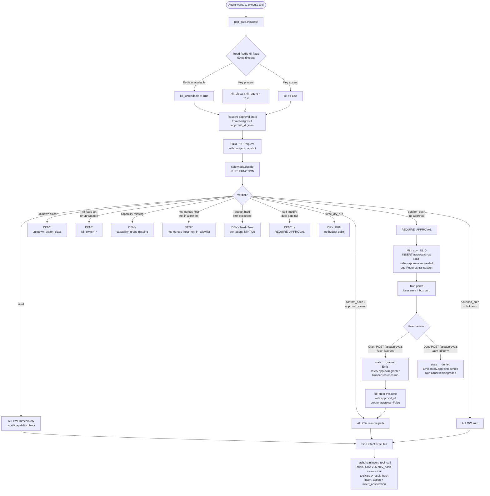

CurlyOS Core enforces a non-negotiable invariant (P6): **no side effect executes without a PDP verdict**. This subsystem is the complete implementation of that invariant — a pure policy core, async I/O resolver, budget gate, fail-closed kill switch, human approval workflow, and hash-chained audit trail.

## Overview

Every action an autonomous agent wants to take flows through a layered authorization pipeline before any side effect occurs:

```
Agent wants to execute a tool call
        │
        ▼
   pdp_gate.evaluate()          ← async I/O resolver
   ┌─────────────────────────────────────────────────────┐
   │ 1. Read kill flags from Redis (fail-closed, 50ms)   │
   │ 2. Resolve approval state from Postgres (if any)    │
   │ 3. Attach default budget snapshot                   │
   │ 4. Build canonical PDPRequest                       │
   └─────────────────────────────────────────────────────┘
        │
        ▼
   safety.pdp.decide(req)       ← pure function, no I/O
   ┌─────────────────────────────────────────────────────┐
   │ Precedence (fail-closed):                           │
   │  read → unknown-class → kill (unreadable/present)  │
   │  → capability → net-egress/budget/self_modify       │
   │  → autonomy clamp → base verdict                   │
   └─────────────────────────────────────────────────────┘
        │
        ├─ ALLOW → side effect executes
        │
        ├─ REQUIRE_APPROVAL → apv_ minted, approvals row
        │                      inserted, run parks.
        │                      User sees Inbox card.
        │                      On grant → run resumes.
        │
        ├─ DRY_RUN → simulated, no budget debit, no apv_
        │
        └─ DENY → action blocked, reason recorded
                  (budget_hard_limit_exceeded also
                   sets per_agent_kill=True → per-agent
                   kill key is written to Redis)

After execution (ALLOW / resumed):
   hashchain.insert_tool_call()  ← appends hash-chained
   hashchain.insert_action()       entry to audit log;
   hashchain.insert_observation()  entry_hash covers
                                   tool+args+result_hash
                                   + prev_hash
```

The kill switch short-circuits the entire pipeline: if `safety:kill:global` or `safety:kill:agent:{name}` is set in Redis, or Redis is unreadable, every non-read action gets `DENY` instantly.

---

## Policy Decision Point

**Files:** `safety/pdp.py` (pure logic) and `agent/pdp_gate.py` (async resolver)

### Design principle

`safety.pdp.decide()` is a **pure function**: it accepts a fully resolved `PDPRequest` and returns a `PDPDecision`. No clock, no RNG, no I/O. This makes every decision deterministic, replay-hashable, and unit-testable with no mocks. All ambient state (kill flags, approval state, budget) is resolved by the caller (`pdp_gate.evaluate`) and passed in as fields.

### Enums

```python
class ActionClass(str, Enum):
    READ = "read"
    MEMORY_WRITE = "memory_write"
    MEMORY_FORGET_HARD = "memory_forget_hard"
    FILE_EDIT = "file_edit"
    CODE_EXEC = "code_exec"
    NET_EGRESS = "net_egress"
    EXTERNAL_POST = "external_post"
    SPEND = "spend"
    SELF_MODIFY = "self_modify"

class AutonomyLevel(str, Enum):
    SUGGEST_ONLY = "suggest_only"   # rank 0
    CONFIRM_EACH = "confirm_each"   # rank 1
    BOUNDED_AUTO = "bounded_auto"   # rank 2
    FULL_AUTO    = "full_auto"      # rank 3

class PDPVerdict(str, Enum):
    ALLOW            = "ALLOW"
    DRY_RUN          = "DRY_RUN"
    REQUIRE_APPROVAL = "REQUIRE_APPROVAL"
    DENY             = "DENY"

class SecurityRisk(str, Enum):
    LOW    = "low"
    MEDIUM = "medium"
    HIGH   = "high"
```

### Hardcoded class floors

Class floors are hardcoded in `_CLASS_FLOORS` (invariant T14 `floor_hardcoded`) and are never read from the policy bundle. Two classes have dynamic floors:

| Action class | Default floor | Dynamic override |
|---|---|---|
| `read` | `full_auto` | — (the only non-side-effecting class) |
| `memory_write` | `bounded_auto` | — |
| `memory_forget_hard` | `confirm_each` | — |
| `file_edit` | `bounded_auto` | — |
| `code_exec` | `bounded_auto` | — |
| `net_egress` | `bounded_auto` | — |
| `external_post` | `confirm_each` | `full_auto` when `channel == "private"` |
| `spend` | `confirm_each` | `full_auto` when `amount_usd <= 25.00` |
| `self_modify` | `confirm_each` | always confirm_each + eval-gate |

```python
def class_floor(
    action_class: str,
    amount_usd: float | None = 0.0,
    channel: str | None = None
) -> str:
    ...
```

A missing `channel` is treated as `"public"` (the deny side) to avoid a fail-open hole.

### Autonomy resolution

```python
def resolve_level(
    agent_default: str,
    workspace_override: str,
    floor: str
) -> tuple[str, str | None]:
    ...
```

`effective_level = min(agent_default, workspace_override, floor)` over the integer rank mapping. Tie preference for `clamped_by` attribution: `action_class_floor` > `workspace_override` > `agent_default`. `clamped_by` is `None` only when `agent_default` alone is the binding minimum.

### Decision inputs: `PDPRequest`

```python
class PDPRequest(BaseModel):
    # Identity
    action_id: str           # act_ ULID
    run_id: str              # run_ ULID
    agent: str
    workspace_id: str        # ws_ ULID
    user_id: str             # usr_ prefixed

    # Action
    action_class: ActionClass
    tool: str | None
    args: dict[str, Any]
    channel: str | None      # external_post: "public" | "private"
    amount_usd: float | None # spend actions

    # Resolution inputs
    agent_default_level: AutonomyLevel
    workspace_override_level: AutonomyLevel
    capability_grant: CapabilityGrantClaims
    budget: BudgetSnapshot

    # Kill switches (pre-read by caller)
    kill_global: bool
    kill_agent: bool
    kill_unreadable: bool

    # Dry-run mode
    force_dry_run: bool

    # Additional caller-pre-read resolution inputs
    approval_state: str | None   # 'granted'|'pending'|... or None
    eval_verdict: str | None     # self_modify: 'pass'|'fail' or None
    host: str | None             # net_egress target host
    egress_allow: list[str]      # net_egress allow-list (CIDRs/hosts)
```

### Decision output: `PDPDecision`

```python
class PDPDecision(BaseModel):
    verdict: PDPVerdict
    action_id: str
    run_id: str
    effective_level: AutonomyLevel
    clamped_by: Literal["agent_default", "workspace_override", "action_class_floor"] | None
    apv_id: str | None          # filled by the gate on REQUIRE_APPROVAL
    reason: str                 # human-readable reason string
    security_risk: SecurityRisk | None
    security_reason: str | None
    policy_version: int         # currently 7 (spike-04 v7)
    budget_headroom: dict[str, float]  # remaining capacity per dim
    hard: bool                  # True when budget_hard_limit_exceeded
    per_agent_kill: bool        # True when hard budget breach → per-agent kill
```

### Decision precedence

The pure `decide()` function applies gates in strict order (fail-closed):

1. `read` — allowed freely, no kill/capability gate.
2. Unknown action class — `DENY` `unknown_action_class_fail_closed`.
3. `kill_unreadable` — `DENY` `kill_switch_unreadable` (degrades to `suggest_only`).
4. `kill_global` or `kill_agent` — `DENY` `kill_switch_active`.
5. Capability not in grant — `DENY` `capability_grant_missing`.
6. Compute class floor + `resolve_level`.
7. `net_egress` host not in allow-list — `DENY` `net_egress_host_not_in_allowlist`.
8. Budget hard limit exceeded — `DENY` `budget_hard_limit_exceeded` with `hard=True, per_agent_kill=True`.
9. `self_modify` dual-gate: eval verdict must be `"pass"` AND effective level must not be `suggest_only` AND an existing `approval_state == "granted"` for a full `ALLOW`; otherwise `REQUIRE_APPROVAL` or `DENY`.
10. `force_dry_run` — `DRY_RUN`.
11. Existing `approval_state == "granted"` at `confirm_each` — upgrades to `ALLOW` (the resume path).
12. Base verdict by effective level: `suggest_only` → `DENY`, `confirm_each` → `REQUIRE_APPROVAL`, `bounded_auto`/`full_auto` → `ALLOW`.

### The async gate: `pdp_gate.evaluate`

```python
async def evaluate(
    *,
    pool: Any,
    redis: Any,
    publisher: Any,
    scope_text: str,
    run_id: str,
    action_id: str,
    action_class: str,
    autonomy_level: str,
    agent: str = "Executive",
    tool: str | None = None,
    args: dict[str, Any] | None = None,
    approval_id: str | None = None,
    create_approval: bool = True,
    force_dry_run: bool = False,
    host: str | None = None,
    egress_allow: list[str] | None = None,
) -> PDPDecision:
```

This is the only entry point agents call. On `REQUIRE_APPROVAL` and `create_approval=True` it atomically inserts the `approvals` row and emits `safety.approval.requested` in a single Postgres transaction. On the resume path, pass `approval_id` (the `apv_` ULID) and `create_approval=False`.

### Capability grants

Phase A grants are built by `phase_a_capability_grant()`. The Phase A ceiling is `confirm_each`. Granted tools:

```python
PHASE_A_GRANTED_TOOLS = [
    "read", "memory_write", "memory_forget_hard",
    "file_edit", "code_exec", "net_egress", "external_post"
]
```

Any action class absent from `tools` gets `DENY capability_grant_missing` (deny-by-default). The `CapabilityGrantClaims` model carries `fs` (filesystem glob policies) and `net` (egress allow-list) for Phase 2 MCP gateway enforcement; in Phase 1 these are empty.

```python
class CapabilityGrantClaims(BaseModel):
    grant_id: str
    agent: str
    run_id: str
    scope: str
    tools: list[str]
    fs: CapGrantFsPolicy        # rw/ro/deny glob patterns
    net: CapGrantNetPolicy      # egress_allow, default="deny"
    memory_scope: list[str]
    max_autonomy: AutonomyLevel
```

---

## Budget

**File:** `safety/budget.py`

### What is metered

The PDP enforces per-run / per-agent-day / per-user-day limits across four dimensions:

| Dimension | Phase 1 hard limit | Redis key pattern |
|---|---|---|
| `tokens` | 1,000,000 | `budget:{scope}:tokens:{window}` |
| `tool_actions` | 1,000 | `budget:{scope}:tool_actions:{window}` |
| `usd_spend` | $50.00 | `budget:{scope}:usd_spend:{window}` |
| `wall_clock_seconds` | 3,600 | `budget:{scope}:wall_clock_seconds:{window}` |

### Enforcement

`_budget_eval()` inside `decide()` computes headroom (`limit - consumed`) for all four dims and returns `(any_hard_limit_crossed, headroom_dict)`. Crossing any hard limit causes:

- `PDPVerdict.DENY` with reason `budget_hard_limit_exceeded`
- `hard=True`, `per_agent_kill=True` on the `PDPDecision`
- The gate caller is responsible for writing the per-agent kill key to Redis

### Phase 1 default snapshot

Live Redis counters are not yet wired in Phase 1. `default_budget_snapshot()` returns a `BudgetSnapshot` with `consumed=0` and the generous limits above. The PDP still exercises the enforcement path on every call; only the live counter pipeline is deferred.

```python
def default_budget_snapshot() -> BudgetSnapshot:
    """A zero-consumed, under-limit snapshot — the P1 default until live metering lands."""
    ...
```

The `BudgetSnapshot` model is defined in `safety/pdp.py` and re-exported from `safety/__init__.py`:

```python
class BudgetSnapshot(BaseModel):
    tokens: int
    tool_actions: int
    usd_spend: float
    wall_clock_seconds: int
    tokens_hard_limit: int
    tool_actions_hard_limit: int
    usd_spend_hard_limit: float
    wall_clock_seconds_hard_limit: int
```

A soft limit (80% of hard) is noted as an implementation choice in the module docstring but is not enforced separately in Phase 1. Nightly reconciliation into `budget_ledger` is planned (see spec `09-permission-system/architecture.md §4`).

---

## Kill Switch

**File:** `safety/killswitch.py`

### Redis keys

```
safety:kill:global          kills ALL agent actions system-wide
safety:kill:agent:{name}    kills a specific named agent
```

A key being **present** (any value) is a kill. Absence means alive. The presence/absence model means a `SET` engages and a `DELETE` recovers; no TTL races.

### Fail-closed behaviour

`read_kill()` is called on every `pdp_gate.evaluate()` with a hard 50ms timeout (`_READ_BUDGET_S = 0.05`). Three outcomes:

- Key absent → alive
- Key present → killed
- Redis `None`, timeout, or any exception → `kill_unreadable=True`

When `kill_unreadable=True`, the PDP returns `DENY kill_switch_unreadable` for every non-read action. There is no silent fail-open path.

```python
async def read_kill(
    redis: Any,
    agent: str | None = None
) -> tuple[bool, bool, bool]:
    """Returns (kill_global, kill_agent, kill_unreadable)."""
    ...
```

### Setting and clearing

```python
async def set_kill(
    redis: Any,
    pool: Any,
    publisher: Any,
    *,
    scope_text: str,
    agent: str | None = None,
    set_by: str,
) -> dict[str, Any]:
    ...

async def clear_kill(
    redis: Any,
    *,
    agent: str | None = None,
) -> dict[str, Any]:
    ...

async def kill_status(
    redis: Any,
    agent: str | None = None,
) -> dict[str, Any]:
    ...
```

`set_kill()` writes the Redis key **first**, then best-effort emits `safety.kill.triggered` on the `CURLYOS_SAFETY` event channel. The kill engages even if event emission fails. If Redis is unavailable, `set_kill()` raises `RuntimeError` — a panic button that cannot engage must surface loudly, never silently no-op.

`clear_kill()` is the manual recovery path. It deletes the key and returns `{"killed": False, "scope": ..., "cleared": bool}`.

---

## Approval Workflow

**File:** `agent/approval_service.py`

### Purpose

When the PDP returns `REQUIRE_APPROVAL`, execution parks. The agent run is suspended until a human (via the webapp Inbox) grants or denies the pending `apv_` approval. This is the human-in-the-loop (HITL) gate for all `confirm_each`-floor actions and for the `self_modify` dual-gate.

### Approval states

| State | Meaning |
|---|---|
| `pending` | Awaiting human decision (default on creation) |
| `granted` | Human approved; caller resumes the parked run |
| `denied` | Human rejected; caller cancels/degrades the run |
| `expired` | TTL exceeded while still pending |

State transitions are single-shot: `pending → granted` or `pending → denied`. A conditional `UPDATE ... WHERE state = 'pending' AND expires_at > now()` prevents double-grant or double-deny races. If the row count is not exactly 1, the current true state is fetched and `ApprovalNotActionable` is raised.

### Approval origins

| `origin` | `run_id` | Description |
|---|---|---|
| `'agent'` | non-null | Created by `pdp_gate._create_approval()` during agent execution |
| `'human'` | `NULL` | Created by `POST /api/approvals` for human-originated ops (e.g. hard-forget) |

### Public functions

```python
async def grant(
    pool: Any,
    publisher: Any,
    scope_text: str,
    apv_id: str,
) -> dict:
    """Grant a pending approval. Returns {apv_id, state, run_id, action_class}."""
    ...

async def deny(
    pool: Any,
    publisher: Any,
    scope_text: str,
    apv_id: str,
    reason: str = "user_denied",
) -> dict:
    """Deny a pending approval. Returns {apv_id, state, run_id, action_class}."""
    ...

async def list_pending(
    pool: Any,
    scope_text: str,
) -> list[dict]:
    """List pending, unexpired approvals in scope (max 100, newest first)."""
    ...
```

Each returns `run_id` so the caller can resume or cancel the parked run. The approval service itself does not resume runs — that is the responsibility of the Phase-A runner (`orchestration/runner.py`).

### Events emitted

| Event type | Trigger |
|---|---|
| `safety.approval.requested` | `_create_approval()` — atomic with the INSERT |
| `safety.approval.granted` | `grant()` — atomic with the state UPDATE |
| `safety.approval.denied` | `deny()` — atomic with the state UPDATE |

### Exceptions

```python
class ApprovalNotFound(Exception):
    """No such approval in the caller's scope (→ HTTP 404)."""

class ApprovalNotActionable(Exception):
    """Approval exists but is not pending (→ HTTP 409)."""
    # .state carries the actual current state
```

### Webapp Inbox integration

`GET /api/approvals` returns the pending approval queue for the current scope. Each item contains `apv_id`, `run_id`, `origin`, `action_class`, `payload`, `expires_at`, `created_at`. The webapp renders these as Approval cards. Granting or denying calls `POST /api/approvals/{apv_id}/grant` or `POST /api/approvals/{apv_id}/deny`, which flip state and trigger runner resume.

---

## Hash Chain

**File:** `agent/hashchain.py`

### Purpose

Every tool call executed by an agent is appended to a per-run hash chain. The chain makes replayed or duplicated side effects detectable: changing any prior entry (tool, args, result, or sequence) invalidates every subsequent `entry_hash`. A checkpoint-resumed run can prove it did not double-execute.

### Chain invariant

```
entry_hash = SHA-256(prev_hash || canonical({tool, args, result_hash}))
result_hash = SHA-256(canonical(result))
```

`canonical()` is deterministic: `json.dumps(sort_keys=True, separators=(",", ":"))`. At the head of a run, `prev_hash = b""`.

### Functions

```python
def chain_entry(
    prev_hash: bytes,
    tool: str,
    args: dict,
    result: dict,
) -> tuple[bytes, bytes]:
    """Pure hash-chain step. Returns (result_hash, entry_hash)."""
    ...

async def insert_action(
    conn: Any,
    action_id: str,
    run_id: str,
    kind: str,
    payload: dict,
) -> None:
    """INSERT into actions table."""
    ...

async def insert_observation(
    conn: Any,
    obs_id: str,
    action_id: str,
    result: dict,
) -> None:
    """INSERT into observations table."""
    ...

async def insert_tool_call(
    conn: Any,
    run_id: str,
    tcl_id: str,
    action_id: str,
    tool: str,
    args: dict,
    result: dict,
) -> bytes:
    """Append a hash-chained tool_call. Returns the new entry_hash."""
    ...
```

`insert_tool_call()` fetches the most recent `entry_hash` for `run_id` from `tool_calls` (ordered by `created_at DESC, id DESC`), computes the new chain step, and inserts the row. `prev_hash` is stored as `NULL` for the chain head.

---

## Data Model

### `approvals`

Stores all pending/decided human-in-the-loop approvals.

| Column | Type | Notes |
|---|---|---|
| `id` | `text` | `apv_` ULID, primary key |
| `run_id` | `text` | `run_` ULID; `NULL` for `origin='human'` |
| `origin` | `text` | `'agent'` or `'human'` |
| `scope` | `text` | e.g. `"user:usr_hiten"` |
| `action_class` | `text` | `ActionClass` value |
| `payload` | `jsonb` | tool + args + plan cursor shown on the card |
| `state` | `text` | `'pending'` \| `'granted'` \| `'denied'` |
| `expires_at` | `timestamptz` | default 7 days from creation |
| `decided_at` | `timestamptz` | set on grant/deny |
| `created_at` | `timestamptz` | auto |

Scope is stored directly so scope checks never require a join to `agent_runs`.

### `actions`

One row per agent action (the outer record before tool execution).

| Column | Type | Notes |
|---|---|---|
| `id` | `text` | `act_` ULID |
| `run_id` | `text` | `run_` ULID |
| `kind` | `text` | action kind string |
| `payload` | `jsonb` | action payload |
| `created_at` | `timestamptz` | auto |

### `observations`

One row per tool call result.

| Column | Type | Notes |
|---|---|---|
| `id` | `text` | `obs_` ULID |
| `action_id` | `text` | FK to `actions.id` |
| `result` | `jsonb` | tool result |
| `created_at` | `timestamptz` | auto |

### `tool_calls`

Hash-chained audit log, one row per executed tool call.

| Column | Type | Notes |
|---|---|---|
| `id` | `text` | `tcl_` ULID |
| `action_id` | `text` | FK to `actions.id` |
| `tool` | `text` | tool name |
| `args` | `jsonb` | tool arguments |
| `result_hash` | `bytea` | SHA-256 of canonical(result) |
| `prev_hash` | `bytea` | `NULL` at chain head |
| `entry_hash` | `bytea` | SHA-256 of prev_hash + canonical({tool, args, result_hash}) |
| `created_at` | `timestamptz` | auto |

### `budget_ledger` (planned)

Nightly reconciliation of Redis counters. Not yet active in Phase 1. Documented in spec `09-permission-system/architecture.md §4`.

---

## Public API Surface

### `safety` package (`safety/__init__.py`)

Re-exports from `safety.pdp`:

```python
ActionClass, AutonomyLevel, BudgetSnapshot, CapabilityGrantClaims,
PDPDecision, PDPRequest, PDPVerdict, SecurityRisk,
class_floor, decide, resolve_level
```

### `safety.pdp`

```python
decide(req: PDPRequest) -> PDPDecision
class_floor(action_class: str, amount_usd: float | None, channel: str | None) -> str
resolve_level(agent_default: str, workspace_override: str, floor: str) -> tuple[str, str | None]
```

### `safety.budget`

```python
default_budget_snapshot() -> BudgetSnapshot
```

### `safety.killswitch`

```python
async read_kill(redis, agent: str | None) -> tuple[bool, bool, bool]
async set_kill(redis, pool, publisher, *, scope_text, agent, set_by) -> dict
async clear_kill(redis, *, agent) -> dict
async kill_status(redis, agent: str | None) -> dict
```

### `agent.pdp_gate`

```python
async evaluate(*, pool, redis, publisher, scope_text, run_id, action_id,
               action_class, autonomy_level, agent, tool, args,
               approval_id, create_approval, force_dry_run,
               host, egress_allow) -> PDPDecision

phase_a_capability_grant(run_id, scope_text, agent, grant_id) -> CapabilityGrantClaims
approval_ttl_seconds() -> int
scope_parts(scope_text: str) -> dict[str, str]
```

### `agent.approval_service`

```python
async grant(pool, publisher, scope_text, apv_id) -> dict
async deny(pool, publisher, scope_text, apv_id, reason) -> dict
async list_pending(pool, scope_text) -> list[dict]
```

### `agent.hashchain`

```python
chain_entry(prev_hash: bytes, tool: str, args: dict, result: dict) -> tuple[bytes, bytes]
async insert_action(conn, action_id, run_id, kind, payload) -> None
async insert_observation(conn, obs_id, action_id, result) -> None
async insert_tool_call(conn, run_id, tcl_id, action_id, tool, args, result) -> bytes
```

---

## Related REST Endpoints

All endpoints are on `api_server.py`. The current scope is read from the global `SCOPE` constant (derived from environment at startup).

### Kill switch

| Method | Path | Description |
|---|---|---|
| `GET` | `/api/safety/kill` | Report current kill state. Query param `agent` for per-agent status. |
| `POST` | `/api/safety/kill` | Engage kill switch. Body: `{"agent": "Executive"}` or `{}` for global. Returns `503` if Redis unavailable. |
| `DELETE` | `/api/safety/kill` | Clear kill switch (recovery). Query param `agent` for per-agent clear. |

`POST /api/safety/kill` request body model:

```python
class KillRequest(BaseModel):
    agent: str | None = None
```

### Approvals

| Method | Path | Description |
|---|---|---|
| `GET` | `/api/approvals` | List pending, unexpired approvals in scope. Returns `{items, count}`. |
| `POST` | `/api/approvals` | Create a human-originated approval (run_id NULL). Used for webapp hard-forget flow. |
| `POST` | `/api/approvals/{apv_id}/grant` | Grant a pending approval; resumes any parked run. Returns `404` if not found, `409` if not actionable. |
| `POST` | `/api/approvals/{apv_id}/deny` | Deny a pending approval; cancels/degrades any parked run. Optional body: `{"reason": "user_denied"}`. |

`POST /api/approvals` request body (inferred — `CreateApprovalRequest`):

```python
# action_class: str
# payload: dict
# ttl_seconds: int | None   (default: CURLYOS_APPROVAL_TTL_SECONDS)
```

After grant or deny, `_resume_after_decision()` calls `runner.resume(run_id)` if a runner is attached to `app.state`.

---

## Configuration and Settings

| Variable | Default | Description |
|---|---|---|
| `CURLYOS_APPROVAL_TTL_SECONDS` | `604800` (7 days) | Hard expiry for pending approvals. Parsed by `approval_ttl_seconds()`. |
| Redis connection | via `_make_redis()` in `api_server.py` | Required for kill switch. If unavailable, all non-read actions are denied (fail-closed). |
| Postgres pool | via `_get_async_pool()` | Required for approval state and audit writes. |
| `CURLYOS_SAFETY` | event channel name | Channel on which `safety.kill.triggered` is published (referenced in `killswitch.py` docstring; channel wiring is in the publisher). |

### Autonomy level configuration

The Phase A ceiling is hardcoded in `pdp_gate.py` as `AutonomyLevel.CONFIRM_EACH` on every `phase_a_capability_grant()`. The `autonomy_level` parameter passed to `evaluate()` feeds both `agent_default_level` and `workspace_override_level` in `PDPRequest`; the `min()` clamp then applies the class floor on top.

**Inference:** there is currently no database-backed autonomy setting per agent or workspace — the level is passed in by the caller at each `evaluate()` invocation. A settings/policy table is anticipated in Phase 2.

---

## Gotchas and Edge Cases

**Redis unavailability is DENY, not ALLOW.** If `_make_redis()` returns `None` or any Redis read times out past 50ms, `kill_unreadable=True` flows into the PDP and every non-read action is denied. This is intentional; do not mistake it for a Redis connectivity bug.

**`set_kill()` raises on Redis unavailability.** A panic button that cannot engage must surface loudly. The REST handler maps this to `HTTP 503`.

**The `apv_id` on `PDPDecision` is filled by the gate, not by `decide()`.** The pure function leaves it `None`; `pdp_gate.evaluate()` mints the ULID and inserts the row after `decide()` returns. Callers that bypass the gate and call `decide()` directly will never get a populated `apv_id`.

**Approval scope check uses `approvals.scope` directly.** No join to `agent_runs` is needed. This means human-originated approvals (`origin='human'`, `run_id=NULL`) pass the same scope check as agent-originated ones.

**`_approval_state()` is bound to `(run_id, action_class)`.** A granted `apv_` from run A cannot satisfy run B's gate, even if both are in the same scope. Defense in depth.

**`self_modify` requires BOTH gates.** Autonomy level and eval verdict are independent. `eval_verdict='pass'` with `effective_level='suggest_only'` is still `DENY`. An existing granted approval without a passing eval verdict is also `DENY`.

**Phase 1 budget is always under-limit.** `default_budget_snapshot()` returns `consumed=0` for all dims. The enforcement path runs on every call, but no real counter is incremented yet. Treat `budget_headroom` values as nominal until Phase 2 metering lands.

**`external_post` with a missing channel is treated as public.** An absent `channel` defaults to `confirm_each` floor, not `full_auto`. This is an explicit anti-fail-open choice documented in `class_floor()`.

**Hash chain is append-only but not database-enforced.** Tamper-evidence relies on the chain math, not a DB constraint. An adversary with write access to `tool_calls` could rewrite rows. The chain provides detection for replayed/duplicated executions in normal operation; it is not a substitute for Postgres row-level security.

**Policy version is hardcoded as `7`.** It appears as `_POLICY_VERSION = 7` in `safety/pdp.py` and is stamped on every `PDPDecision`. Version bumps require a code change.

---

## Action-Authorization Flow


