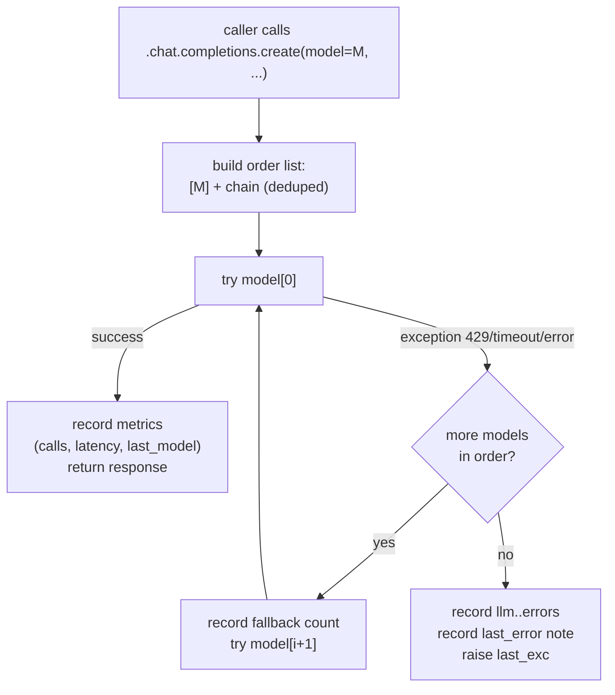

The `shared/` package is the stable contract layer of CurlyOS Core. No engine imports from another engine's internal modules—all cross-cutting concerns route through `shared`. Changes here ripple everywhere, so the interfaces are kept narrow and versioned carefully.

---

## LLM routing and models

**Files:** `shared/models.py`, `shared/llm.py`, `api_server.py:1909`

### Three tiers

CurlyOS routes LLM calls to one of three task tiers, each mapped to a different provider/model:

| Tier | Purpose | Default model | Env chain var |
|------|---------|---------------|--------------|
| `fast` | High-volume, cheap work: distillation, classify, KG extraction | `openrouter/owl-alpha` (general chain) | `CURLYOS_MODEL_CHAIN` |
| `agentic` | Orchestration + agent runs | `kimi-k2.6` (Azure) | `CURLYOS_AGENTIC_CHAIN` |
| `deep` | Heavy cognition: reflection, meta, narrative, planning | `gpt-oss-120b` (Azure) | `CURLYOS_DEEP_CHAIN` |

A fourth chain, `coding`, is defined but not wired into the general path—consumers opt in explicitly via `coding_chain()`.

### Model chain functions

```python
def general_chain() -> list[str]   # CURLYOS_MODEL_CHAIN
def coding_chain() -> list[str]    # CURLYOS_CODING_MODEL_CHAIN
def agentic_chain() -> list[str]   # CURLYOS_AGENTIC_CHAIN
def deep_chain() -> list[str]      # CURLYOS_DEEP_CHAIN
def primary_model() -> str         # first of general_chain()
```

Chains are comma-separated strings parsed by `_parse(s)`. The `general` chain default is:

```
openrouter/owl-alpha,nex-agi/nex-n2-pro:free,nvidia/nemotron-3-ultra-550b-a55b:free
```

### `_make_llm_client(tier)` — the choke point

Defined in `api_server.py:1909`. This is the single factory that all API handlers call to get an LLM client.

```python
def _make_llm_client(tier: str = "fast") -> tuple[FallbackClient | None, str]:
```

- Returns `(FallbackClient, model_str)` or `(None, "")` when no API key is present or the `openai` SDK is not installed.
- Results are cached per tier in `_LLM_CLIENTS: dict[str, tuple]`. A no-key result is **not** cached so adding a key later is picked up without a restart.
- Per-tier env resolution (shown for `agentic`; `deep` mirrors it):

```python
key      = _load_env_key("CURLYOS_AGENTIC_API_KEY", "CURLYOS_LLM_API_KEY", "OPENROUTER_API_KEY")
base_url = CURLYOS_AGENTIC_BASE_URL or CURLYOS_LLM_BASE_URL or "https://openrouter.ai/api/v1"
model    = CURLYOS_AGENTIC_MODEL or chain[0]
```

The fast tier falls back through `CURLYOS_LLM_API_KEY` / `OPENROUTER_API_KEY` and `CURLYOS_LLM_BASE_URL`, so an unconfigured agentic/deep tier gracefully degrades to OpenRouter rather than erroring.

Reasoning models (Azure Kimi, `gpt-oss-120b`) use `timeout=120.0, max_retries=0`—the chain is the resilience mechanism, not same-model retries.

### `FallbackClient`

```python
class FallbackClient:
    def __init__(self, raw: Any, chain: list[str] | None = None, tier: str = "general"):
        ...
    # .chat.completions.create intercepted; everything else proxies to raw
```

Only `chat.completions.create` is intercepted. All other attributes proxy transparently to the underlying `AsyncOpenAI` client.

The inner `_FallbackCompletions.create` method:

```python
async def create(self, *, model: str | None = None, **kwargs: Any) -> Any:
```

1. Builds the order list: caller-supplied `model` first, then the configured chain (deduped).
2. Iterates the list, trying each model in turn.
3. On success: records `metrics.incr("llm.<tier>.calls")`, `metrics.timing("llm.<tier>.latency", ...)`, `metrics.note("llm.<tier>.last_model", m)`. If `i > 0` (a failover occurred), also records `metrics.incr("llm.<tier>.fallbacks")`.
4. On failure of all models: records `metrics.incr("llm.<tier>.errors")` and `metrics.note("llm.<tier>.last_error", ...)`, then re-raises the last exception.

### `shared/llm.py` — robust JSON extraction

LLM responses—especially from cheaper/free models—often wrap JSON in fences, prepend prose, or truncate. Two helpers insulate callers from this:

```python
def first_json(content: str | None, default: Any = None) -> Any:
    """Parse the first complete JSON value from an LLM response. Fence/prose tolerant."""

def json_records(content: str | None) -> list[dict]:
    """Best-effort list of flat JSON record-objects. Tolerates fences, prose, AND truncation."""
```

`json_records` unwraps common LLM wrapper shapes (`{"results": [...]}`, `{"triples": [...]}`, etc.) and falls back to regex-salvaging complete `{...}` objects from a truncated tail.

### LLM failover flow



---

## Embeddings

**Files:** `shared/embeddings/__init__.py`, `shared/embeddings/implementations.py`

### Contract

```python
class Embedder:
    @property
    def dimension(self) -> int: ...      # always 1024
    @property
    def model_name(self) -> str: ...
    async def embed(self, texts: list[str]) -> list[list[float]]: ...
    async def embed_single(self, text: str) -> list[float]: ...   # convenience

class Reranker:
    @property
    def model_name(self) -> str: ...
    async def rerank(
        self, query: str, documents: list[str], top_k: int | None = None
    ) -> list[tuple[int, float]]: ...    # (original_index, score) desc
```

All vectors are 1024-dimensional. This is the system-wide pinned dimension (aligned to `BAAI/bge-m3`).

### Backends

| Class | Model | Use case |
|-------|-------|----------|
| `LocalBgeM3` | `BAAI/bge-m3` via sentence-transformers | Production — 1024-dim, L2-normalised |
| `OpenAIAdapter` | `text-embedding-3-large` (truncated to 1024-dim) | Fallback / alternative |
| `FakeEmbedder` | `fake` | Tests — zero vectors, no model download |
| `HashEmbedder` | `deterministic-hash-1024` | CI / replay — SHA-256 pseudo-vectors, NON-SEMANTIC |
| `CachingEmbedder` | wraps any `Embedder` | Per-request memo cache |
| `FakeReranker` | `fake` | Tests — returns original order |

### Device selection

`_detect_device()` in `implementations.py` picks the torch device for `LocalBgeM3`:

1. If `CURLYOS_EMBED_DEVICE` is set, use it verbatim.
2. Else if `torch.cuda.is_available()`, use `cuda`.
3. Else default to `cpu`.

**MPS is intentionally excluded from auto-selection.** On Apple Silicon, `bge-m3` on MPS recompiles kernels per input shape, making sporadic varied-length recall queries 200–800 ms each versus ~50 ms on CPU's Accelerate/AMX path—approximately 5x slower overall. MPS only wins on large, repeated, same-shape batches. Force it with `CURLYOS_EMBED_DEVICE=mps` for dedicated bulk re-embed jobs.

`LocalBgeM3` uses a class-level `threading.Lock` (`_load_lock`) to ensure the ~1.3 GB model loads exactly once even under concurrent first requests.

### `CachingEmbedder`

```python
class CachingEmbedder(Embedder):
    def __init__(self, inner: Embedder): ...
    async def embed(self, texts: list[str]) -> list[list[float]]: ...
```

Wraps any `Embedder` with an exact-text in-memory memo cache. A single `/api/recall` call can embed the same query multiple times (dense first-stage, re-score, agentic follow-ups). Scoped to short-lived objects; **unbounded by design**—do not attach to a long-running process singleton.

### HNSW usage

CurlyOS Core uses `pgvector` with HNSW indexes on embedding columns. The embedder dimension (1024) must match the index at creation time. The embedder itself has no direct knowledge of the index type—HNSW configuration lives in the DB migration layer.

---

## Epistemic classifier

**File:** `shared/epistemic.py`

### The axis

Every memory, identity fact, and knowledge entity carries an `epistemic_status` drawn from the following closed set (defined in `shared/types/__init__.py` as `EpistemicStatus`):

| Status | Meaning | Assigned by |
|--------|---------|------------|
| `seed` | Studio draft, not yet validated | Studio engine |
| `conjecture` | Early speculation, not yet hypothesis-grade | Studio / creative engines |
| `hypothesis` | Tentative pattern or inference, not yet established | Reflection engine / LLM classifier |
| `canonical` | Established, objective fact | LLM classifier (default) |
| `belief` | Subjective worldview, value, or opinion the user holds | LLM classifier |
| `possible_world` | Simulation or counterfactual scenario | Simulation engine |

### Classifier

For free-text memories at ingest time, only three statuses can be reliably inferred from content alone: `canonical`, `belief`, `hypothesis`. The others require their specific producers.

```python
ALL_STATUSES = ("seed", "conjecture", "hypothesis", "canonical", "belief", "possible_world")
MEMORY_STATUSES = ("canonical", "belief", "hypothesis")

def normalize_status(raw: str | None, allowed=MEMORY_STATUSES, default: str = "canonical") -> str:
    """Normalise a raw status string; falls back to 'canonical' on unknown input."""

async def classify_statements(llm: Any, model: str, items: list[dict]) -> dict[str, str]:
    """items: [{"id", "statement"}] -> {id: status}. Best-effort; robust JSON parse."""
```

`classify_statements` calls the LLM at `temperature=0.0`, max 2048 tokens, and parses the response through `json_records` (fence/truncation tolerant). Errors on individual records are silently skipped—partial classification is better than a hard failure.

The classification prompt (`CLASSIFY_PROMPT`) instructs the model to classify each statement as:
- **`canonical`**: biographical detail, health metric, dated event, concrete preference, tool/app, relationship, place.
- **`belief`**: worldview, value, philosophy, opinion, spiritual/metaphysical position, or self-perception the user holds.
- **`hypothesis`**: tentative, inferred, or speculative pattern not yet established as fact.

Controlled by the `epistemic_classify_enabled` setting (see Settings Registry).

---

## Events and event sourcing

**Files:** `shared/events/__init__.py`, `shared/events/catalog.py`, `shared/events/implementations.py`

### CloudEvents envelope

All events are CloudEvents v1.0 envelopes built via:

```python
def build_event(
    short_type: str,
    subject: str,
    scope: dict[str, Any],
    data: dict[str, Any],
    actor: str = "system",
    source: str = "curlyos-core",
) -> dict[str, Any]:
```

Fields: `specversion`, `type` (full prefixed), `source`, `id` (typed-prefix ULID `evt_...`), `time` (UTC ISO-8601), `subject`, `data`, `actor`, `scope`.

`build_event` validates the short type against the closed catalog before constructing the envelope. Unknown types raise `UnknownEventType`.

### Event type grammar

```
art.curlybrackets.curlyos.<domain>.<verb>
```

Helper functions:

```python
def full_type(short_type: str) -> str:   # "memory.fact.stored" -> "art.curlybrackets.curlyos.memory.fact.stored"
def short_type(full: str) -> str         # strips prefix; returns unchanged if not prefixed
def subject_for(short: str) -> str       # "memory.fact.stored" -> "curlyos.memory.fact.stored"
def group_for(type_or_short: str) -> str # resolve domain group; raises UnknownEventType if unknown
def validate_short_type(short: str) -> str  # asserts membership; returns short unchanged
```

### Closed event catalog

The catalog is the single source of truth. `build_event` rejects any short type not listed. Adding an event type requires a deliberate one-line addition to `catalog.py`—no string improvisation at call sites.

#### MEMORY group

| Short type | Description |
|-----------|-------------|
| `memory.episode.recorded` | Raw episode ingested |
| `memory.fact.stored` | Distilled fact written |
| `memory.fact.consolidated` | Fact merged/consolidated |
| `memory.fact.invalidated` | Fact time-closed |
| `identity.fact.updated` | Self-model triple updated |
| `knowledge.entity.created` | KG entity created |
| `knowledge.entity.invalidated` | KG entity invalidated |
| `knowledge.edge.created` | KG edge created |
| `knowledge.edge.invalidated` | KG edge invalidated |
| `metacog.assumption.created` | Metacognitive assumption recorded |
| `metacog.model.created` | Mental model recorded |

#### EVENTS group

| Short type | Description |
|-----------|-------------|
| `studio.created` | Studio created |
| `studio.sketch.created` | Sketch created |
| `studio.sketch.updated` | Sketch updated |
| `studio.sketch.invalidated` | Sketch invalidated |
| `studio.sketch.graduated` | Sketch promoted to memory |
| `studio.sketches.linked` | Two sketches linked |
| `simulation.run.created` | Simulation run started |
| `simulation.run.completed` | Simulation run completed |
| `simulation.run.forked` | Simulation forked |
| `goal.created` | Goal created |
| `goal.updated` | Goal metadata updated |
| `goal.invalidated` | Goal closed/cancelled |
| `goal.plan.proposed` | Plan proposed for a goal |
| `goal.plan.approved` | Plan approved (human or auto) |
| `goal.task.dispatched` | Task dispatched to agent |
| `goal.task.verified` | Task outcome verified |
| `goal.task.retry` | Task queued for retry |
| `goal.progress` | Goal progress update |
| `goal.achieved` | Goal marked achieved |
| `goal.needs_work` | Verifier determined goal needs more work |
| `decision.recorded` | Decision captured |
| `decision.reviewed` | Decision reviewed |
| `opportunity.detected` | Opportunity surfaced by attention engine |
| `opportunity.resolved` | Opportunity resolved (promoted/dismissed) |

#### AGENTS group

| Short type | Description |
|-----------|-------------|
| `agent.run.started` | Agent run started |
| `agent.run.completed` | Agent run completed successfully |
| `agent.run.failed` | Agent run failed |
| `runtime.action.executed` | Agent action executed |
| `runtime.observation.recorded` | Observation recorded |
| `tool.call.invoked` | Tool call invoked |

#### EVOLUTION group

| Short type | Description |
|-----------|-------------|
| `evolution.candidate.proposed` | Evolution candidate proposed |
| `evolution.eval.completed` | Evaluation of candidate completed |
| `evolution.candidate.held` | Candidate held for review |
| `evolution.prompt.activated` | New prompt version activated |

#### SAFETY group

| Short type | Description |
|-----------|-------------|
| `safety.approval.requested` | Human approval requested |
| `safety.approval.granted` | Approval granted |
| `safety.approval.denied` | Approval denied |
| `safety.approval.expired` | Approval window expired |
| `safety.kill.triggered` | Kill switch triggered |
| `safety.budget.exceeded` | Budget constraint exceeded |
| `safety.pdp.unavailable` | Policy decision point unavailable |

### Publishers

```python
class EventPublisher:
    async def stage(self, event: dict, conn: Any) -> tuple[str, str, dict]: ...
    async def emit(self, subject: str, event: dict) -> None: ...
    def stamp(self, event: dict) -> dict: ...
```

#### `PgNatsPublisher`

```python
class PgNatsPublisher(EventPublisher):
    def __init__(self, nats_client: Any = None, stream: str = "CURLYOS_MEMORY"): ...
```

- `stage()`: INSERTs the event row into the `events` table inside the caller's Postgres transaction. Returns `(event_id, nats_subject, stamped_event)`.
- `emit()`: Publishes to NATS JetStream post-commit, best-effort. NATS failure is logged, never raised—events are durable in Postgres regardless.
- **Transactional pattern**: stage in the same DB transaction as the system-of-record write, then emit to NATS after commit. This guarantees event durability even when NATS is down.

#### `PgOnlyPublisher`

```python
class PgOnlyPublisher(PgNatsPublisher):
    def __init__(self): ...   # nats_client=None
```

Postgres-only publisher for development/testing. No NATS dependency.

### Stream taxonomy (NATS)

> **Note:** CurlyOS Core currently uses domain groups for SSE filtering, not discrete NATS streams (deviation DR-C1 from the build spec). The group names reflect the intended future NATS stream mapping.

| Group | Intended NATS stream |
|-------|---------------------|
| `MEMORY` | `HITENOS_MEMORY` |
| `AGENTS` | `HITENOS_AGENTS` |
| `SAFETY` | `HITENOS_SAFETY` |
| `EVOLUTION` | `HITENOS_EVOLUTION` |
| `EVENTS` | `HITENOS_EVENTS` |

---

## Metrics and observability

**File:** `shared/metrics.py`

### Design

In-process, since-boot counters. Thread-safe via a module-level `threading.Lock`. Zero external dependencies—no Redis, no DB. Deliberately lives in process memory because this is a single-process box and metrics must never be on a correctness path.

Cumulative counter semantics (like Prometheus counters): values only grow and reset when the process restarts. Always read alongside `uptime_seconds`.

### API

```python
def incr(key: str, n: float = 1.0) -> None       # increment a counter
def timing(key: str, ms: float) -> None           # record one latency observation (sum + count → avg)
def note(key: str, value: Any) -> None            # store a last-seen scalar (model name, error, …)
def counter(key: str) -> float                    # read a single counter
def uptime_seconds() -> float                     # seconds since module load
def snapshot() -> dict                            # full {counters, timings, notes, uptime_seconds}
def reset() -> None                               # zero all counters (does not reset uptime)
```

`snapshot()` returns:
```python
{
    "counters": {"key": float, ...},
    "timings": {"key": {"avg_ms": float, "count": int}, ...},
    "notes": {"key": Any, ...},
    "uptime_seconds": float,
}
```

### Key convention

Dotted names: `<domain>.<sub>`.

#### LLM tier counters (one set per tier: `fast`, `agentic`, `deep`)

| Key | Type | Description |
|-----|------|-------------|
| `llm.<tier>.calls` | counter | Successful completions |
| `llm.<tier>.fallbacks` | counter | Times a fallback model was used |
| `llm.<tier>.errors` | counter | Times the entire chain exhausted |
| `llm.<tier>.latency` | timing | End-to-end latency (ms) including failover attempts |
| `llm.<tier>.last_model` | note | Model that answered the last successful call |
| `llm.<tier>.last_error` | note | Last error string (truncated to 200 chars) |

#### Recall counters

| Key | Type | Description |
|-----|------|-------------|
| `recall.requests` | counter | Total `/api/recall` requests |
| `recall.cache_hits` | counter | Requests served from Redis cache |
| `recall.cache_misses` | counter | Requests that bypassed/missed cache |
| `recall.errors` | counter | Recall requests that errored |
| `recall.latency` | timing | End-to-end recall latency (ms), cache miss path |
| `recall.latency_cached` | timing | Recall latency (ms), cache hit path |

### Feed into `/api/observability`

The metrics snapshot feeds four read-only endpoints (`GET /api/observability/{llm,recall,pipeline,overview}`). The `llm` endpoint iterates `("fast", "agentic", "deep")` and calls `_tier_config(tier)` (from `api_server.py`) to surface endpoint host, model, and chain alongside the counters—never API keys.

---

## Settings registry

**File:** `shared/settings.py`

### Design

Async key/value runtime settings over the `app_settings` Postgres table (JSONB values). Reads are cheap (single PK lookup). Hot-path callers use `get_setting_cached` with a 10-second in-process TTL so a settings change takes effect within seconds without a DB hit per request.

Keys not in the registry are readable/writable as free-form (no validation). Registered keys are the documented, validated surface.

### Functions

```python
async def get_setting(pool, key: str, default: Any = None) -> Any
async def get_setting_cached(pool, key: str, default: Any = None) -> Any   # 10s in-process TTL
async def set_setting(pool, key: str, value: Any) -> None                  # upsert + invalidate cache
async def all_settings(pool) -> dict[str, Any]                             # all registered + free-form
def coerce_value(key: str, raw: Any) -> Any                                # validate + type-coerce
def invalidate_cache(key: str | None = None) -> None                       # manual cache bust
```

`set_setting` upserts with `ON CONFLICT (key) DO UPDATE` and invalidates the in-process cache entry.

`all_settings` returns every registered setting with effective value, default, type, category, and description—plus any free-form keys present in the table. A registered key that has never been written still reports its effective (default) value.

### Registered settings

| Key | Type | Default | Category | Description |
|-----|------|---------|----------|-------------|
| `auto_promote` | `bool` | `true` | autonomy | Promote high-scoring opportunities into goals automatically. |
| `auto_plan` | `bool` | `true` | autonomy | Decompose active goals into plans automatically (autoplan sweep). |
| `auto_execute` | `bool` | `false` | autonomy | Autonomously approve and dispatch proposed goal plans, closing the full opportunity→goal→agent→verify loop without a human click. Per-action safety is still enforced by the policy gate (PDP). |
| `agent_bypass` | `bool` | `false` | safety | Run agent side effects without human approval. Use with care. |
| `recall_cache_enabled` | `bool` | `true` | recall | Cache `/api/recall` results in Redis (per-scope, generation-invalidated). |
| `recall_cache_ttl_seconds` | `int` | `120` | recall | TTL for cached recall results, in seconds (valid range: 1–3600). |
| `recall_fast_followups` | `bool` | `false` | recall | Allow the agentic coverage-gap follow-up round in fast mode (slower, more thorough). |
| `epistemic_classify_enabled` | `bool` | `true` | ingest | Run the per-ingest LLM epistemic classification (`canonical`/`belief`/`hypothesis`). |
| `kg_extraction_enabled` | `bool` | `true` | ingest | Run knowledge-graph extraction (entities/edges) on ingest. |

### `coerce_value` validation

- `bool`: accepts Python `bool`, strings `"true"/"1"/"yes"/"on"/"false"/"0"/"no"/"off"`, and numeric values.
- `int`/`float`: standard numeric conversion plus range checks where applicable (`recall_cache_ttl_seconds` must be 1–3600).
- `str`: `str(raw)` passthrough.
- Unregistered keys pass through unchanged.

The module also exports the constant `AGENT_BYPASS = "agent_bypass"` for use in safety gate code without string literals.

---

## Notifications

**File:** `shared/notify.py`

### Design principle

Core calls `notify(text, ...)`. An adapter delivers it. Core never imports anything Hermes/Telegram-shaped—delete Hermes and notifications degrade gracefully to log-only. This is the P1 replaceability guarantee.

```python
class Notifier:
    async def notify(
        self, text: str, *, approval_id: str | None = None, run_id: str | None = None
    ) -> bool:
        """Returns True when delivered to an external surface; False = logged only."""
```

### Implementations

| Class | Delivery | Availability |
|-------|---------|-------------|
| `NullNotifier` | `logging.info` only | Always available; the default |
| `HermesNotifier` | Shells out to `hermes send -t <target>` | Requires Hermes CLI on PATH |

`HermesNotifier` resolves the `hermes` binary explicitly via `shutil.which` and a `~/.local/bin/hermes` fallback, because systemd units get a minimal PATH without `~/.local/bin`.

`HermesNotifier.notify` is always non-fatal: timeouts (20 s), non-zero exit codes, `FileNotFoundError`, and all other exceptions are logged and return `False`. A notification is never worth blocking cognition.

### Selection

`get_notifier()` reads `CURLYOS_NOTIFIER` from env first, then falls back to parsing the process's own `.env` file (so systemd units without env injection still work):

```python
def get_notifier() -> Notifier:
```

| `CURLYOS_NOTIFIER` value | Result |
|------------------------|--------|
| `""` / `"null"` / `"log"` | `NullNotifier` |
| `"hermes"` | `HermesNotifier(target=CURLYOS_NOTIFY_TARGET)` |
| anything else | `NullNotifier` with a warning |

`CURLYOS_NOTIFY_TARGET` sets the `hermes send -t` target (default: `"telegram"`; example: `"telegram:#OS Updates"` for a group topic).

---

## ULIDs and types

**Files:** `shared/types/ulid.py`, `shared/types/__init__.py`

### ULID format

```
<prefix>_<26-char ULID>
```

Example: `epi_01JX8ZTQABCDEFGHJKMNPQRSTV`

The 26-character body uses the Crockford Base32 alphabet (`0123456789ABCDEFGHJKMNPQRSTVWXYZ`—excludes I, L, O, U to avoid visual ambiguity).

Structure: 10-char timestamp (48-bit ms since epoch) + 16-char randomness (80-bit). Monotonically increasing within the same millisecond via randomness increment.

```python
def mint_ulid() -> str          # raw 26-char ULID
def mint(prefix: str) -> str    # typed-prefix ULID: mint("epi") -> "epi_..."
def is_valid(prefix: str, value: str) -> bool
def id_pattern(prefix: str) -> str    # anchored regex string
def prefix_of(value: str) -> str | None
```

`mint` validates the prefix against `ALL_PREFIXES` and raises `ValueError` for unknown prefixes.

### Registered prefixes

| Prefix | Entity |
|--------|--------|
| `evt` | event |
| `epi` | episode |
| `mem` | memory |
| `idf` | identity fact |
| `ws` | workspace |
| `prj` | project |
| `tsk` | task |
| `art` | artifact |
| `arv` | artifact version |
| `run` | agent run |
| `act` | action |
| `obs` | observation |
| `tcl` | tool call |
| `apv` | approval |
| `bgt` | budget |
| `cap` | capability grant |
| `ses` | session |
| `usr` | user |
| `stu` | studio |
| `skt` | sketch |
| `cpt` | concept |
| `wld` | world model |
| `sim` | simulation |
| `dsc` | discovery |
| `goal` | goal |
| `dec` | decision |
| `out` | outcome |
| `les` | lesson |
| `opp` | opportunity |
| `asu` | assumption |
| `mdl` | mental model |
| `dau` | decision audit |
| `prn` | principle |
| `cha` | chapter |
| `thm` | theme |
| `trd` | trend |
| `aln` | alignment signal |
| `ats` | activity session |
| `foc` | focus log |
| `enr` | energy sample |
| `evr` | eval run |
| `smd` | self-modification |
| `pmt` | prompt version |
| `rpt` | insight report |
| `lck` | lock |
| `cor` | correlation |
| `ent` | entity |
| `sjob` | scheduled job |
| `inb` | inbox item |
| `gpl` | goal plan |
| `gtk` | goal task |
| `omsg` | orchestrator message |

### Core domain models (`shared/types/__init__.py`)

Key Pydantic models used across engines:

| Model | ID pattern | Description |
|-------|-----------|-------------|
| `Episode` | `epi_...` | Raw experience; the provenance ground-truth stream |
| `Memory` | `mem_...` | Distilled bi-temporal semantic fact |
| `IdentityFact` | `idf_...` | Bi-temporal self-model triple (predicate + object + confidence) |
| `RetrievalRequest` | — | Recall query parameters (query, scope, tiers, mode, budget) |
| `RetrievalResult` | — | Recall results (items, tokens, rounds, cache key) |

Enums: `EpistemicStatus` (see above), `ScopeLevel` (`user`, `session`, `agent`, `workspace`, `studio`, `scenario`), `MemoryKind` (`fact`, `procedure`).

`Scope` carries a `level`, `user_id`, and optional `session_id`. Its `as_string()` method produces the DB text form, e.g. `user:usr_...` or `workspace:ws_...`.

---

## Configuration and env vars

All `CURLYOS_*` and related environment variables read by the shared layer:

| Variable | Module | Description |
|----------|--------|-------------|
| `CURLYOS_EMBED_DEVICE` | `shared/embeddings/implementations.py` | Force torch device: `cpu`, `mps`, or `cuda`. Default: auto (cuda if available, else cpu). |
| `CURLYOS_MODEL_CHAIN` | `shared/models.py` | Comma-separated fast/general model chain. Default: `openrouter/owl-alpha,...` |
| `CURLYOS_CODING_MODEL_CHAIN` | `shared/models.py` | Comma-separated coding model chain. |
| `CURLYOS_AGENTIC_CHAIN` | `shared/models.py` | Comma-separated agentic model chain. Default: `kimi-k2.6`. |
| `CURLYOS_DEEP_CHAIN` | `shared/models.py` | Comma-separated deep model chain. Default: `gpt-oss-120b`. |
| `CURLYOS_LLM_API_KEY` | `api_server.py` | Fallback API key for fast tier (and agentic/deep when tier-specific key absent). |
| `CURLYOS_LLM_BASE_URL` | `api_server.py` | Fallback base URL for fast tier. Default: `https://openrouter.ai/api/v1`. |
| `CURLYOS_LLM_MODEL` | `api_server.py` | Override model for fast tier. |
| `CURLYOS_AGENTIC_API_KEY` | `api_server.py` | API key for agentic tier. Falls back to `CURLYOS_LLM_API_KEY`. |
| `CURLYOS_AGENTIC_BASE_URL` | `api_server.py` | Base URL for agentic tier. Falls back to `CURLYOS_LLM_BASE_URL`. |
| `CURLYOS_AGENTIC_MODEL` | `api_server.py` | Override model for agentic tier. |
| `CURLYOS_DEEP_API_KEY` | `api_server.py` | API key for deep tier. Falls back to `CURLYOS_LLM_API_KEY`. |
| `CURLYOS_DEEP_BASE_URL` | `api_server.py` | Base URL for deep tier. Falls back to `CURLYOS_LLM_BASE_URL`. |
| `CURLYOS_DEEP_MODEL` | `api_server.py` | Override model for deep tier. |
| `OPENROUTER_API_KEY` | `api_server.py` | Fallback API key for all tiers when tier-specific and `CURLYOS_LLM_API_KEY` are absent. |
| `CURLYOS_NOTIFIER` | `shared/notify.py` | Notifier selection: `null` (default) or `hermes`. |
| `CURLYOS_NOTIFY_TARGET` | `shared/notify.py` | `hermes send -t` target. Default: `telegram`. |

> **Note:** `shared/notify.py` reads env vars from the process environment first, then falls back to parsing the project's own `.env` file. This enables systemd units (which do not load `.env`) to pick up configuration without `sudo`-level environment injection.

---

## Gotchas and edge cases

- **MPS embedding regression**: never set `CURLYOS_EMBED_DEVICE=mps` for the live API server. It reduces recall throughput ~5x on the varied-length queries the recall path issues. MPS is only useful for large, repeated, same-shape batches (e.g. a dedicated bulk re-embed job).

- **`HashEmbedder` is non-semantic**: it produces byte-identical, L2-normalised pseudo-vectors suitable for replay/CI determinism testing. It must never be used as a production retrieval backend—cosine similarity between hash vectors is meaningless.

- **`_LLM_CLIENTS` cache and missing keys**: `_make_llm_client` does not cache a no-key result (`(None, "")`). Adding an API key to the environment while the process is running will be picked up on the next call. Conversely, a cached client is held for the process lifetime—rotating a key requires a restart.

- **`CachingEmbedder` is unbounded**: its `_cache` dict grows without limit. Scope it to a single request lifecycle. Attaching it to a long-running singleton will cause unbounded memory growth.

- **`recall_cache_ttl_seconds` bounds**: the settings registry enforces 1–3600 seconds. Values outside this range raise `ValueError` from `coerce_value`.

- **`auto_execute` default is `false`**: the full autonomous loop (opportunity → goal → plan → dispatch without human click) is off by default. The PDP safety gate still applies even when `auto_execute` is `true`.

- **Event catalog is closed**: `build_event` raises `UnknownEventType` for any short type not in `catalog.py`. Adding an event type must be done in the catalog file—never by string construction at a call site. This prevents event-log continuity breaks from renamed types.

- **NATS is optional**: `PgNatsPublisher` can be instantiated without a NATS client. `stage()` (Postgres) always works; `emit()` becomes a no-op. The consolidation worker reads from the `events` table by sequence number, not from NATS, so durability is unaffected.

- **Reasoning model `max_tokens`**: Azure Kimi and `gpt-oss-120b` require `max_tokens >= 2000` (they allocate space for `reasoning_content`). Callers using the deep tier should set at least 2000–3000 to avoid truncated outputs.

- **`shared/llm.py` `json_records` salvage**: when an LLM truncates mid-JSON, the regex fallback (`_FLAT_OBJ`) salvages complete `{...}` objects and drops the trailing partial record. This means a batch classification call may return fewer results than input items—callers must handle missing IDs gracefully.

- **Settings in-process cache TTL**: `get_setting_cached` caches for 10 seconds. A settings write via `/api/settings PUT` invalidates the in-process cache entry immediately, but other workers (if any were running) would not see the change for up to 10 seconds.
