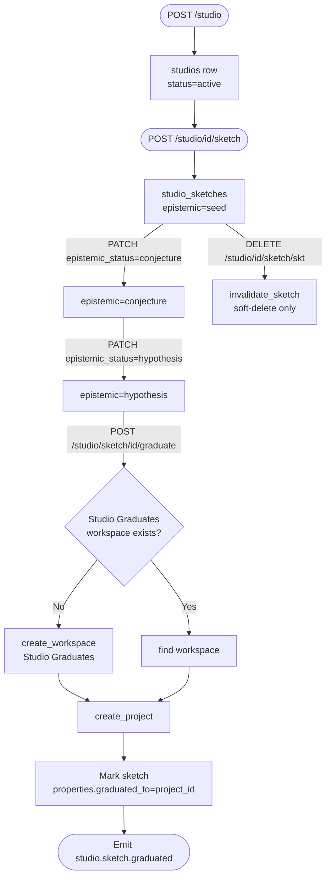

CurlyOS Core ships three interconnected subsystems that cover the full creative-to-quality lifecycle. **Studio** is an infinite idea canvas where raw sketches progress through an epistemic ladder before graduating into real workspace projects. **Simulation** forks a world model, runs scenario sweeps, and records outcome distributions — always at epistemic status `possible_world`, never auto-promoted to reality. **Evaluation** provides content-addressed golden datasets, three pluggable scorers, and a gate service that issues a `promote / hold / rollback` verdict on every candidate.

---

## Studio

Studio (`studio/__init__.py`) is the canvas-to-graduation pipeline. A **studio** is a named container (prefix `stu_`) that owns any number of **sketches** (prefix `skt_`). Sketches travel a one-way epistemic ladder and, when ready, graduate into workspace projects through a hard gate.

### Data model

**`studios` table**

| Column | Type | Notes |
|---|---|---|
| `id` | `text` | ULID, prefix `stu` |
| `scope` | `text` | Scoped owner string, e.g. `user:usr_hiten` |
| `title` | `text` | Human label |
| `status` | `text` | `active` at creation |
| `properties` | `jsonb` | Free-form metadata |
| `created_at` | `timestamptz` | |
| `updated_at` | `timestamptz` | |

**`studio_sketches` table**

| Column | Type | Notes |
|---|---|---|
| `id` | `text` | ULID, prefix `skt` |
| `studio_id` | `text` | FK → `studios.id` |
| `content` | `text` | Raw idea text |
| `kind` | `text` | Content type, e.g. `text`, `code`, `image` |
| `epistemic_status` | `text` | `seed` \| `conjecture` \| `hypothesis` — CHECK constraint forbids `canonical` |
| `properties` | `jsonb` | Holds `graduated_to` once graduated |
| `created_at` | `timestamptz` | |
| `updated_at` | `timestamptz` | |

**`studio_links` table**

| Column | Type | Notes |
|---|---|---|
| `id` | `text` | ULID, prefix `cor` |
| `src_sketch_id` | `text` | FK → `studio_sketches.id` |
| `dst_sketch_id` | `text` | FK → `studio_sketches.id` |
| `rel_type` | `text` | Default `related` |
| `created_at` | `timestamptz` | |

**Epistemic ladder**

Transitions are one-directional and enforced in code (see `_VALID_TRANSITIONS`):

```
seed  →  conjecture  →  hypothesis
                              ↓
                          graduate()
```

The status `canonical` is permanently blocked on sketches by a `CHECK` constraint. A sketch that reaches `hypothesis` has only one forward path: graduation.

### Functions

#### `create_studio`

```python
async def create_studio(
    pool: Any,
    publisher: Any,
    scope: str,
    title: str,
    properties: dict | None = None,
) -> dict
```

Creates a studio row, emits `studio.created` event. Returns `{id, scope, title, status}`.

#### `create_sketch`

```python
async def create_sketch(
    pool: Any,
    publisher: Any,
    studio_id: str,
    content: str,
    kind: str = "text",
    properties: dict | None = None,
) -> dict
```

Creates a sketch seeded at `epistemic_status='seed'`. Emits `studio.sketch.created`. Returns `{id, studio_id, content, kind, epistemic_status}`.

#### `update_sketch`

```python
async def update_sketch(
    pool: Any,
    publisher: Any,
    sketch_id: str,
    content: str | None = None,
    epistemic_status: str | None = None,
) -> dict
```

Updates content and/or epistemic status. Validates the transition against `_VALID_TRANSITIONS` before touching the DB; raises `ValueError` if the transition is illegal or if `canonical` is requested. Emits `studio.sketch.updated`. Returns the full updated sketch dict including `updated_at`.

#### `link_sketches`

```python
async def link_sketches(
    pool: Any,
    publisher: Any,
    src_id: str,
    dst_id: str,
    rel_type: str = "related",
) -> dict
```

Creates a typed link row (prefix `cor`). Emits `studio.sketches.linked`. Returns `{id, src_id, dst_id, rel_type}`.

#### `search_sketches`

```python
async def search_sketches(
    pool: Any,
    studio_id: str,
    query: str,
    mode: str = "divergent",
) -> list[dict]
```

Searches by `content ILIKE` or `kind` exact match. When `mode='divergent'`, applies a round-robin interleave across `kind` groups so no single content type dominates results. Returns list of sketch dicts.

#### `graduate_sketch`

```python
async def graduate_sketch(
    pool: Any,
    publisher: Any,
    sketch_id: str,
    target_type: str = "project",
    scope_text: str = "user:usr_hiten",
) -> dict
```

Graduates a sketch into a workspace `Project`. Prerequisites: sketch must be at `conjecture` or `hypothesis` and must not already have `properties.graduated_to` set. Finds or creates a `Studio Graduates` workspace under `scope_text`, then calls `workspace.create_project`. Writes `{graduated_to: project_id}` back into `properties`. Emits `studio.sketch.graduated`. Returns `{sketch_id, graduated_to_project_id}`.

#### `invalidate_sketch`

```python
async def invalidate_sketch(
    pool: Any,
    publisher: Any,
    sketch_id: str,
) -> dict
```

Soft-invalidates a sketch — updates `updated_at` but never deletes the row. Emits `studio.sketch.invalidated`. Returns `{id, action: 'invalidated'}`.

#### `get_studio`

```python
async def get_studio(pool: Any, studio_id: str) -> dict
```

Returns `{id, scope, title, status, sketches: [...]}` with all sketch rows ordered newest-first.

### Endpoints

> _Inference note:_ the HTTP routing layer is not in this file. The routes below are declared in the module docstring and match the function signatures; exact router wiring may be in a separate `routes/` module.

| Method | Path | Function | Notes |
|---|---|---|---|
| `POST` | `/api/studio` | `create_studio` | Body: `{scope, title, properties?}` |
| `GET` | `/api/studio/{id}` | `get_studio` | Returns studio + all sketches |
| `POST` | `/api/studio/{id}/sketch` | `create_sketch` | Body: `{content, kind?, properties?}` |
| `PATCH` | `/api/studio/{id}/sketch/{skt}` | `update_sketch` | Body: `{content?, epistemic_status?}` |
| `POST` | `/api/studio/{id}/link` | `link_sketches` | Body: `{src_id, dst_id, rel_type?}` |
| `POST` | `/api/studio/{id}/search` | `search_sketches` | Body: `{query, mode?}` |
| `POST` | `/api/studio/sketch/{id}/graduate` | `graduate_sketch` | Body: `{target_type?, scope_text?}` |
| `DELETE` | `/api/studio/{id}/sketch/{skt}` | `invalidate_sketch` | Soft-invalidate only |

### Studio graduation flow



---

## Simulation

Simulation (`simulation/__init__.py`) models uncertainty: create a run, execute it with a named technique, then fork and compare alternative assumptions. Every run lands at `epistemic_status='possible_world'` — outcomes are never auto-promoted into the main knowledge graph.

### Data model

**`simulation_runs` table**

| Column | Type | Notes |
|---|---|---|
| `id` | `text` | ULID, prefix `sim` |
| `scope` | `text` | Scoped owner string |
| `question` | `text` | The driving question for the run |
| `world_model_id` | `text` \| `null` | Optional reference to an external world model |
| `parameters` | `jsonb` | Assumptions dict, `NOT NULL DEFAULT '{}'` |
| `status` | `text` | `created` → `completed` |
| `epistemic_status` | `text` | Always `possible_world` at creation; never auto-promoted |
| `outcome_distribution` | `jsonb` | `{scenario_name: probability, ...}` after execution |
| `created_at` | `timestamptz` | |
| `completed_at` | `timestamptz` | Populated on `execute_simulation` |

**`simulation_scenarios` table**

> _Inference:_ columns inferred from the `INSERT` in `execute_simulation`; no explicit `CREATE TABLE` is in this file.

| Column | Type | Notes |
|---|---|---|
| `id` | `text` | ULID, prefix `sim` (same prefix as runs) |
| `run_id` | `text` | FK → `simulation_runs.id` |
| `name` | `text` | Scenario label, e.g. `best_case` |
| `description` | `text` | Human summary |
| `assumptions` | `jsonb` | Key-value assumption overrides |
| `probability` | `float` | 0–1 subjective probability |
| `outcome` | `text` | Outcome label |
| `created_at` | `timestamptz` | |

### Scenario templates

The only built-in technique is `scenario_planning`, which generates five canonical scenarios:

| Name | Probability | Outcome |
|---|---|---|
| `best_case` | 0.20 | `maximum_gain` |
| `worst_case` | 0.20 | `maximum_loss` |
| `most_likely` | 0.35 | `expected_value` |
| `black_swan` | 0.10 | `tail_risk` |
| `status_quo` | 0.15 | `no_change` |

Total probability sums to 1.00.

### Functions

#### `create_simulation_run`

```python
async def create_simulation_run(
    pool: Any,
    publisher: Any,
    scope: str,
    question: str,
    world_model_id: str | None = None,
    parameters: dict | None = None,
) -> dict
```

Inserts a run row at `status='created'`, `epistemic_status='possible_world'`. Emits `simulation.run.created`. Returns `{id, scope, question, status, epistemic_status}`.

#### `execute_simulation`

```python
async def execute_simulation(
    pool: Any,
    publisher: Any,
    run_id: str,
    technique: str = "scenario_planning",
) -> dict
```

Runs the named technique against an existing run. For `scenario_planning`, inserts all five scenario rows, then updates the run to `status='completed'` with `outcome_distribution` and `completed_at`. Raises `ValueError` if the technique is unknown. Emits `simulation.run.completed`. Returns `{run_id, scenarios_count, outcome_distribution}`.

#### `fork_simulation`

```python
async def fork_simulation(
    pool: Any,
    publisher: Any,
    run_id: str,
    new_assumptions: dict,
) -> dict
```

Creates a new run that inherits the original's `question` and `world_model_id` but with `parameters` = `{**original_parameters, **new_assumptions}` (new assumptions win on key collision). Emits `simulation.run.forked`. Returns `{id, scope, question, status, epistemic_status, parent_run_id}`.

#### `get_simulation_results`

```python
async def get_simulation_results(pool: Any, run_id: str) -> dict
```

Returns the full run plus all scenario rows (ordered by `probability DESC`): `{id, scope, question, status, epistemic_status, outcome_distribution, created_at, completed_at, scenarios: [...]}`.

### Endpoints

> _Inference note:_ routes declared in the module docstring; router wiring is external.

| Method | Path | Function | Notes |
|---|---|---|---|
| `POST` | `/api/sim/runs` | `create_simulation_run` | Body: `{scope, question, world_model_id?, parameters?}` |
| `GET` | `/api/sim/runs/{id}` | `get_simulation_results` | Returns run + scenarios |
| `POST` | `/api/sim/runs/{id}/fork` | `fork_simulation` | Body: `{new_assumptions}` |
| `POST` | `/api/sim/runs/{id}/execute` | `execute_simulation` | Body: `{technique?}` (inferred; not in docstring) |
| `PATCH` | `/api/sim/runs/{id}/assumptions/{asm_id}` | _(not yet implemented in this file)_ | Bump version of a single assumption |
| `POST` | `/api/sim/runs/{id}/replay` | _(not yet implemented in this file)_ | Deterministic re-run from seed |
| `GET` | `/api/sim/runs/{id}/sensitivity` | _(not yet implemented in this file)_ | Tornado chart data |

---

## Evaluation

Evaluation (`evaluation/__init__.py`) is the quality gate. It stores versioned **golden datasets** in Postgres (content-addressed by `sha256`), runs **scorers** against a candidate response, and emits a `GateDecision` (`promote / hold / rollback`) based on aggregate pass rate and regression count.

### Data model

**`golden_datasets` table**

| Column | Type | Notes |
|---|---|---|
| `id` | `text` | `gds_` + raw ULID (no `mint()` prefix mechanism; uses `mint_ulid()` directly) |
| `name` | `text` | Human label |
| `content_hash` | `text` | `sha256` of canonical JSON (`sort_keys=True`) — content-addressed |
| `data` | `jsonb` | The golden data payload |
| `metadata` | `jsonb` | Free-form |
| `created_at` | `timestamptz` | Inferred; used in `list_golden_datasets` ORDER BY |

**`evaluation_runs` table**

| Column | Type | Notes |
|---|---|---|
| `id` | `text` | ULID, prefix `evr` |
| `candidate_ref` | `text` | Opaque reference to the candidate being evaluated |
| `dataset_ids` | `jsonb` | Array of dataset IDs used |
| `scorers` | `jsonb` | Array of scorer type strings used |
| `pass_rate` | `float` | Aggregate pass rate, 0–1 |
| `decision` | `text` | `promote` \| `hold` \| `rollback` |

### `GateDecision` enum

```python
class GateDecision(StrEnum):
    PROMOTE = "promote"
    HOLD = "hold"
    ROLLBACK = "rollback"
```

Gate thresholds (hardcoded in `evaluate_candidate`):

| Condition | Decision |
|---|---|
| `pass_rate >= 0.8` AND `regressions == 0` | `promote` |
| `0.5 <= pass_rate < 0.8` (any regressions) | `hold` |
| `pass_rate < 0.5` | `rollback` |

A regression is counted when any individual scorer returns `score < 0.5` on a dataset.

### Scorers

Three scorers are registered in `_SCORERS`:

| Key | Function | Method |
|---|---|---|
| `llm_judge` | `_scorer_llm_judge` | Fraction of expected items whose text appears (case-insensitive) in the candidate |
| `embedding` | `_scorer_embedding` | Average cosine similarity using character-level trigram vectors (pgvector fallback) |
| `exact` | `_scorer_exact` | Binary: 1.0 if candidate matches at least one expected item verbatim, else 0.0 |

All scorers return `{score: float, details: dict, scorer_type: str, dataset_id: str}`.

**Dataset shape accepted by scorers**

```text
{"expected": [...]}                    -- explicit list at top level
[{"expected": ...}, ...]               -- list of items, each with expected
{"items": [{"expected": ...}, ...]}    -- nested items list
```

### Functions

#### `create_golden_dataset`

```python
async def create_golden_dataset(
    pool: Any,
    name: str,
    data: Any,
    metadata: Any | None = None,
) -> dict
```

Computes `sha256` of canonical JSON, inserts into `golden_datasets`. Returns `{id, name, content_hash}`.

#### `get_golden_dataset`

```python
async def get_golden_dataset(pool: Any, dataset_id: str) -> dict | None
```

Returns full dataset row or `None` if not found. Includes `data` and `metadata` fields.

#### `list_golden_datasets`

```python
async def list_golden_datasets(pool: Any) -> list[dict]
```

Returns `[{id, name, content_hash, created_at}]` ordered newest-first. Does not include `data` payload.

#### `run_scorer`

```python
async def run_scorer(
    pool: Any,
    dataset_id: str,
    candidate_response: str,
    scorer_type: str = "llm_judge",
) -> dict
```

Loads the dataset, extracts `expected_items`, calls the named scorer function. Raises `ValueError` on unknown `scorer_type` or missing dataset. Returns scorer result dict.

#### `evaluate_candidate`

```python
async def evaluate_candidate(
    pool: Any,
    publisher: Any,
    candidate_ref: str,
    dataset_ids: list[str],
    scorers: list[str] | None = None,
) -> dict
```

Runs all `scorers` (default: `["llm_judge"]`) across all `dataset_ids`. Accumulates scores, counts regressions, computes `pass_rate`, applies gate thresholds, persists an `evaluation_runs` row. Returns `{evr_id, decision, pass_rate, regressions, reason}`.

> _Note:_ in production, `candidate_response` should be the agent output under test. The current implementation derives a baseline response from the dataset's own `response`/`answer` field as a self-consistency check — real integration requires injecting the actual candidate output.

### Endpoints

> _Inference note:_ only one endpoint is declared in the module docstring; additional CRUD routes for datasets are expected but not documented there.

| Method | Path | Function | Notes |
|---|---|---|---|
| `POST` | `/api/gate/evaluate` | `evaluate_candidate` | Body: `{candidate_ref, dataset_ids, scorers?}` — returns `GateVerdict` |
| `POST` | `/api/eval/datasets` | `create_golden_dataset` | Inferred |
| `GET` | `/api/eval/datasets` | `list_golden_datasets` | Inferred |
| `GET` | `/api/eval/datasets/{id}` | `get_golden_dataset` | Inferred |
| `POST` | `/api/eval/datasets/{id}/score` | `run_scorer` | Inferred; Body: `{candidate_response, scorer_type?}` |

---

## Configuration & settings

No subsystem-level configuration file or environment variable block was found in these three `__init__.py` files. All three subsystems accept `pool` (asyncpg connection pool) and `publisher` (NATS publisher with `.emit()` / `.stage()`) as explicit arguments — they are dependency-injected at the call site.

Key implicit dependencies:

- `shared.types.ulid.mint(prefix)` — ULID minting with short prefix.
- `shared.types.ulid.mint_ulid()` — raw ULID (used in Evaluation only).
- `shared.events.build_event(short_type, subject, scope, data, actor, source)` — canonical event builder.
- `workspace.create_workspace / create_project / list_workspaces` — lazily imported by `graduate_sketch` to avoid circular imports.

---

## Gotchas & edge cases

**Studio**

- `epistemic_status='canonical'` is blocked by both a `CHECK` constraint on the table and a guard in `update_sketch`. Attempting to set it raises `ValueError` before any SQL is executed.
- `graduate_sketch` checks `properties.graduated_to` for idempotency — calling it twice on the same sketch raises `ValueError`, not a silent no-op.
- `invalidate_sketch` only touches `updated_at`; there is no `valid_to` column write despite the docstring mentioning it. Treat the returned `{action: 'invalidated'}` as a soft-delete signal tracked purely by the `studio.sketch.invalidated` event.
- The `scope_text` default in `graduate_sketch` is `"user:usr_hiten"` — this is almost certainly a development placeholder. Override it in production calls.
- `search_sketches` uses SQL `ILIKE` (not full-text search / vector similarity). For large studios, add an index on `studio_sketches(studio_id, content)`.

**Simulation**

- `epistemic_status` is hardcoded to `'possible_world'` on every insert including forks. There is no promotion path inside this module; a separate reconciliation step is required to graduate a simulation outcome into the main knowledge graph.
- Scenario IDs (rows in `simulation_scenarios`) are minted with prefix `sim` — same prefix as run IDs. Do not rely on prefix alone to distinguish runs from scenarios.
- `fork_simulation` uses Python-side dict merge (`{**orig, **new}`). Key order of `new_assumptions` wins; there is no deep merge for nested dicts.
- The `PATCH /sim/runs/{id}/assumptions/{asm_id}`, `POST /sim/runs/{id}/replay`, and `GET /sim/runs/{id}/sensitivity` endpoints are declared in the docstring but have no corresponding Python functions in this file — they are not yet implemented.
- `execute_simulation` does not guard against double-execution. Calling it on a `completed` run will insert a second set of scenario rows and overwrite `outcome_distribution`.

**Evaluation**

- The `_scorer_embedding` function uses a character-level trigram fallback rather than real sentence embeddings. Scores will be lower than expected for semantically equivalent but lexically different responses. Swap in `pgvector` / `sentence-transformers` for production use.
- `_compute_content_hash` uses `sort_keys=True` but does not normalise Unicode or whitespace. Two datasets with identical logical content but different whitespace will get different hashes.
- `evaluate_candidate` derives `candidate_response` from the dataset's own `response`/`answer` field for the self-consistency baseline — in real usage this must be replaced with the actual agent output.
- `evaluation_runs` is inserted but no publisher event is staged in `evaluate_candidate` (contrast with Studio and Simulation which both stage events). Gate verdict notifications must be handled at the HTTP layer or by a separate observer.
- `list_golden_datasets` does not support pagination. Large datasets collections will return all rows in a single query.
